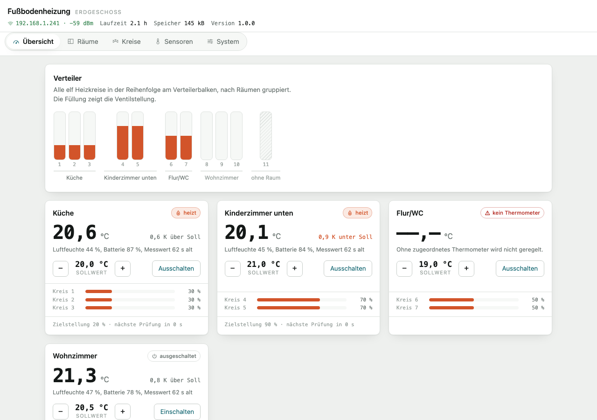
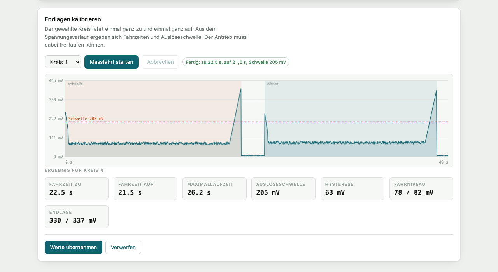
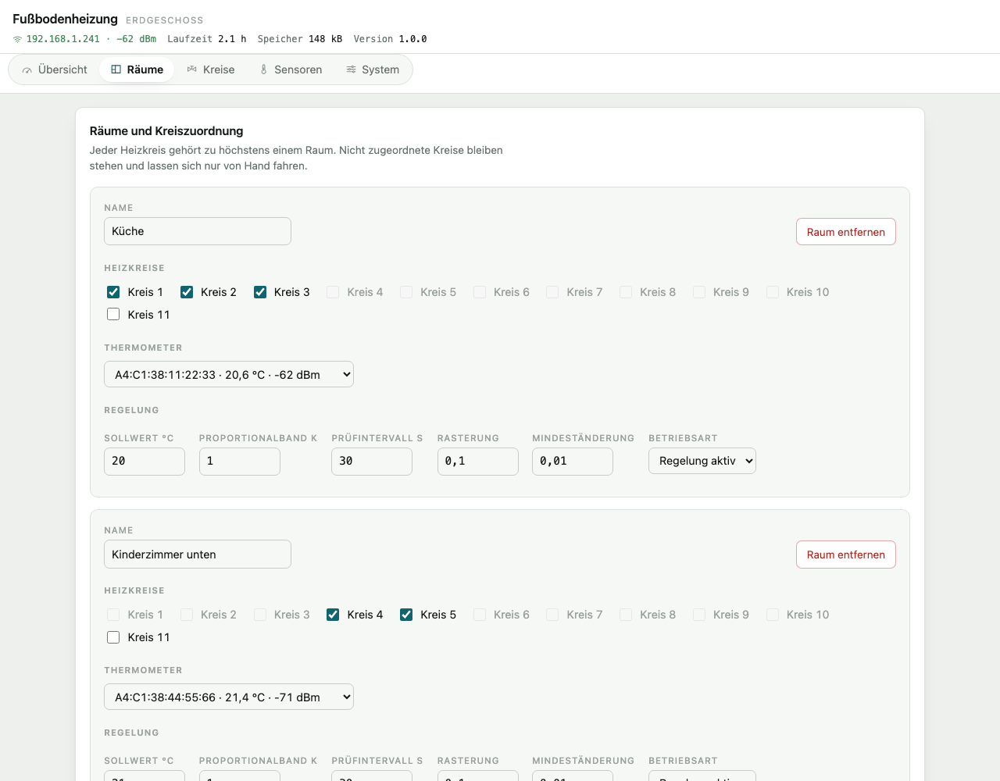
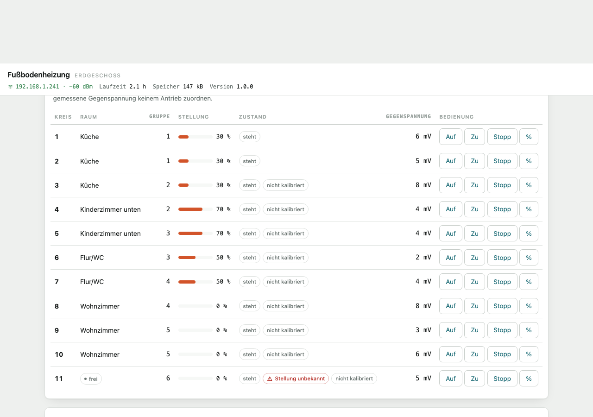
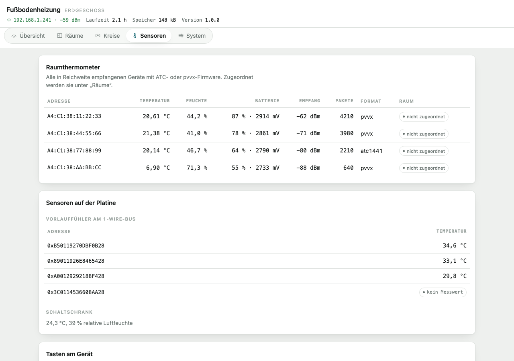
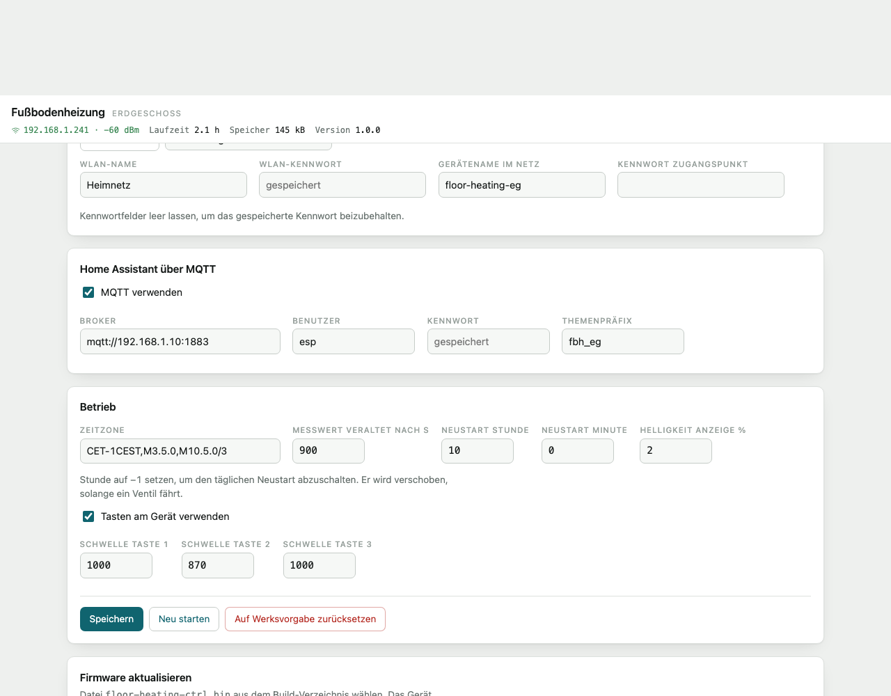
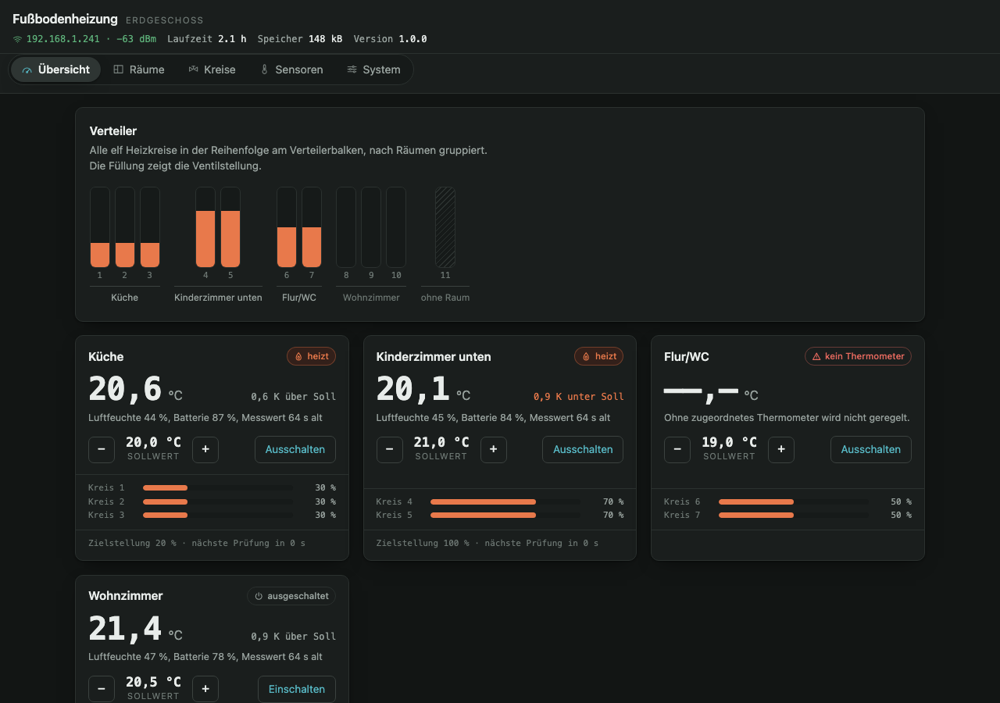
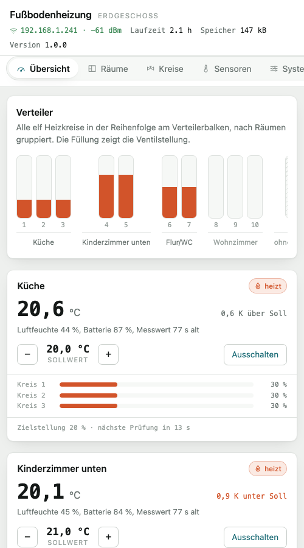
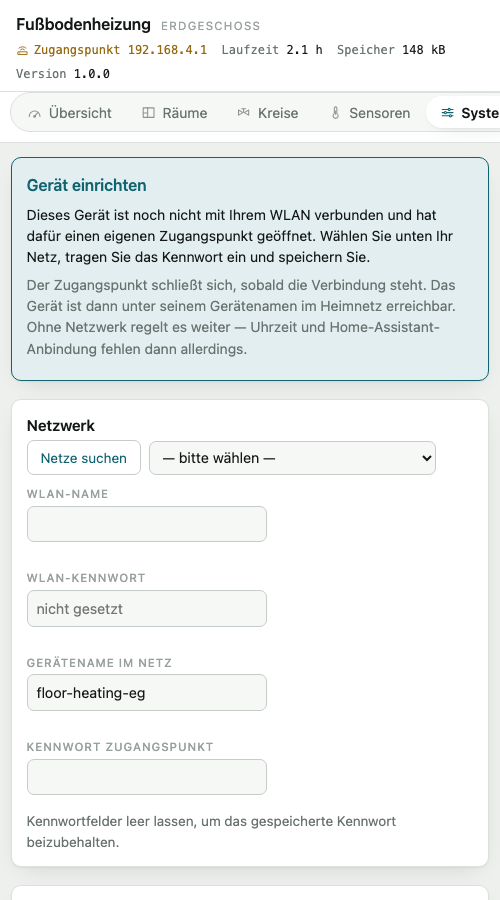

# Ventilsteuerung Fußbodenheizung

Eigenbau-Ersatz für einen **Homematic IP FALMOT** — den motorischen
Fußbodenheizungsaktor, der die Stellantriebe am Heizkreisverteiler ansteuert.
Angesteuert werden weiterhin die originalen **HmIP-VDMOT**-Stellantriebe; nur
die Steuerung dahinter ist ersetzt. Die Firmware läuft nativ auf ESP-IDF,
bindet Home Assistant über MQTT ein und ist vollständig über eine
Weboberfläche auf dem Gerät einzurichten.



## Warum

Die HmIP-VDMOT sind gute Stellantriebe: motorisch statt thermisch, damit
schnell und stromsparend, und ohne Endschalter — die Endlage erkennt die
Steuerung an der Gegenspannung des blockierenden Motors. Gebunden sind sie
allerdings an den FALMOT und damit an die Homematic-Welt.

Dieses Projekt behält die Antriebe und ersetzt die Steuerung durch eine eigene
Platine mit ESP32. Damit ist die Anlage frei konfigurierbar, spricht direkt
MQTT, holt die Raumtemperaturen selbst über Bluetooth und regelt auch dann
weiter, wenn Netzwerk oder Home Assistant ausfallen.

Vorgänger dieser Firmware war eine ESPHome-Konfiguration mit rund 1750 Zeilen
YAML, in der die eigentliche Regel- und Endlagenlogik bereits vollständig in
Lambda-Blöcken steckte. Räume und Kanalzuordnung waren dort fest verdrahtet;
jede Änderung erforderte Neuübersetzung und Flashen.

## Hardware

Die Steuerplatine ist selbst entworfen und bei **JLCPCB** gefertigt. Sie trägt
keinen eigenen Mikrocontroller: ein **ESP32-DevKitC** wird auf Buchsenleisten
gesteckt und lässt sich damit ohne Löten tauschen.

| Baugruppe | Umsetzung |
|---|---|
| Stellantriebe | 11 × HmIP-VDMOT, motorisch, ohne Endschalter |
| Ansteuerung | 11 × L9110s H-Brücke, bidirektional |
| Kanalauswahl | 3 × SN74HC595 Schieberegister über SPI2, 22 der 24 Ausgänge belegt |
| Endlagenerkennung | Shunt je Messgruppe an ADC1, 6 Messgruppen |
| Anzeige | SSD1327, 128 × 128, 16 Graustufen, I²C |
| Bedienung am Gerät | 3 kapazitive Tasten |
| Vorlauffühler | DS18B20 am 1-Wire-Bus |
| Schaltschrank-Klima | HDC1080, I²C |
| Rechner | ESP32-DevKitC (WROOM-32) auf Sockel |

### Anschlussbelegung

| Funktion | Pin |
|---|---|
| Schieberegister | DATA 16, CLK 5, LATCH 17, OE 18 |
| Gegenspannung, ADC1, Dämpfung 6 dB | 36, 39, 34, 35, 32, 33 |
| 1-Wire | 23 |
| I²C | SDA 21, SCL 22 |
| Tasten | 4 (−), 2 (+), 15 (Raumwahl) |

### Messgruppen

Je zwei Heizkreise teilen sich einen Messeingang:

| Gruppe | ADC-Pin | Kreise |
|---|---|---|
| 1 | 36 | 1, 2 |
| 2 | 39 | 3, 4 |
| 3 | 34 | 5, 6 |
| 4 | 35 | 7, 8 |
| 5 | 32 | 9, 10 |
| 6 | 33 | 11 |

Daraus folgt die zentrale Betriebsregel: **innerhalb einer Messgruppe fährt
immer nur ein Kreis.** Sonst liegt die Gegenspannung beider Motoren auf
demselben Eingang und die Endlage ließe sich keinem Antrieb mehr zuordnen.
Durchgesetzt wird das von der Gruppensperre in
[`main/app_control.c`](main/app_control.c).

## Funktionsweise

### Endlagenerkennung

Die VDMOT haben keine Endschalter. Im Lauf zieht der Motor eine kleine Spannung
über den Shunt; erreicht das Ventil den Anschlag, blockiert er und die Spannung
steigt deutlich. Überschreitet der gleitende Median die Schwelle, gilt die
Endlage als erreicht und die Position wird auf 0 beziehungsweise 100 % gesetzt.

Nach dem Anlauf gilt eine Sperrzeit von zwei Sekunden, in der die Meldung
verworfen wird — der Einschaltstrom sieht sonst wie ein Blockieren aus.

### Automatische Kalibrierung

Die Auslöseschwelle hängt von Antrieb, Shunt und Verkabelung ab. Statt sie von
Hand zu suchen, fährt die Messfahrt den Kreis einmal ganz zu und einmal ganz
auf und schreibt dabei den Spannungsverlauf mit. Das Blockieren wird
**relativ** zum gemessenen Fahrniveau erkannt — eine vorhandene Schwelle geht
nicht ein, sonst würde die Kalibrierung ihr eigenes Ergebnis voraussetzen.



Braun ist die Schließfahrt, blau die Öffnungsfahrt, dazwischen liegt eine
Ruhepause. Die beiden Spitzen sind die Anschläge. Aus dem Verlauf ergeben sich
Fahrzeiten, Maximallaufzeit, Auslöseschwelle und Hysterese; übernommen werden
sie erst nach Bestätigung.

### Regelung

Die Ventilstellung folgt der Regelabweichung proportional, über ein Band von
±1 K von ganz zu bis ganz auf, gerastert auf Zehntel:

```
diff = soll − ist
pos  = runden(((diff / band) + 1) / 2 / raster) × raster,   begrenzt auf 0 … 1
gefahren wird, wenn |aktuell − pos| > Mindeständerung
```

Band, Rasterung, Mindeständerung und Prüfintervall sind je Raum einstellbar.

### Raumtemperatur

Der ESP32 hört die Raumthermometer selbst mit — Xiaomi-Thermometer mit
ATC- oder pvvx-Firmware senden ihre Messwerte offen als Rundruf. Es wird keine
Verbindung aufgebaut und nichts gesendet. Damit hängt die Regelung nicht am
Netzwerk.

Bleibt ein Messwert länger als eingestellt aus, setzt die Regelung für diesen
Raum aus und die Ventile bleiben stehen, statt mit einem veralteten Wert
weiterzuregeln.

## Oberfläche

Räume, Kreiszuordnung, Thermometer und Regelparameter sind zur Laufzeit
änderbar. Die Oberfläche liegt komprimiert im Programmabbild (gut 15 kB) und
lädt ohne Internetzugang.

| | |
|---|---|
|  |  |
| **Räume** — Kreise zuordnen, Thermometer wählen, Regelparameter | **Kreise** — Zustand, Handbedienung, Fahrzeiten und Schwellen |
|  |  |
| **Sensoren** — empfangene Thermometer, Vorlauffühler, Tastenabgleich | **System** — Netzwerk, MQTT, Betrieb, Firmware |




## Erste Inbetriebnahme

1. Nach dem Flashen findet das Gerät kein WLAN und öffnet nach 30 s einen
   Zugangspunkt `floor-heating-eg-XXXX` (Kennwort `fussboden`).
2. Beim Verbinden öffnet sich die Einrichtungsseite von selbst (Captive
   Portal). Andernfalls `http://192.168.4.1` aufrufen.
3. Netz wählen, Kennwort eintragen, speichern. Der Zugangspunkt schließt sich,
   sobald die Verbindung steht und niemand mehr daran hängt.
4. Unter **Sensoren** prüfen, welche Thermometer empfangen werden, und unter
   **Räume** je Raum eines zuordnen.
5. Unter **Kreise** für jeden Kreis eine Messfahrt starten.



Bis zur ersten Messfahrt gelten Vorgabewerte (39 s/40 s Fahrzeit, 190 mV
Schwelle), die aus dem Betrieb der Vorgängerkonfiguration stammen.

## Übersetzen und Flashen

Vorausgesetzt wird ESP-IDF v6.0.2.

```bash
. ~/esp/esp-idf-6.0.2/export.sh && idf.py set-target esp32 && idf.py build
```

```bash
idf.py -p /dev/cu.usbserial-0001 flash monitor
```

Spätere Aktualisierungen laufen über die Weboberfläche (System → Firmware
aktualisieren) oder direkt:

```bash
curl -X POST --data-binary @build/floor-heating-ctrl.bin http://<adresse>/api/ota
```

## Aufbau

```
main/
  main.c          Start der Bausteine
  app_control.c   Ventilzustände, Gruppensperre, Raumregelung   ← Kern
  app_calib.c     Automatische Kalibrierung der Endlagenerkennung
  app_web.c       HTTP-Server, JSON-Schnittstelle, Captive Portal, OTA
  app_mqtt.c      Home-Assistant-Discovery und Zustände
  app_ui.c        Anzeige und Tasten am Gerät
  www/index.html  Oberfläche, komprimiert ins Abbild gelegt
components/
  hw_map/         Pin- und Gruppentabellen — einzige Stelle mit Hardwarewissen
  sr74hc595/      Schieberegister mit Verriegelung IA gegen IB
  valve/          Zustandsmaschine je Kreis (frei von IDF-Abhängigkeiten)
  bemf/           ADC-Abtastung, gleitender Median, Schwellwertauswertung
  roomctrl/       Regelgesetz (frei von IDF-Abhängigkeiten)
  config_store/   Konfiguration als JSON im NVS
  atc_ble/        NimBLE-Observer, ATC- und pvvx-Dekoder
  ssd1327/        Anzeigetreiber mit Bitmap-Schrift
  sensors_local/  DS18B20 und HDC1080
  netmgr/         WLAN, SNTP, täglicher Neustart
  captive_dns/    Namensdienst des Einrichtungsportals
  i2cbus/         gemeinsamer I²C-Bus
```

Die Firmware belegt rund 1,19 MB. Die Partitionstabelle sieht zwei
OTA-Bereiche zu je 1,875 MB vor; rund 40 % bleiben frei.

## Home Assistant

Die Entities werden per MQTT-Discovery angemeldet und bei jeder
Konfigurationsänderung neu berechnet; entfallene Räume werden wieder entfernt.

| Typ | Umfang |
|---|---|
| `cover` | 11 Heizkreise mit Position, Öffnen/Schließen/Stopp |
| `climate` | je eingerichtetem Raum |
| `sensor` | Raumtemperaturen mit Batterie und Empfang, 6 Messgruppen, Vorlauffühler, Schaltschrankklima, Laufzeit, WLAN |
| `button` | Neustart, Regelung je Raum sofort auslösen |

Die 22 einzelnen H-Brücken-Eingänge werden bewusst **nicht** exportiert —
direktes Schalten umginge Verriegelung und Gruppensperre. Handbetrieb läuft
über die Cover-Entities oder die Kreisseite der Oberfläche.

## Prüfen

Regelgesetz, Ventil-Zustandsmaschine und Hardwarezuordnung laufen ohne IDF und
ohne Hardware:

```bash
make -C test/host
```

Am Gerät:

1. Schieberegister: alle 22 Ausgänge einzeln schalten, gegen die
   L9110s-Eingänge messen, Verriegelung prüfen (IA und IB nie gleichzeitig).
2. Einen Kreis ganz zu und ganz auf fahren; Laufzeit und Abschaltung über die
   Endlage prüfen. Die Maximallaufzeit muss greifen, wenn die Endlage ausbleibt.
3. Messfahrt eines Kreises, Verlauf gegen den Vorgabewert von 190 mV halten.
4. Gruppensperre: Kreis 1 fahren lassen und währenddessen Kreis 2 anfordern —
   Kreis 2 darf erst danach fahren.
5. Tasten: unter **Sensoren** die Rohwerte in Ruhe und bei Berührung ablesen,
   die Schwelle etwa mittig setzen.
6. MQTT: Entities erscheinen in Home Assistant; einen Raum löschen und neu
   anlegen — die Entities verschwinden und kommen wieder.

## Abweichungen von der Vorgängerkonfiguration

Vier Unstimmigkeiten der ESPHome-Fassung sind dabei bereinigt:

1. **Endlagenzuordnung Kreis 9 bis 11.** Die Cover gaben `BEMF_4_sensor` an,
   gehören laut Verdrahtung aber zu Gruppe 5 beziehungsweise 6. Wirksam wurde
   die Endlage bisher nur über die `on_press`-Lambdas.
2. **Belegtprüfung bei Kreis 5.** Geprüft wurde Kreis 4; Kreis 5 teilt sich die
   Messgruppe jedoch mit Kreis 6.
3. **Touch-Tasten.** Die Raumauswahl zählte 0 bis 3, die Tasten verglichen
   gegen 10 bis 13 und lösten deshalb nie aus.
4. **Abbruch statt Überspringen.** War ein Kreis gesperrt, brach die Prüfung des
   gesamten Raums ab. Jetzt wird nur der betroffene Kreis übersprungen.

Bewusst geändertes Verhalten:

- **Schnellere Endlagenerkennung.** ESPHome bildete den Median über fünf Werte
  und meldete nur jeden fünften, also alle 1,25 s. Jetzt wird bei 50 ms
  Abtastung ein gleitender Median bei jedem Wert ausgewertet.
- **Ein Sollwert statt low/high.** Das Original mittelte ohnehin über beide.
- **Ventilstellungen im NVS**, beim Start wiederhergestellt. Ist keine Stellung
  bekannt, fährt der Kreis beim ersten Regeleingriff einmal auf Anschlag.
- **Veralteter Messwert setzt die Regelung aus.** Das Original hätte
  stillschweigend mit dem letzten bekannten Wert weitergeregelt.
- **Raumtemperatur über BLE statt über Home Assistant.**
- **Räume zur Laufzeit konfigurierbar** statt fest im YAML.

## Abfragetakt der Oberfläche

Die Seite fragt den Gerätezustand nicht in festem Takt ab, sondern richtet sich
danach, was sich tatsächlich ändert:

| Lage | Takt |
|---|---|
| ein Ventil fährt oder eine Messfahrt läuft | 1 s |
| Ruhezustand | 6 s |
| Tab im Hintergrund | keine Abfrage |
| Messreihe während einer Messfahrt | 400 ms |

`/api/state` gibt den Änderungszähler als ETag mit. Fragt die Seite mit
demselben Wert erneut an und fährt gerade kein Ventil, antwortet das Gerät mit
304 und erspart sich den Aufbau der rund 4 kB großen Antwort. Restzeiten,
Messwertalter und Laufzeit rechnet die Seite selbst weiter.

Gemessen mit einem Kreis 20 % der Zeit in Bewegung: 22,5 Anfragen je Minute,
davon 13 mit Inhalt — gegenüber 30 Anfragen je Minute mit durchgehend vollem
Inhalt in der ersten Fassung.

## Entwicklung

Die Oberfläche lässt sich ohne Hardware bedienen. `tools/mock_device.py`
liefert die echte Seite mit erfundenen Messwerten:

```bash
python3 tools/mock_device.py
```

Danach `http://localhost:8321` aufrufen. `?theme=dark` erzwingt ein
Farbschema, `#kreise` und die übrigen Anker öffnen einen Bereich direkt,
`/mock/ap?on=1` schaltet in den Zugangspunkt-Betrieb, um das Einrichtungsportal
zu sehen. `tools/screenshots.sh` erzeugt daraus die Aufnahmen dieser Seite.

## Offene Punkte

- **Am Gerät ist bisher nichts geprüft.** Firmware und Oberfläche sind gegen
  eine Attrappe getestet, die Logikmodule zusätzlich mit 198 Prüfungen auf dem
  Rechner. Die Prüfschritte an der Hardware stehen oben.
- **Touch-Schwellen** (1000, 870, 1000) stammen aus der ESPHome-Fassung. Die
  Messdauer der neuen Treiberfassung weicht ab, sie sind nur ein Ausgangspunkt.
- **MAC-Adressen der Thermometer** ergeben sich beim ersten BLE-Empfang.
- **Matter und Thread** sind nicht umgesetzt. Thread scheidet auf dieser
  Platine aus, weil dem ESP32-WROOM-32 das 802.15.4-Funkteil fehlt. Matter über
  WLAN sprengt das Flash-Budget. Wird Matter gebraucht, reicht Home Assistant
  die vorhandenen MQTT-Entities über seine eigene Matter-Bridge weiter.

## Rechtliches

Homematic IP, HmIP-VDMOT und HmIP-FALMOT sind Bezeichnungen der eQ-3 AG.
Dieses Projekt steht in keiner Verbindung zu eQ-3 und verwendet die Namen nur,
um die eingesetzten Stellantriebe und das ersetzte Gerät zu benennen.
