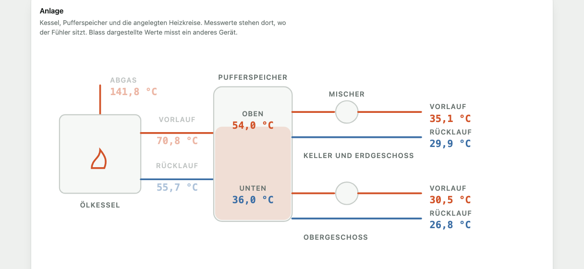
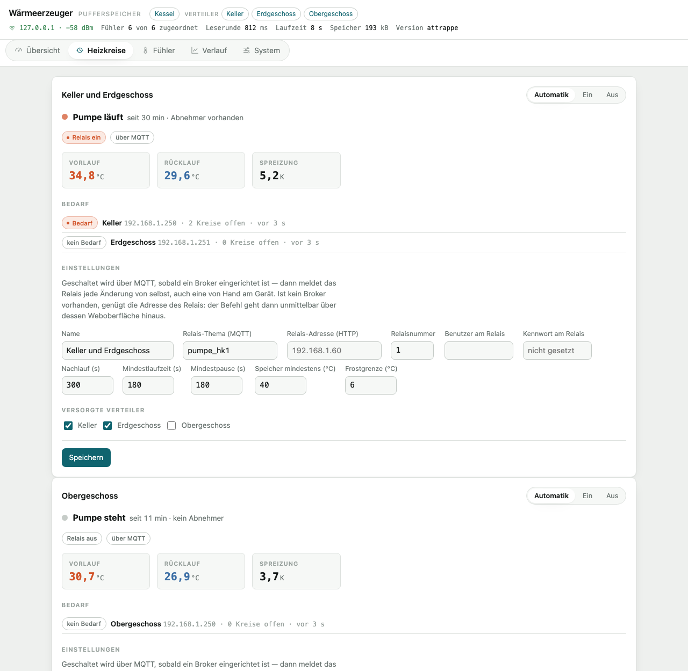
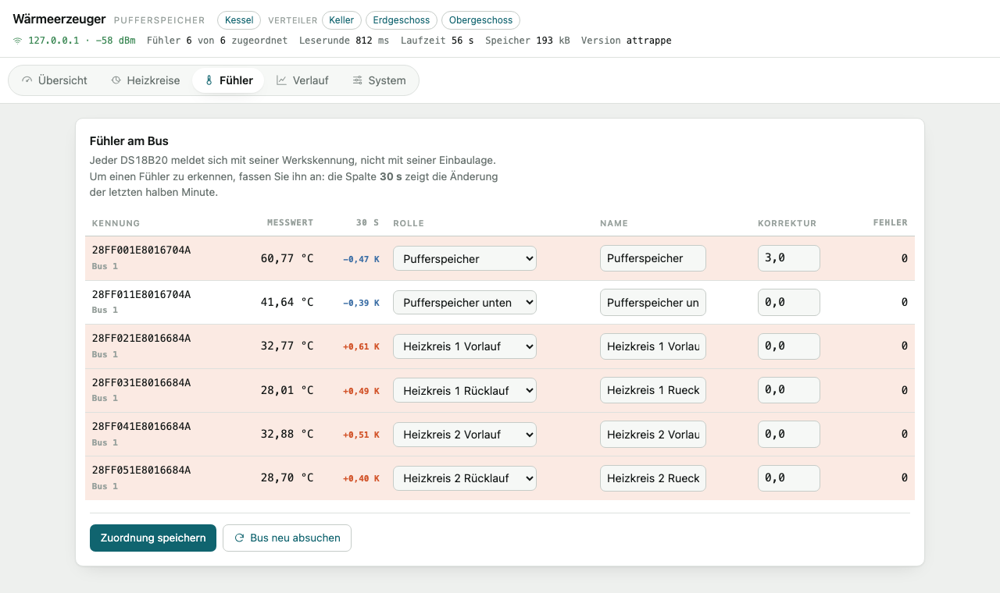
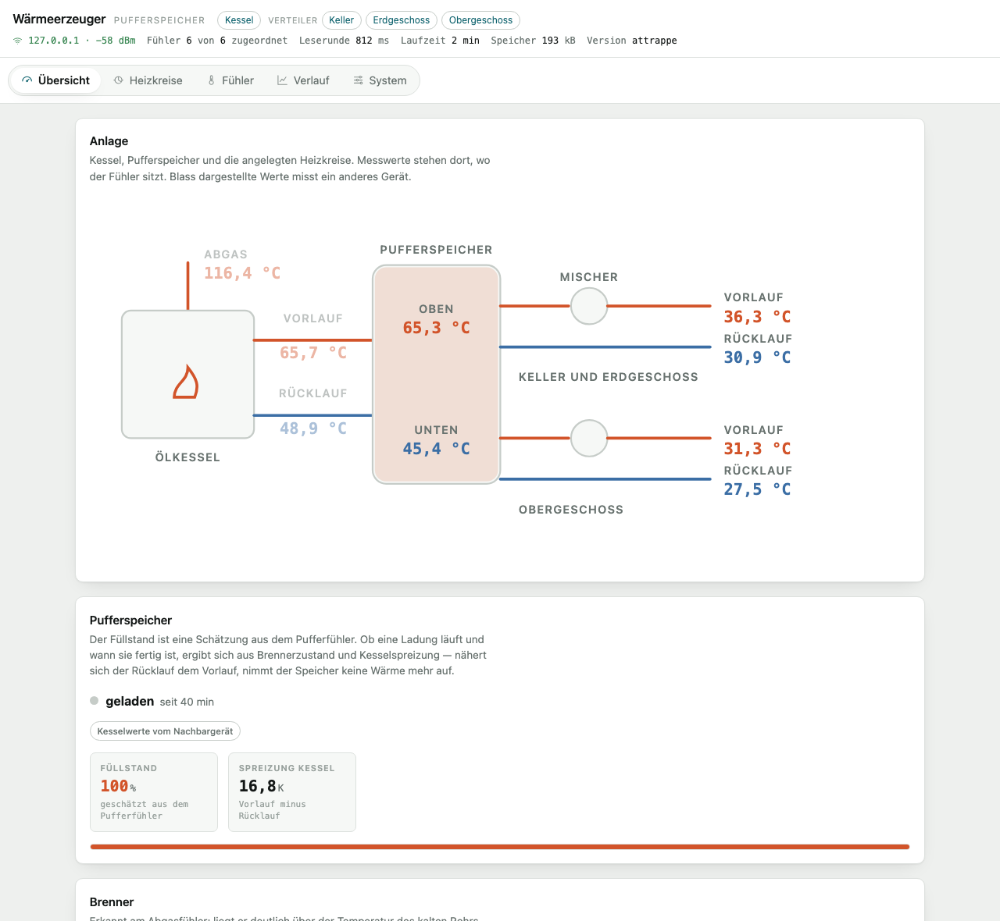
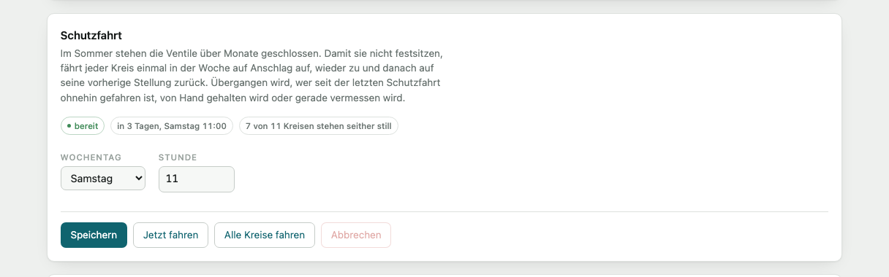
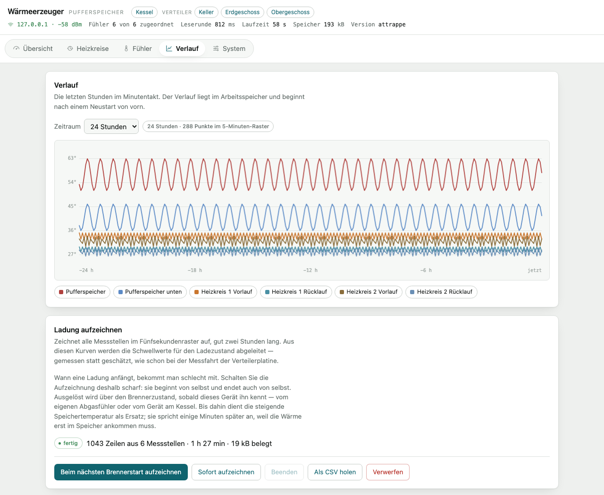

# Benutzerhandbuch

Diese Anleitung beschreibt Bedienung, Einrichtung und Wartung der Anlage aus Sicht der
Benutzung. Wie die Firmware aufgebaut ist und warum, steht in den Konzepten:
[Wärmeerzeugung und Pumpensteuerung](konzept-waermeerzeuger.md) sowie
[Umbau auf zwei Anwendungen](umbau-projektstruktur.md).

## Inhalt

- [Was die Anlage tut](#was-die-anlage-tut)
- [Die Geräte](#die-geräte)
- [Erste Inbetriebnahme](#erste-inbetriebnahme)
- [Die Oberfläche](#die-oberfläche)
- [Täglicher Betrieb](#täglicher-betrieb)
- [Räume einrichten](#räume-einrichten)
- [Heizkreise und Messfahrt](#heizkreise-und-messfahrt)
- [Fühler des Heizungsgeräts zuordnen](#fühler-des-heizungsgeräts-zuordnen)
- [Pumpen einrichten](#pumpen-einrichten)
- [Brenner und Pufferspeicher](#brenner-und-pufferspeicher)
- [Schutzfahrt und Schutzlauf](#schutzfahrt-und-schutzlauf)
- [Verlauf und Aufzeichnung](#verlauf-und-aufzeichnung)
- [Home Assistant](#home-assistant)
- [Wartung](#wartung)
- [Fehlersuche](#fehlersuche)
- [Anhang](#anhang)

---

## Was die Anlage tut

Ein Ölkessel lädt einen Pufferspeicher. Aus dem Speicher werden zwei Heizkreise versorgt, jeder
über einen Mischer, der den Vorlauf auf die für die Fußbodenheizung nötige Temperatur
herunterregelt. Das Trinkwasser wird im Durchlauf aus dem Pufferinhalt erwärmt.

An jedem Heizkreisverteiler sitzt eine Steuerplatine, die die Ventilstellungen der einzelnen
Kreise regelt. Im Heizungsbereich stehen zwei weitere Geräte: eines am Kessel, eines am
Pufferspeicher. Sie erfassen die Temperaturen und schalten die Umwälzpumpen ab, solange kein
Ventil offen ist.



Der Kessel selbst wird **nicht** gesteuert, die Mischer ebenso wenig. Deren Regelungen bleiben
unangetastet. Die Firmware misst mit und schaltet ausschließlich die beiden Umwälzpumpen.

## Die Geräte

| Gerät | Aufgabe | Oberfläche |
|---|---|---|
| Verteilerplatine (je Etage eine) | Ventile fahren, Räume regeln | Übersicht, Räume, Kreise, Sensoren, System |
| Gerät am Kessel | Abgas sowie Vor- und Rücklauf messen, Brennerlauf erkennen | Übersicht, Fühler, Verlauf, System |
| Gerät am Pufferspeicher | Speicher und Heizkreise messen, Pumpen schalten | zusätzlich Heizkreise |

Alle Geräte melden sich im Netz gegenseitig an und erscheinen in der Kopfzeile als Verweise. Ein
Klick öffnet die Oberfläche des anderen Geräts; bedient wird stets nur das gerade geöffnete.

Welche Aufgabe ein Heizungsgerät übernimmt, ergibt sich allein aus den zugeordneten Fühlern.
Beide tragen dieselbe Firmware.

## Erste Inbetriebnahme

### Firmware einspielen

Beide Firmwares liegen im selben Quelltextbestand und werden getrennt übersetzt:

```bash
. ~/esp/esp-idf-6.0.2/export.sh
idf.py -C apps/manifold   -p /dev/cu.usbserial-0001 flash    # Verteilerplatine
idf.py -C apps/heatsource -p /dev/cu.usbserial-0001 flash    # Heizungsgerät
```

Spätere Aktualisierungen laufen über die Weboberfläche (**System → Firmware**) oder direkt:

```bash
curl -X POST --data-binary @apps/manifold/build/floor-heating-ctrl.bin http://<adresse>/api/ota
```

Schlägt der Start einer neuen Fassung fehl, kehrt der Bootlader von selbst zur vorherigen
zurück. Bestätigt wird eine Fassung erst, wenn sie vollständig angelaufen ist.

### Ins WLAN bringen

1. Nach dem Einspielen findet das Gerät kein Netz und öffnet einen eigenen Zugangspunkt:
   `floor-heating-XXXX` beziehungsweise `heizung-XXXX`, Kennwort `fussboden`. Die vier Stellen
   sind die letzten beiden Bytes der MAC-Adresse.
2. Verbinden Sie sich damit. Das Einrichtungsfenster öffnet sich von selbst; andernfalls rufen
   Sie `http://192.168.4.1` auf.
3. **Netze suchen**, Ihr Netz wählen, Kennwort eintragen, speichern.


Das Gerät verbindet sich und ist danach unter seinem Gerätenamen erreichbar — im Auslieferungs
zustand `floor-heating.local` beziehungsweise `heizung.local`. Stehen mehrere Geräte im Netz,
vergeben Sie unter **System → Netzwerk** unterschiedliche Namen.

### Einrichtungsassistent

Beim ersten Aufruf führt ein Assistent durch die Grundeinrichtung. Er erscheint, solange keine
Bezeichnung eingetragen ist, und lässt sich später über **System** erneut öffnen.

Bei der Verteilerplatine: Etage benennen, Räume anlegen, je Raum ein Thermometer wählen.
Beim Heizungsgerät: Gerät benennen, Fühler zuordnen.

## Die Oberfläche

Die Oberfläche liegt im Gerät und lädt ohne Internetzugang. Sie kommt ohne Anmeldung aus und ist
für Telefon und Rechner gleichermaßen gedacht.


Der Verteilerbalken zeigt alle elf Kreise in der Reihenfolge am Verteiler, nach Räumen
gruppiert. Ein **gestrichelter** Kreis gehört zu keinem Raum: er wird nicht geregelt und fährt
nur von Hand. Ein **schraffierter** Kreis hat eine unbekannte Stellung — nach einem Neustart ohne
gespeicherte Stellung, bis er das erste Mal auf Anschlag gefahren ist.

**Kopfzeile.** Links die Bezeichnung des Geräts, daneben die übrigen Geräte im Haus. Darunter
Adresse, Empfangsstärke, Laufzeit, freier Speicher und Version.

**Reiter.** Wechseln die Ansicht. Die Adresszeile führt den Reiter mit (`…/#kreise`), sodass sich
eine Ansicht als Lesezeichen ablegen lässt.

**Farben.** Der Wärmeton steht ausschließlich für heiße Medien und für „läuft" — eine gefüllte
Ventilsäule, ein laufender Brenner, eine laufende Pumpe. Blau steht für Rückläufe, Petrol für
alles Bedienbare.

**Abfragetakt.** Die Oberfläche fragt den Zustand im Sekundentakt ab, solange etwas fährt, sonst
alle sechs Sekunden. Im Hintergrund liegende Fenster fragen nicht ab.


## Täglicher Betrieb

### Raum wärmer oder kälter

Auf der **Übersicht** trägt jeder Raum eine Karte mit Ist- und Solltemperatur. Den Sollwert
verstellen Sie über die Schaltflächen **−** und **+** in Schritten von 0,5 K oder durch
unmittelbare Eingabe der Zahl.

Die Ventilstellung folgt der Abweichung proportional: bei zwei Kelvin unter Soll fährt der Kreis
auf, bei Erreichen des Sollwerts steht er halb offen, darüber schließt er. Die Zeile unter den
Kreisen nennt die Zielstellung und wann die Regelung das nächste Mal prüft.

### Raum abschalten

**Ausschalten** hält die Regelung dieses Raums an. Die Ventile bleiben stehen, wo sie sind — sie
fahren weder auf noch zu. Das ist gewollt: ein abgeschalteter Raum soll nicht von selbst
auskühlen, wenn er gerade warm ist.

### Einen einzelnen Kreis von Hand fahren

Unter **Kreise** steht ganz oben die Handsteuerung. Wählen Sie den Kreis und fahren Sie mit
**Motor auf**, **Motor aus**, **Motor zu**.


Die Handsteuerung wirkt **unabhängig von der Stellung, die die Firmware für richtig hält**. Das
ist der Notfall-Weg: Wenn die geschätzte Stellung nicht zur Wirklichkeit passt, fährt der Motor
trotzdem in die gewünschte Richtung, bis die Endlage erkannt wird oder die Maximallaufzeit
abläuft.

Ein von Hand gefahrener Kreis bleibt aus der Regelung genommen, bis Sie ihn mit **Wieder regeln**
freigeben. Die Übersicht weist das aus.

> **Betriebsregel:** Innerhalb einer Messgruppe fährt immer nur ein Kreis. Fordern Sie einen
> zweiten Kreis derselben Gruppe an, wartet er, bis der erste steht. Die Gruppen stehen unter
> **Kreise**.

### Pumpe von Hand

Auf dem Gerät am Pufferspeicher steht unter **Heizkreise** je Kreis ein Schalter mit drei
Stellungen:

| Stellung | Wirkung |
|---|---|
| **Automatik** | Die Pumpe folgt dem Bedarf der zugeordneten Verteiler |
| **Ein** | Die Pumpe läuft dauerhaft |
| **Aus** | Die Pumpe steht dauerhaft |



Der Wechsel wirkt sofort; Mindestlaufzeit und Mindestpause werden dabei übergangen. Der
Frostschutz geht auch der Stellung **Aus** vor: fällt eine Raumtemperatur unter die Frostgrenze,
läuft die Pumpe.

## Räume einrichten

Unter **Räume** legen Sie an, welche Heizkreise zu welchem Raum gehören und welches Thermometer
seine Temperatur liefert.


| Angabe | Bedeutung |
|---|---|
| Name | erscheint auf der Übersicht, am Gerät und in Home Assistant |
| Heizkreise | ein Kreis gehört zu höchstens einem Raum; nicht zugeordnete Kreise bleiben nur von Hand fahrbar |
| Thermometer | eines der empfangenen Geräte, siehe unten |
| Sollwert | Zieltemperatur |
| Proportionalband | über welche Abweichung die Ventilstellung von zu nach auf läuft; Vorgabe 1 K |
| Prüfintervall | wie oft die Regelung nachsteuert; Vorgabe 30 s |
| Rasterung | Schrittweite der Zielstellung; Vorgabe 0,1 |

**Ohne zugeordnetes Thermometer wird nicht geregelt.** Der Raum erscheint dann mit dem Hinweis
„kein Thermometer" und die Ventile bleiben stehen. Dasselbe gilt, wenn ein Messwert länger
ausbleibt als die eingestellte Zeitgrenze — die Regelung rechnet dann nicht mit einem veralteten
Wert weiter.

### Thermometer

Unter **Sensoren** stehen alle in Reichweite empfangenen Geräte mit ATC- oder pvvx-Firmware. Sie
senden ihre Messwerte offen als Rundruf; das Gerät hört nur mit.


Trägt ein Thermometer einen Namen, steht er in der ersten Spalte über der Adresse. Bei der
pvvx-Firmware lässt sich der Name frei setzen, was die Zuordnung erheblich erleichtert. Die Namen
kommen erst auf Nachfrage vom Thermometer, deshalb erscheinen sie einige Sekunden nach dem
ersten Messwert.

## Heizkreise und Messfahrt

Unter **Kreise** stehen je Kreis die Fahrzeiten und die Auslöseschwelle der Endlagenerkennung.

Die Antriebe haben keine Endschalter. Die Endlage wird daran erkannt, dass der Motor am Anschlag
blockiert und die Spannung über dem Messwiderstand steigt. Wie hoch diese Spannung ausfällt und
wie lange ein Kreis von zu nach auf braucht, ist von Antrieb zu Antrieb verschieden.

### Messfahrt

Die Messfahrt ermittelt beides selbst. Sie fährt den Kreis einmal ganz zu und einmal ganz auf,
zeichnet die Spannung im 50-Millisekunden-Raster auf und leitet daraus Fahrzeiten und Schwelle
ab.


1. **Kreise** öffnen, beim gewünschten Kreis **Messfahrt starten**.
2. Der Verlauf wird währenddessen gezeichnet. Eine Fahrt dauert rund anderthalb Minuten.
3. Nach dem Ende stehen die Vorschläge unter dem Diagramm. **Übernehmen** schreibt sie in die
   Konfiguration, **Verwerfen** lässt alles beim Alten.

Während einer Messfahrt ist die Messgruppe des Kreises belegt; andere Kreise derselben Gruppe
warten.

> Die Messfahrt lohnt sich. An der bestehenden Anlage lagen die gemessenen Fahrzeiten
> durchgehend unter den zuvor fest eingestellten Werten — die Kreise waren damit systematisch
> anders eingestellt, als angenommen.

## Fühler des Heizungsgeräts zuordnen

Ein DS18B20 meldet sich mit seiner Werkskennung, nicht mit seiner Einbaulage. Unter **Fühler**
ordnen Sie jeder Kennung ihre Rolle zu.



**So finden Sie den richtigen:** Fassen Sie einen Fühler mit der Hand an. Die Spalte **30 s**
zeigt die Änderung der letzten halben Minute; die betroffene Zeile hebt sich sichtbar hervor.
Ordnen Sie ihn dann zu und speichern Sie.

| Rolle | Wo der Fühler sitzt |
|---|---|
| `abgas` | außen am Abgasrohr des Kessels |
| `kessel_vl`, `kessel_rl` | Vor- und Rücklauf des Kessels |
| `puffer` | Pufferspeicher |
| `puffer_unten` | unterer Bereich des Speichers, sofern vorhanden |
| `hk<n>_vl`, `hk<n>_rl` | Vor- und Rücklauf des Heizkreises n, hinter dem Mischer |

**Korrekturwert.** Sitzt ein Fühler nicht ganz an der richtigen Stelle, tragen Sie die Abweichung
in Kelvin ein; sie wird auf jeden Messwert addiert. Anzumerken ist, dass ein fester Korrekturwert
eine Abweichung nur an einem Betriebspunkt ausgleicht: bei einem geschichteten Speicher ändert
sich der Fehler mit dem Ladezustand.

**Fehlerzähler.** Die letzte Spalte zählt verworfene Messungen. Der Wert 85,0 °C ist der
Einschaltwert eines DS18B20 nach einem Spannungseinbruch, −127 °C zeigt eine unterbrochene
Leitung an. Beide werden verworfen; steigt der Zähler stetig, stimmt etwas mit der Verkabelung
nicht.

### Anschluss des Busses

Der 1-Wire-Bus hängt an einem frei wählbaren Anschluss und braucht einen Anschlusswiderstand
**nach 3,3 V** — einen je Bus, am Gerät, nicht am Fühler.

| Leitungslänge | Widerstand | Kabel |
|---|---|---|
| bis etwa 10 m | 4,7 kΩ | beliebig |
| 10 bis 50 m | 2,2 bis 3,3 kΩ | verdrillt, DQ mit GND als Paar |
| darüber | eigener 1-Wire-Treiber vorsehen | verdrillt und geschirmt |

Bei langer Leitung begrenzt nicht der Spannungsabfall, sondern die Kapazität der Leitung: Sie
macht die steigende Flanke träge. Dagegen hilft ein kleinerer Widerstand, keine höhere Spannung.
Drei Fühler ziehen zusammen rund 4,5 mA; auf 30 m Alarmkabel sind das etwa 20 mV Abfall.

Die Fühler werden mit **3,3 V** versorgt, nicht mit 5 V. Der Anschluss des ESP32 verträgt
höchstens 3,6 V, und mit 5 V am Fühler steigt dessen Erkennungsschwelle über den Pegel, den ein
Widerstand nach 3,3 V erzeugt — die Kombination aus 5 V am Fühler und 3,3 V am Widerstand
schweigt deshalb, und die umgekehrte belastet den Anschluss über seinen Grenzwert.

Versorgt werden die Fühler regulär über VDD, nicht parasitär: Die Firmware startet die Messung
mit einem Sammelbefehl an alle Fühler zugleich, und dafür reicht der Strom aus der Datenleitung
nicht. Die Wahl steht im Einrichtungsassistenten und später unter
**System → 1-Wire-Bus**; eine Änderung wirkt sofort, ein Neustart ist nicht nötig.

| Anschluss | Geeignet |
|---|---|
| 13, 14, 16 bis 19, 21 bis 23, 25 bis 27, 32, 33 | ja — freie Anschlüsse ohne Sonderaufgabe |
| 6 bis 11 | nein, sie gehören zum Flash-Speicher |
| 34 bis 39 | nein, nur als Eingang ausgelegt und damit nicht treibfähig |
| 1 und 3 | nein, das ist die serielle Schnittstelle |
| 12 | nein, entscheidet beim Start über die Flash-Spannung; der Anschlusswiderstand verhindert den Start |
| 0, 2, 15 | möglich, aber ungünstig — sie werden beim Start ausgewertet |

Die Firmware lehnt die ungeeigneten Anschlüsse mit Begründung ab. Im Assistenten zeigt die
Seite laufend, wie viele Fühler sich am eingetragenen Anschluss melden; nach dem Umstellen
dauert es bis zu einer Minute, bis der Bus neu abgesucht ist.

## Pumpen einrichten

Auf dem Gerät am Pufferspeicher legen Sie unter **Heizkreise** an, welche Verteiler ein Kreis
versorgt und über welches Relais seine Pumpe geschaltet wird. Vorgesehen sind bis zu vier Kreise.

Die Schaltfläche **Heizkreis anlegen** steht am Ende der Seite und nennt, wie viele Kreise
bereits angelegt sind. Jeder neue Kreis bekommt die nächste freie Kennung und damit die
Fühlerrollen „Vorlauf Heizkreis n" und „Rücklauf Heizkreis n"; ordnen Sie ihm anschließend unter
**Fühler** die beiden Messstellen zu. Über **Heizkreis löschen** am Fuß einer Karte entfällt ein
Kreis wieder. Seine Pumpe wird dabei einmal abgeschaltet — sonst liefe sie weiter, ohne dass sie
noch jemand steuert. Die zugeordneten Fühler bleiben stehen, die übrigen Kreise behalten ihre
Kennung und ihre Einstellungen.

| Angabe | Bedeutung |
|---|---|
| Name | erscheint in der Oberfläche und in Home Assistant |
| Relais-Thema (MQTT) | Tasmota-Thema, etwa `pumpe_hk1` |
| Relais-Adresse (HTTP) | Adresse des Relais, falls kein Broker vorhanden ist |
| Relaisnummer | 1 bis 8, bei mehrkanaligen Geräten |
| Benutzer, Kennwort | nur wenn das Relais eine Anmeldung verlangt |
| Nachlauf | wie lange die Pumpe nach dem letzten Bedarf weiterläuft; Vorgabe 300 s |
| Mindestlaufzeit, Mindestpause | verhindern kurzes Takten; je 180 s |
| Speicher mindestens | darunter bringt Umwälzen nichts; Vorgabe 40 °C |
| Frostgrenze | darunter läuft die Pumpe in jedem Fall; Vorgabe 6 °C |
| Versorgte Verteiler | welche Platinen den Bedarf dieses Kreises melden |

**Zu den beiden Wegen.** Ist ein Broker eingerichtet und die Verbindung steht, geht der Befehl
über MQTT — dann meldet das Relais jede Änderung von selbst, auch eine von Hand am Gerät. Sonst
genügt die Adresse: der Befehl geht unmittelbar an die Schnittstelle `/cm` des Relais. Zwischen
zwei Aufrufen bleibt eine Änderung am Relais dabei unbemerkt, deshalb wird der Sollzustand alle
sechzig Sekunden nachgesendet. Die Oberfläche weist aus, welcher Weg gerade gilt.

**Warum „Speicher mindestens" hoch liegt.** Der Mischer kann nur herunterregeln. Fällt der
Speicher unter die benötigte Vorlauftemperatur, öffnet der Mischer vollständig und der Kreis
bekommt trotzdem zu wenig. Der Wert gehört deshalb **über** die höchste benötigte
Fußbodenvorlauftemperatur, nicht knapp über Raumtemperatur.

### Was bei einer Störung geschieht

| Fall | Verhalten |
|---|---|
| Ein zugeordneter Verteiler antwortet nicht mehr | Bedarf gilt als vorhanden, die Pumpe läuft; die Oberfläche meldet „Verteiler antwortet nicht" |
| Ein Verteiler hat seit dem Start nie geantwortet | Er wird nicht gewertet — sonst liefe die Pumpe wegen eines abgeschalteten Geräts durchgehend |
| Diese Steuerung fällt ganz aus | Am Relais sorgt eine Regel dafür, dass die Pumpe von selbst anläuft (siehe unten) |
| Die Rückmeldung weicht länger als 30 s vom Sollwert ab | „Relais folgt nicht" |

**Absicherung am Relais.** Das Gerät sendet alle sechzig Sekunden ein Lebenszeichen. Hinterlegen
Sie am Tasmota-Relais folgende Einstellungen, damit die Pumpe bei einem Ausfall dieser Steuerung
von selbst anläuft:

```
PowerOnState 1
Rule1 ON Var1#State DO RuleTimer1 900 ENDON ON Rules#Timer=1 DO Power1 1 ENDON
Rule1 1
```

Bleibt das Lebenszeichen aus, schaltet das Relais nach einer Viertelstunde ein. Eine laufende
Pumpe gegen geschlossene Ventile ist verschwenderisch, aber unschädlich; eine stehende Pumpe bei
Wärmebedarf ist es nicht.

## Brenner und Pufferspeicher

Sind die entsprechenden Fühler zugeordnet, erscheinen auf der **Übersicht** zwei weitere Karten.



### Brenner

Erkannt wird am Abgasfühler. Ein fester Schwellwert wäre von der Raumtemperatur des Heizungsraums
abhängig — im Sommer stünde er zu tief, im Winter zu hoch. Gemessen wird deshalb gegen eine
gleitende Bezugslinie: das Minimum der letzten 24 Stunden, also die Temperatur des kalten Rohrs.

| Angabe | Vorgabe | Bedeutung |
|---|---|---|
| Einschaltschwelle | 12 K | so weit über dem kalten Rohr gilt der Brenner als laufend |
| Ausschaltschwelle | 6 K | darunter als aus |
| Haltezeit ein | 60 s | so lange muss die Bedingung anhalten |
| Haltezeit aus | 300 s | länger, damit kurzes Abkühlen den Lauf nicht beendet |
| Düsendurchsatz | 2,2 l/h | Grundlage der Verbrauchsschätzung |

Laufzeit und Starts des Tages überdauern einen Neustart. Häufige kurze Starts bei geringer
Gesamtlaufzeit werden als **Taktbetrieb** ausgewiesen — der Kessel geht dann öfter an, als er
Wärme abgibt.

Der Ölverbrauch ist eine **Schätzung** aus Laufzeit und Düsendurchsatz, keine Messung.

### Ladezustand

Der Füllstand ist eine lineare Schätzung aus dem Pufferfühler zwischen den Werten für „leer" und
„voll". Ob eine Ladung läuft und wann sie fertig ist, ergibt sich aus zwei Beobachtungen:

- Während der Ladung ist der Kesselrücklauf kalt. Nähert er sich dem Vorlauf und bleibt fünf
  Minuten dort, nimmt der Speicher keine Wärme mehr auf.
- Schaltet der Brenner bei hohem Vorlauf von selbst ab, hat die eigene Regelung des Kessels die
  Ladung für beendet erklärt.

Stehen Kessel und Speicher an verschiedenen Geräten, holt sich das Gerät am Speicher die
Kesselwerte vom Nachbargerät. Bleiben sie aus, fällt die Beurteilung auf den Pufferfühler allein
zurück und meldet das als **„nur Schätzung, Kesselwerte fehlen"**.

Fällt der Pufferwert unter die Warnschwelle, erscheint **„Warmwasserreserve knapp"**. Da das
Trinkwasser im Durchlauf erwärmt wird, ist das der praktisch spürbare Grenzfall.

> Die Vorgabewerte (8 K Spreizung, 62 °C voll, 35 °C leer, Warnung unter 40 °C) sind Annahmen.
> Ziehen Sie sie nach der ersten aufgezeichneten Ladung nach.

### Brennerzustand am Pufferspeicher

Das Gerät am Pufferspeicher hat keinen Abgasfühler — der sitzt am Kessel. Es zeigt den
Brennerzustand trotzdem an, mit der Marke **vom Gerät am Kessel**, sobald jenes im Netz ist.
Laufzeit, Starts und Verbrauch bleiben dort, wo gemessen wird; hier steht nur, ob der Brenner
gerade läuft. Danach richten sich Ladezustand und Aufzeichnung.

Ohne erreichbares Gerät am Kessel steht dort **kein Abgasfühler**, und die Aufzeichnung weicht
auf die Speichertemperatur aus.

## Schutzfahrt und Schutzlauf



Im Sommer stehen die Ventile über Monate geschlossen und die Umwälzpumpen still. Beides setzt
sich mit der Zeit fest. Einmal in der Woche fahren deshalb alle Ventile einmal durch und alle
Pumpen laufen kurz an.

Der Termin steht auf beiden Gerätearten unter **System** und ist ab Werk **Samstag 11 Uhr** —
eine Stunde nach dem täglichen Neustart der Verteilerplatinen, damit sich beides nicht in die
Quere kommt. Wochentag auf „kein Termin" schaltet ihn ab.

**An der Verteilerplatine.** Jeder Kreis fährt einmal auf Anschlag auf, wieder zu und danach auf
seine vorherige Stellung zurück. Gefahren wird auf Anschlag, nicht auf eine Stellung: Die Fahrt
soll den ganzen Weg abdecken, und die Stellung ist danach wieder gesichert statt geschätzt. Die
Kreise fahren nacheinander, je Messgruppe einer; für alle elf dauert das rund zwanzig Minuten.

| Übergangen wird | Grund |
|---|---|
| Kreise, die seit der letzten Schutzfahrt gefahren sind | wer regelt, sitzt nicht fest — und die Fahrt käme dem Raum in die Quere |
| Kreise in Notstellung von Hand | die Handbedienung hat Vorrang |
| Kreise, die gerade vermessen werden | die Messfahrt darf nicht gestört werden |

**Jetzt fahren** stößt die Schutzfahrt außerhalb des Termins an, **Alle Kreise fahren** nimmt
auch die zwischenzeitlich gefahrenen mit. **Abbrechen** streicht die noch offenen Kreise;
angefangene Fahrten laufen zu Ende, weil ein Ventil auf halbem Weg schlechter stünde als eines,
das seine Fahrt abschließt.

**Am Heizungsgerät.** Jede Umwälzpumpe läuft drei Minuten. Übergangen wird, wer am selben Tag
ohnehin gelaufen ist. Der Schutzlauf gilt unabhängig von Bedarf und Speichertemperatur — er dient
dem Lager, nicht der Wärme.

Gemessen wird der Termin an der Uhr, nicht an der Laufzeit seit dem Einschalten. Das ist der
Unterschied, auf den es ankommt: Die Verteilerplatinen starten täglich um 10 Uhr neu und
erreichen nie sieben Tage Laufzeit; ein Termin, der daran hinge, käme nie. Steht die Uhr noch
nicht, fällt der Termin aus, statt im Jahr 1970 zu liegen. Wer zur Terminstunde aus war und
später am selben Tag angeht, holt ihn nach.

## Verlauf und Aufzeichnung



**Verlauf.** Die letzten 24 Stunden im Minutentakt. Die Messreihen lassen sich einzeln
zuschalten. Der Verlauf liegt im Arbeitsspeicher und beginnt nach einem Neustart von vorn.

**Ladung aufzeichnen.** Zeichnet alle belegten Messstellen im Fünfsekundenraster auf, gut zwei
Stunden lang.

Wann eine Ladung anfängt, bekommt man schlecht mit. Schalten Sie die Aufzeichnung deshalb scharf:

1. **Beim nächsten Brennerstart aufzeichnen**
2. Die Aufzeichnung beginnt von selbst und endet auch von selbst
3. **Als CSV holen** lädt die Datei herunter
4. **Verwerfen** gibt den Arbeitsspeicher wieder frei

Ausgelöst wird über eines von zwei Zeichen. Welches, sagt die Zustandszeile.

| Zeichen | Voraussetzung | Beginn | Ende |
|---|---|---|---|
| **Brennerzustand** | eigener Abgasfühler, oder ein Gerät am Kessel meldet ihn | der Brenner läuft an | zehn Minuten nach dem Brennerlauf |
| **Speichertemperatur** | ein Fühler mit der Rolle `puffer` | sie steigt um 1,5 K in zwanzig Minuten | eine Viertelstunde ohne neuen Höchstwert |

Der Brennerzustand hat Vorrang: er ist das unmittelbare Zeichen. Die Speichertemperatur ist der
Ersatz für ein Gerät am Pufferspeicher, solange das Gerät am Kessel noch nicht steht — sie
spricht einige Minuten später an, weil die Wärme erst im Speicher ankommen muss. Kennt ein Gerät
weder das eine noch das andere, lässt es sich nicht scharf schalten und sagt das mit Begründung.

Über den Brennerzustand gilt außerdem: Schaltet der Kessel zwischendurch ab und gleich wieder
ein, läuft die Aufzeichnung durch — taktender Betrieb gehört zur selben Ladung. Läuft der Brenner
in dem Augenblick, in dem Sie scharf schalten, wird der übernächste Start abgewartet; eine halbe
Kurve taugt zur Auswertung nicht. **Abbrechen** hebt die Schaltung auf.

Der Arbeitsspeicher wird schon beim Scharfschalten belegt, damit ein Fehlschlag sofort auffällt
und nicht erst dann, wenn der Kessel nachts anspringt. Nach einem Neustart des Geräts ist die
Schaltung aufgehoben.

**Sofort aufzeichnen** beginnt ohne Umweg — für den Fall, dass der Kessel gerade läuft und Sie
den Rest der Kurve haben wollen. Eine so begonnene Aufzeichnung endet nicht von selbst, sondern
erst über **Beenden** oder wenn der Speicher voll ist.

Aufgezeichnet werden nur die Messstellen, die beim Start belegt sind; sind Kesselwerte über das
Nachbargerät erreichbar, kommen sie mit hinein. Die Datei zeigt damit die ganze Anlage, nicht nur
die Hälfte, die an einem Gerät hängt.

Aus diesen Kurven werden die Schwellwerte für den Ladezustand abgeleitet — gemessen statt
geschätzt, wie schon bei der Messfahrt der Verteilerplatine.

## Home Assistant

Es gibt zwei Wege; sie lassen sich einzeln oder gemeinsam nutzen.

### Über MQTT

Tragen Sie unter **System → MQTT** Broker, Benutzer, Kennwort und ein Themenpräfix ein. Die
Geräte melden ihre Entitäten selbst über MQTT-Discovery an. Welche entstehen, richtet sich
danach, was ein Gerät wirklich führt: ohne Abgasfühler keine Brenner-Entitäten, ohne Heizkreise
keine Pumpen.

### Über die Integration

Unter [`custom_components/floor_heating/`](../custom_components/floor_heating/) liegt eine
Integration für HACS. Sie spricht die Geräte unmittelbar über HTTP an und kommt ohne Broker aus.

1. Repository in HACS als eigene Quelle hinzufügen, Integration installieren, Home Assistant neu
   starten.
2. **Einstellungen → Geräte & Dienste → Integration hinzufügen → Fußbodenheizung**.
3. Adresse des Geräts eintragen.

Beide Gerätearten werden unterstützt; die Integration erkennt am Gerät selbst, welche vorliegt,
und richtet die passenden Entitäten ein.

| Verteilerplatine | Heizungsgerät |
|---|---|
| `climate` je Raum | Fühler als `sensor` |
| `cover` je Heizkreis | Brennerzustand, Laufzeit, Starts, Verbrauch |
| Raumthermometer als `sensor` | Füllstand und Ladezustand |
| Messfahrt und Notfahrt als Dienste | Pumpe und Bedarf je Kreis, Betriebsart als Auswahl |

## Wartung

### Firmware aktualisieren

**System → Firmware**, Datei wählen, **Einspielen**. Das Gerät startet neu. Läuft die neue
Fassung nicht an, kehrt der Bootlader zur vorherigen zurück; die Konfiguration bleibt in beiden
Fällen erhalten.


### Konfiguration sichern

Die vollständige Konfiguration lässt sich als Datei holen und zurückspielen:

```bash
curl -s http://<adresse>/api/config > sicherung.json
curl -X PUT -H "Content-Type: application/json" --data @sicherung.json http://<adresse>/api/config
```

Kennwörter sind in der Ausgabe nicht enthalten — sie erscheinen nur als „gesetzt" oder „nicht
gesetzt" und bleiben beim Zurückspielen unverändert stehen.

### Auf Werksvorgabe zurücksetzen

**System → Auf Werksvorgabe zurücksetzen** verwirft alle Einstellungen einschließlich der
WLAN-Zugangsdaten. Das Gerät öffnet danach wieder seinen Einrichtungs-Zugangspunkt.

### Täglicher Neustart

Unter **System** lässt sich eine Uhrzeit für einen täglichen Neustart eintragen. Er wird
verschoben, solange ein Ventil fährt beziehungsweise eine Pumpe in einer Mindestlaufzeit steht.
Auf den Heizungsgeräten ist er ab Werk abgeschaltet.

## Fehlersuche

| Beobachtung | Mögliche Ursache | Vorgehen |
|---|---|---|
| Raum wird nicht warm, Ventile stehen | kein Thermometer zugeordnet oder Messwert veraltet | **Räume** prüfen; unter **Sensoren** sehen, ob das Thermometer empfangen wird |
| Raum zeigt „kein Thermometer" | Zuordnung fehlt | unter **Räume** ein Gerät auswählen |
| Ein Kreis fährt nicht | Handbetrieb aktiv oder Messgruppe belegt | **Kreise** prüfen, gegebenenfalls **Wieder regeln** |
| Ventilstellung passt nicht zur Wirklichkeit | Stellung nach einem Neustart unbekannt | Kreis von Hand ganz zu und ganz auf fahren, danach Messfahrt |
| Endlage wird nicht erkannt | Schwelle zu hoch | Messfahrt für diesen Kreis |
| Am Bus meldet sich kein Fühler | falscher GPIO, fehlender Anschlusswiderstand, Leitungsbruch | **System → 1-Wire-Bus** prüfen; das Gerät sucht bei leerem Bus jede Minute erneut |
| Fühler zeigt Aussetzer, Fehlerzähler steigt | Wackelkontakt oder zu lange Leitung | Verkabelung prüfen, gegebenenfalls auf zwei Busse aufteilen |
| Pumpe läuft dauernd | ein zugeordneter Verteiler antwortet nicht | Meldung unter **Heizkreise** ansehen, Verteiler prüfen |
| „Relais nicht erreichbar" | Adresse falsch oder Gerät aus | Adresse unter **Heizkreise** prüfen |
| „Relais antwortet mit 404" | die Adresse gehört zu keinem Tasmota-Gerät | Adresse prüfen |
| „kein Weg zum Relais" | weder Thema noch Adresse eingetragen | eines von beidem eintragen |
| Brennerzustand bleibt unbekannt | kein Abgasfühler zugeordnet | unter **Fühler** die Rolle `abgas` vergeben |
| „nur Schätzung, Kesselwerte fehlen" | das Gerät am Kessel ist nicht erreichbar | Netzverbindung des anderen Geräts prüfen |
| Gerät nicht erreichbar | WLAN weg | Das Gerät öffnet nach einiger Zeit seinen Zugangspunkt; darüber sind die Einstellungen zugänglich |
| Nach einer Aktualisierung läuft die vorherige Fassung | die neue ist nicht vollständig angelaufen | Ursache über `idf.py monitor` suchen |

## Anhang

### Vorgabewerte

| Bereich | Wert | Vorgabe |
|---|---|---|
| Regelung | Proportionalband | 1,0 K |
| | Prüfintervall | 30 s |
| | Rasterung | 0,1 |
| | Zeitgrenze der Messwerte | 900 s |
| Antriebe | Fahrzeit auf / zu | 39 s / 40 s |
| | Maximallaufzeit | 45 s |
| | Auslöseschwelle | 190 mV |
| Pumpen | Nachlauf | 300 s |
| | Mindestlaufzeit, Mindestpause | je 180 s |
| | Speicher mindestens | 40 °C |
| | Frostgrenze | 6 °C |
| | Schutzlauf | alle 7 Tage, 3 min |
| Bedarf | Abfrage | alle 5 s |
| | Zeitgrenze | 180 s |
| | Schwelle | 5 % Ventilstellung |
| Brenner | Ein / Aus | 12 K / 6 K über dem kalten Rohr |
| | Haltezeit ein / aus | 60 s / 300 s |
| | Düsendurchsatz | 2,2 l/h |
| Speicher | Spreizung „geladen" | 8 K über 5 min |
| | voll / leer | 62 °C / 35 °C |
| | Warnung Warmwasser | 40 °C |
| Fühler | Abtastabstand | 10 s |
| Netz | Zugangspunkt-Kennwort | `fussboden` |

### Schnittstelle

Beide Geräte antworten auf dieselben Grundadressen; die Fachadressen unterscheiden sich.

**Beide**

```
GET     /api/state              vollstaendiger Zustand
GET     /api/config             Konfiguration ohne Kennwoerter
PUT     /api/config             Konfiguration aendern
GET     /api/peers              gefundene Geraete im Haus
GET     /api/wifi/scan          erreichbare Netze
POST    /api/system/seize       Schutzfahrt jetzt fahren
POST    /api/system/seize-all   dasselbe, auch die zwischenzeitlich gefahrenen
POST    /api/system/seize-abort offene Kreise streichen
POST    /api/system/restart     Neustart
POST    /api/system/factory     auf Werksvorgabe zuruecksetzen
POST    /api/ota                Firmware einspielen
```

**Verteilerplatine**

```
POST    /api/room/{id}/target   Sollwert setzen
POST    /api/room/{id}/mode     heat | off
POST    /api/room/{id}/check    Regelung sofort ausloesen
POST    /api/channel/{n}/cmd    open | close | stop | position | force | release
GET     /api/calib              Stand der Messfahrt samt Messreihe
POST    /api/calib/{n}/start    Messfahrt starten
POST    /api/calib/accept       Ergebnis uebernehmen
GET     /api/ble                empfangene Thermometer
GET     /api/demand             Waermebedarf, fuer das Heizungsgeraet
```

**Heizungsgerät**

```
GET     /api/measurements       Messstellen und Brennerzustand, fuer das Nachbargeraet
GET     /api/history            Verlauf, Ein-Minuten-Raster
GET     /api/record             Aufzeichnung einer Ladung als CSV
POST    /api/record/arm         bei der naechsten Ladung aufzeichnen
POST    /api/record/start       sofort aufzeichnen
POST    /api/record/stop        beenden, im scharfen Zustand abbrechen
POST    /api/record/discard     verwerfen und Speicher freigeben
POST    /api/circuit/{n}/mode   auto | ein | aus
POST    /api/probes/rescan      Bus neu absuchen
```

### Begriffe

| Begriff | Bedeutung |
|---|---|
| **Messgruppe** | Zwei Heizkreise teilen sich einen Messeingang für die Endlagenerkennung. Innerhalb einer Gruppe fährt immer nur ein Kreis. |
| **Gegenspannung** | Die Spannung über dem Messwiderstand. Sie steigt, wenn der Motor am Anschlag blockiert — daran wird die Endlage erkannt. |
| **Messfahrt** | Einmaliges Zu- und Auffahren mit Aufzeichnung, um Fahrzeiten und Auslöseschwelle zu ermitteln. |
| **Referenzfahrt** | Fahrt in eine Endlage, wenn die Stellung eines Kreises unbekannt ist — etwa nach einem Neustart ohne gespeicherte Stellung. |
| **Bedarf** | Ein Verteiler meldet Bedarf, sobald bei einem seiner Kreise die Ist- oder Zielstellung über 5 % liegt. |
| **Nachlauf** | Zeit, die eine Pumpe nach dem letzten Bedarf weiterläuft, um die Restwärme abzuführen. |
| **Schutzlauf** | Kurzer Lauf nach langer Standzeit, damit die Pumpe nicht festsitzt. |
| **Bezugslinie** | Das Minimum des Abgasfühlers über 24 Stunden: die Temperatur des kalten Rohrs. |
| **Spreizung** | Vorlauf minus Rücklauf. Am Kessel zeigt sie den Ladefortschritt, am Heizkreis die Wärmeabgabe. |

### Stand der Erprobung

| Bereich | Stand |
|---|---|
| Regelung, Ventile, Messfahrt | im Betrieb; 3 von 11 Kreisen vermessen |
| Thermometer über Bluetooth | im Betrieb |
| Gegenseitiges Auffinden der Geräte | im Betrieb |
| Bedarfsabfrage und Pumpenlogik | am Aufbau geprüft |
| Schalten des Relais | nicht erprobt, kein Relais vorhanden |
| Fühler, Brenner, Ladezustand | nicht erprobt, keine Fühler angeschlossen |
| MQTT-Discovery | nicht erprobt, kein Broker eingerichtet |

Die Rechenmodule hinter Regelung, Ventilen, Pumpen, Brenner und Ladezustand laufen ohne Hardware
gegen 297 Prüfungen (`make -C test/host`).
