# Benutzerhandbuch

Diese Anleitung beschreibt Bedienung, Einrichtung und Wartung der Anlage aus Sicht der
Benutzung. Wie die Firmware aufgebaut ist und warum, steht in den Konzepten:
[Wärmeerzeugung und Pumpensteuerung](konzept-waermeerzeuger.md) sowie
[Umbau auf zwei Anwendungen](umbau-projektstruktur.md).

## Inhalt

- [Was die Anlage tut](#was-die-anlage-tut)
- [Die Geräte](#die-geräte)
- [Erste Inbetriebnahme](#erste-inbetriebnahme)
- [Die Oberfläche](#die-oberfläche)
- [Täglicher Betrieb](#täglicher-betrieb)
- [Räume einrichten](#räume-einrichten)
- [Heizkreise und Messfahrt](#heizkreise-und-messfahrt)
- [Fühler des Heizungsgeräts zuordnen](#fühler-des-heizungsgeräts-zuordnen)
- [Pumpen einrichten](#pumpen-einrichten)
- [Brenner und Pufferspeicher](#brenner-und-pufferspeicher)
- [Außenfühler](#außenfühler)
- [Einstellungen im Einzelnen](#einstellungen-im-einzelnen)
- [Kesselkreispumpe](#kesselkreispumpe)
- [Auswertung](#auswertung)
- [Schutzfahrt und Schutzlauf](#schutzfahrt-und-schutzlauf)
- [Verlauf und Aufzeichnung](#verlauf-und-aufzeichnung)
- [Leitstand](#leitstand)
- [Home Assistant](#home-assistant)
- [Wartung](#wartung)
- [Fehlersuche](#fehlersuche)
- [Anhang](#anhang)

---

## Was die Anlage tut

Ein Ölkessel lädt einen Pufferspeicher. Aus dem Speicher werden zwei Heizkreise versorgt, jeder
über einen Mischer, der den Vorlauf auf die für die Fußbodenheizung nötige Temperatur
herunterregelt. Das Trinkwasser wird im Durchlauf aus dem Pufferinhalt erwärmt.

An jedem Heizkreisverteiler sitzt eine Steuerplatine, die die Ventilstellungen der einzelnen
Kreise regelt. Im Heizungsbereich stehen zwei weitere Geräte: eines am Kessel, eines am
Pufferspeicher. Sie erfassen die Temperaturen und schalten die Umwälzpumpen ab, solange kein
Ventil offen ist.

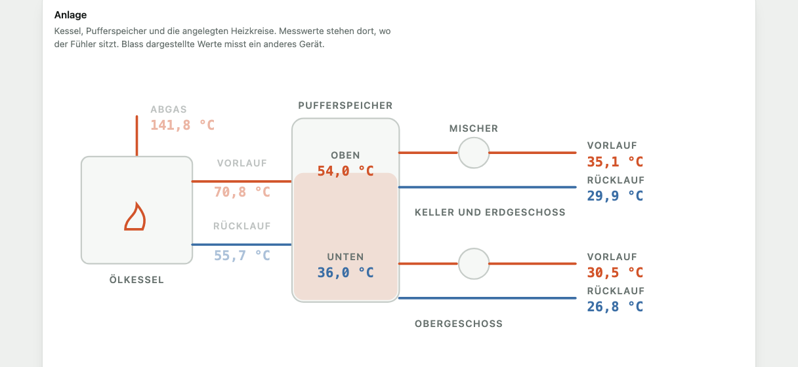

Der Kessel selbst wird **nicht** gesteuert, die Mischer ebenso wenig. Deren Regelungen bleiben
unangetastet. Die Firmware misst mit und schaltet ausschließlich die beiden Umwälzpumpen.

## Die Geräte

| Gerät | Aufgabe | Oberfläche |
|---|---|---|
| Verteilerplatine (je Etage eine) | Ventile fahren, Räume regeln | Übersicht, Räume, Kreise, Sensoren, System |
| Gerät am Kessel | Abgas sowie Vor- und Rücklauf messen, Brennerlauf erkennen | Übersicht, Fühler, Verlauf, System |
| Gerät am Pufferspeicher | Speicher und Heizkreise messen, Pumpen schalten | zusätzlich Heizkreise |
| Leitstand (M5Stack Core), wahlweise | Anlage anzeigen, Funkthermometer empfangen, Außentemperatur liefern; regelt nichts | Übersicht, Funk, Einstellungen, System |

Alle Geräte melden sich im Netz gegenseitig an und erscheinen in der Kopfzeile als Verweise. Ein
Klick öffnet die Oberfläche des anderen Geräts; bedient wird stets nur das gerade geöffnete.

Welche Aufgabe ein Heizungsgerät übernimmt, ergibt sich allein aus den zugeordneten Fühlern.
Beide tragen dieselbe Firmware.

## Erste Inbetriebnahme

### Firmware einspielen

Beide Firmwares liegen im selben Quelltextbestand und werden getrennt übersetzt:

```bash
. ~/esp/esp-idf-6.0.2/export.sh
idf.py -C apps/manifold   -p /dev/cu.usbserial-0001 flash    # Verteilerplatine
idf.py -C apps/heatsource -p /dev/cu.usbserial-0001 flash    # Heizungsgerät
```

Spätere Aktualisierungen laufen über die Weboberfläche (**System → Firmware**) oder direkt:

```bash
curl -X POST --data-binary @apps/manifold/build/floor-heating-ctrl.bin http://<adresse>/api/ota
```

Schlägt der Start einer neuen Fassung fehl, kehrt der Bootlader von selbst zur vorherigen
zurück. Bestätigt wird eine Fassung erst, wenn sie vollständig angelaufen ist.

### Ins WLAN bringen

1. Nach dem Einspielen findet das Gerät kein Netz und öffnet einen eigenen Zugangspunkt:
   `floor-heating-XXXX` beziehungsweise `heizung-XXXX`, Kennwort `fussboden`. Die vier Stellen
   sind die letzten beiden Bytes der MAC-Adresse.
2. Verbinden Sie sich damit. Das Einrichtungsfenster öffnet sich von selbst; andernfalls rufen
   Sie `http://192.168.4.1` auf. Der Zugangspunkt ist WPA2-verschlüsselt — manche Rechner
   brauchen zwei, drei Anläufe, bis die Verbindung steht, weil das Netz keinen Weg ins
   Internet hat.
3. **Netze suchen**, Ihr Netz wählen, Kennwort eintragen, speichern.

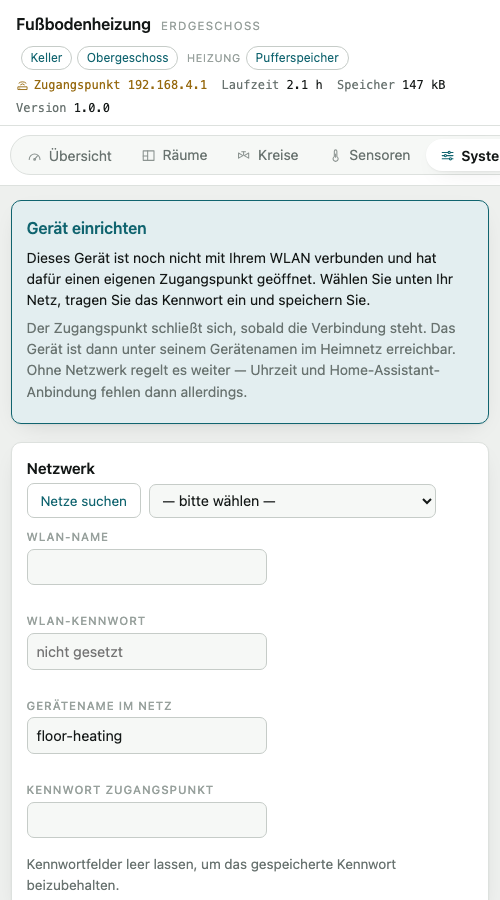

Das Gerät verbindet sich und ist danach unter seinem Gerätenamen erreichbar — im Auslieferungs
zustand `floor-heating.local` beziehungsweise `heizung.local`. Stehen mehrere Geräte im Netz,
vergeben Sie unter **System → Netzwerk** unterschiedliche Namen.

### Einrichtungsassistent

Beim ersten Aufruf führt ein Assistent durch die Grundeinrichtung. Er erscheint, solange keine
Bezeichnung eingetragen ist, und lässt sich später über **System** erneut öffnen.

Bei der Verteilerplatine: Aufgabe wählen, Etage benennen, Räume anlegen, je Raum ein Thermometer
wählen. Mit der Aufgabe **Nur Außenfühler** entfallen Räume und Thermometer; stattdessen wird der
Außenfühler gewählt (siehe [Funkbrücke](#funkbrücke-eine-platine-nur-für-den-empfang)).
Beim Heizungsgerät: Gerät benennen, Fühler zuordnen.

## Die Oberfläche

Die Oberfläche liegt im Gerät und lädt ohne Internetzugang. Sie kommt ohne Anmeldung aus und ist
für Telefon und Rechner gleichermaßen gedacht.

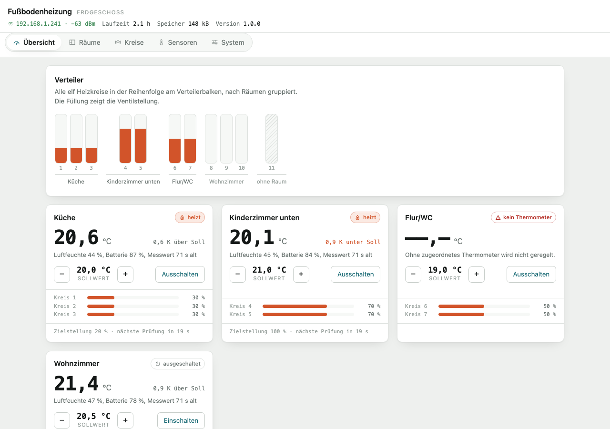

Der Verteilerbalken zeigt alle elf Kreise in der Reihenfolge am Verteiler, nach Räumen
gruppiert. Ein **gestrichelter** Kreis gehört zu keinem Raum: er wird nicht geregelt und fährt
nur von Hand. Ein **schraffierter** Kreis hat eine unbekannte Stellung — nach einem Neustart ohne
gespeicherte Stellung, bis er das erste Mal auf Anschlag gefahren ist.

**Kopfzeile.** Links die Bezeichnung des Geräts, daneben die übrigen Geräte im Haus. Darunter
Adresse, Empfangsstärke, Laufzeit, freier Speicher und Version.

**Reiter.** Wechseln die Ansicht. Die Adresszeile führt den Reiter mit (`…/#kreise`), sodass sich
eine Ansicht als Lesezeichen ablegen lässt.

**Farben.** Der Wärmeton steht ausschließlich für heiße Medien und für „läuft" — eine gefüllte
Ventilsäule, ein laufender Brenner, eine laufende Pumpe. Blau steht für Rückläufe, Petrol für
alles Bedienbare.

**Abfragetakt.** Die Oberfläche fragt den Zustand im Sekundentakt ab, solange etwas fährt, sonst
alle sechs Sekunden. Im Hintergrund liegende Fenster fragen nicht ab.

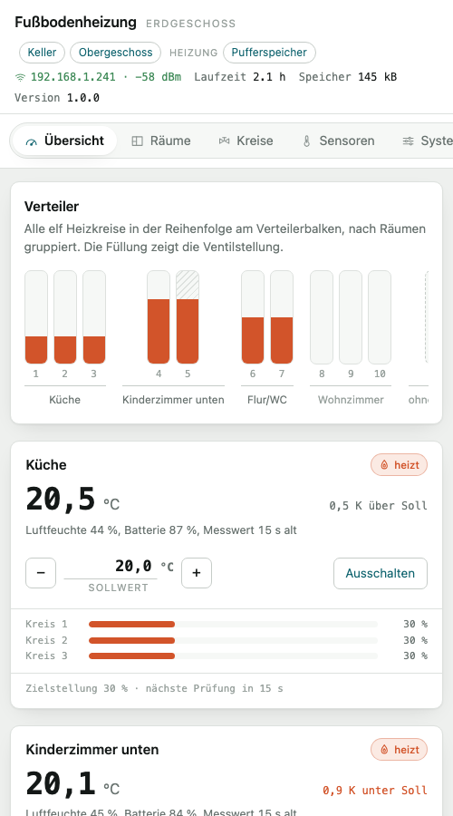

## Täglicher Betrieb

### Raum wärmer oder kälter

Auf der **Übersicht** trägt jeder Raum eine Karte mit Ist- und Solltemperatur. Den Sollwert
verstellen Sie über die Schaltflächen **−** und **+** in Schritten von 0,5 K oder durch
unmittelbare Eingabe der Zahl.

Die Ventilstellung folgt der Abweichung proportional: Am Sollwert steht der Kreis halb offen.
Liegt der Raum um das Proportionalband darunter — in der Vorgabe 1 K —, fährt er ganz auf, liegt
er um denselben Betrag darüber, ganz zu. Die Zeile unter den Kreisen nennt die Zielstellung und
wann die Regelung das nächste Mal prüft.

### Raum abschalten

**Ausschalten** fährt die Ventile dieses Raums zu. Für den Bedienenden heißt „aus", dass kein
warmes Wasser mehr durchgeht; ein Messwert wird dafür nicht gebraucht.

Etwas anderes ist ein Raum **ohne gültigen Messwert** — kein Thermometer zugeordnet oder die
Batterie leer. Dort setzt die Regelung aus und lässt die Ventile stehen, wo sie sind: Auf einen
fehlenden Wert zu regeln wäre schlechter.

**Kein Bedarf ohne Regelung.** Wärmebedarf meldet ein Verteiler nur für Kreise, die auch geregelt
werden — Raum eingeschaltet und Messwert vorhanden. Ein Ventil, das offen steht, weil es niemand
zufährt, ist kein Abnehmer; sonst ließe es die Umwälzpumpe im Sommer durchlaufen. Von Hand
geöffnete Ventile zählen weiterhin, das ist eine Absicht.

**Kreise ohne Raum fahren zu.** Ein Kreis, der keinem Raum zugeordnet ist, hat niemanden, der ihn
anfährt — nach dem ersten Start steht er sogar auf Anschlag offen, weil unbekannte Stellungen
einmal angefahren werden. Einmal in der Minute wird deshalb geprüft, ob ein solcher Kreis offen
steht, und er wird zugefahren. Wer einen Kreis absichtlich offen halten will, hält ihn über die
Handsteuerung; Handbetrieb, Messfahrt und Schutzfahrt bleiben unangetastet.

### Einen einzelnen Kreis von Hand fahren

Unter **Kreise** steht ganz oben die Handsteuerung. Wählen Sie den Kreis und fahren Sie mit
**Motor auf**, **Motor aus**, **Motor zu**.

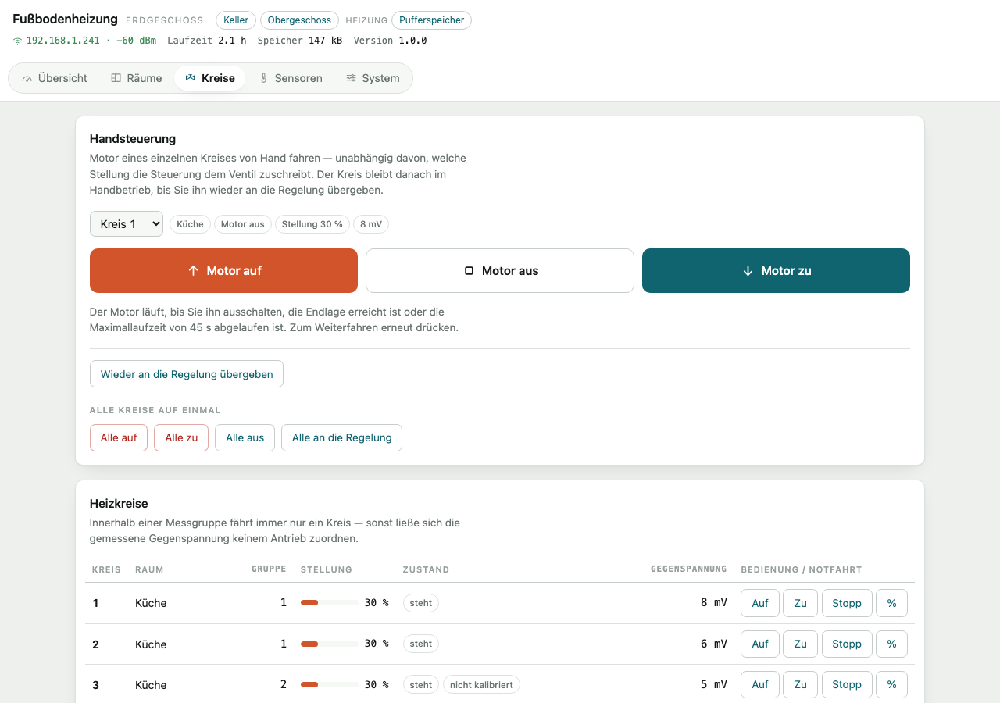

Die Handsteuerung wirkt **unabhängig von der Stellung, die die Firmware für richtig hält**. Das
ist der Notfall-Weg: Wenn die geschätzte Stellung nicht zur Wirklichkeit passt, fährt der Motor
trotzdem in die gewünschte Richtung, bis die Endlage erkannt wird oder die Maximallaufzeit
abläuft.

Ein von Hand gefahrener Kreis bleibt aus der Regelung genommen, bis Sie ihn mit **Wieder regeln**
freigeben. Die Übersicht weist das aus.

> **Betriebsregel:** Innerhalb einer Messgruppe fährt immer nur ein Kreis. Fordern Sie einen
> zweiten Kreis derselben Gruppe an, wartet er, bis der erste steht. Die Gruppen stehen unter
> **Kreise**.

### Pumpe von Hand

Auf dem Gerät am Pufferspeicher steht unter **Heizkreise** je Kreis ein Schalter mit drei
Stellungen:

| Stellung | Wirkung |
|---|---|
| **Automatik** | Die Pumpe folgt dem Bedarf der zugeordneten Verteiler |
| **Ein** | Die Pumpe läuft dauerhaft |
| **Aus** | Die Pumpe steht dauerhaft |

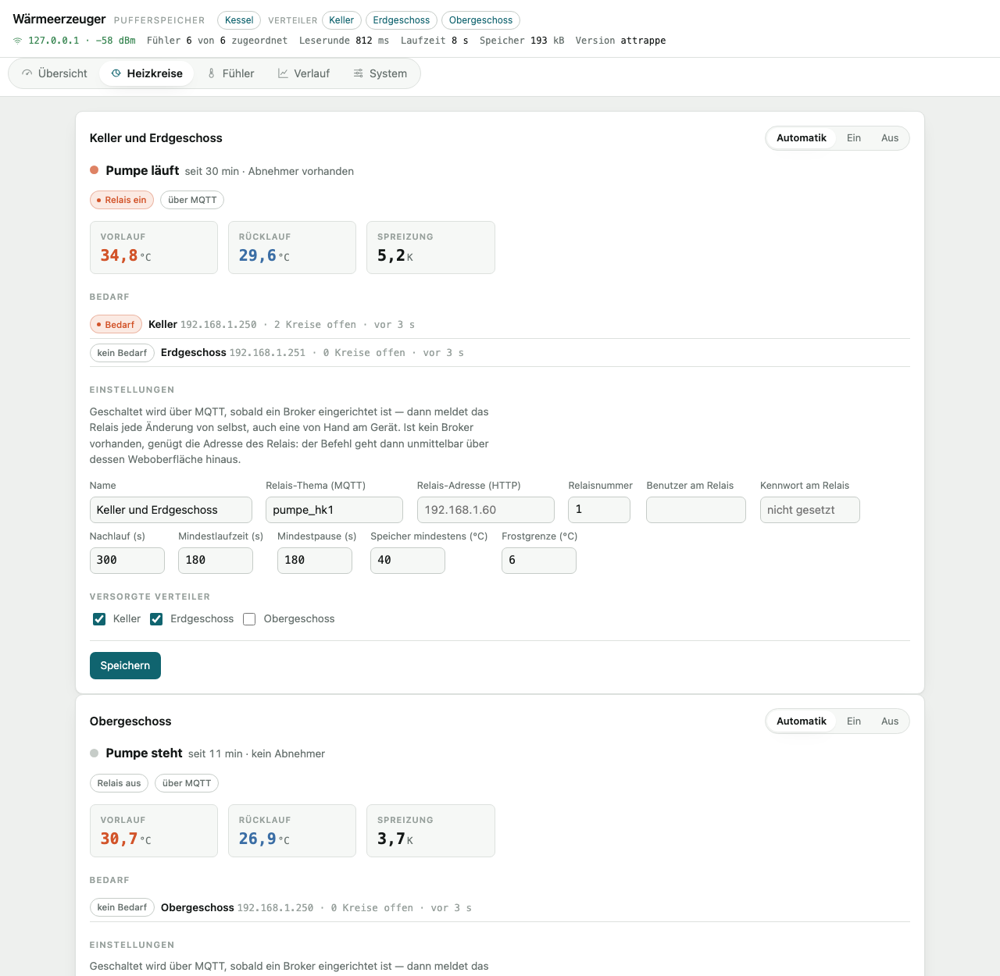

Der Wechsel wirkt sofort; Mindestlaufzeit und Mindestpause werden dabei übergangen. Der
Frostschutz geht auch der Stellung **Aus** vor: fällt eine Raumtemperatur unter die Frostgrenze,
läuft die Pumpe.

## Räume einrichten

Unter **Räume** legen Sie an, welche Heizkreise zu welchem Raum gehören und welches Thermometer
seine Temperatur liefert.

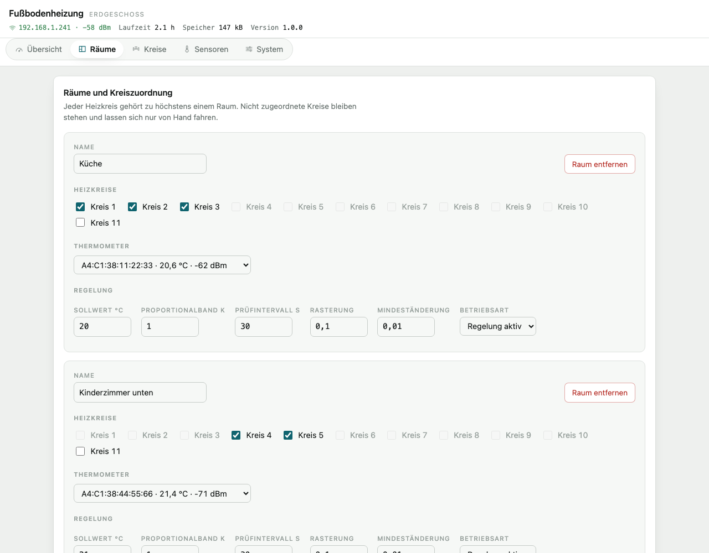

| Angabe | Bedeutung |
|---|---|
| Name | erscheint auf der Übersicht, am Gerät und in Home Assistant |
| Heizkreise | ein Kreis gehört zu höchstens einem Raum; Kreise ohne Raum werden zugefahren, siehe oben |
| Thermometer | eines der empfangenen Geräte, siehe unten |
| Sollwert | Zieltemperatur |
| Proportionalband | Abweichung vom Sollwert, bei der der Kreis ganz auf (darunter) oder ganz zu (darüber) steht; am Sollwert steht er halb offen. Vorgabe 1 K |
| Prüfintervall | wie oft die Regelung nachsteuert; Vorgabe 30 s |
| Rasterung | Schrittweite der Zielstellung; Vorgabe 0,1 |

**Ohne zugeordnetes Thermometer wird nicht geregelt.** Der Raum erscheint dann mit dem Hinweis
„kein Thermometer" und die Ventile bleiben stehen. Dasselbe gilt, wenn ein Messwert länger
ausbleibt als die eingestellte Zeitgrenze — die Regelung rechnet dann nicht mit einem veralteten
Wert weiter.

### Thermometer

Unter **Sensoren** stehen alle in Reichweite empfangenen Geräte: Xiaomi-Thermometer mit ATC- oder
pvvx-Firmware, RuuviTags und Thermometer, die BTHome senden. Sie senden ihre Messwerte als
Rundruf; das Gerät hört nur mit.

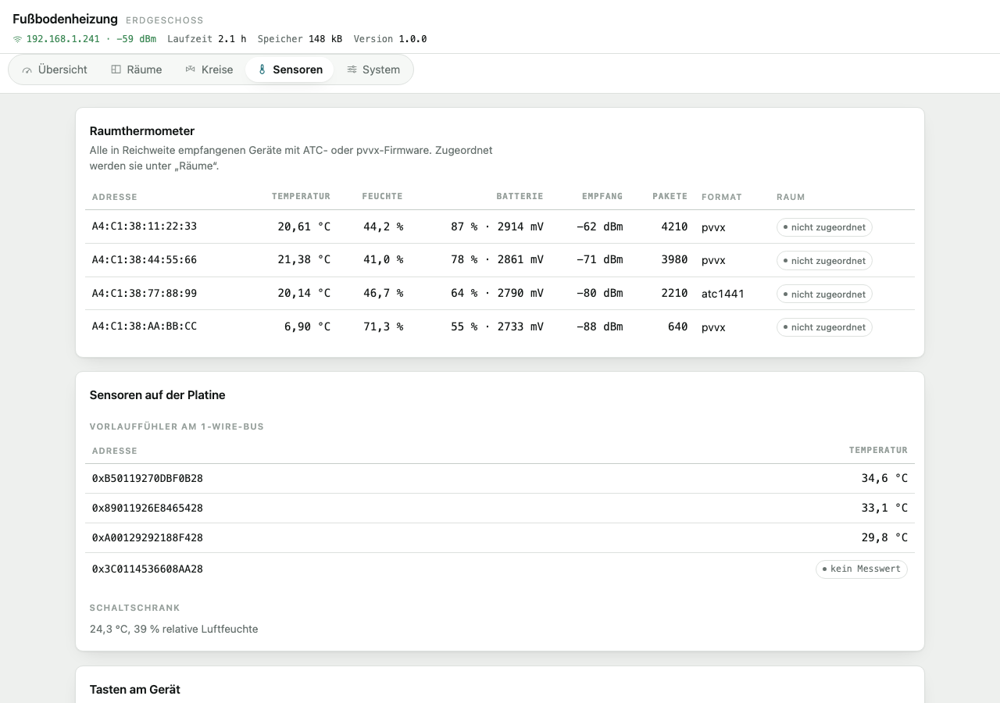

Trägt ein Thermometer einen Namen, steht er in der ersten Spalte über der Adresse. Bei der
pvvx-Firmware lässt sich der Name frei setzen, was die Zuordnung erheblich erleichtert. Die Namen
kommen erst auf Nachfrage vom Thermometer, deshalb erscheinen sie einige Sekunden nach dem
ersten Messwert.

#### Verschlüsselte Thermometer

Der Climate-Sat von camperSense sendet BTHome in Fassung 2 verschlüsselt mit AES-128-CCM. Jedes
Gerät hat einen eigenen Schlüssel aus 32 Hexadezimalziffern; die camperSense-App zeigt ihn beim
jeweiligen Sensor an. Ohne Schlüssel erscheint das Thermometer unter **Sensoren** mit Adresse und
Empfang, aber ohne Messwerte und mit dem Hinweis „Schlüssel fehlt".

Eingetragen wird der Schlüssel unter **Sensoren → Schlüssel verschlüsselter Thermometer**, in der
App unter **Geräte → Verteiler → Sensoren** durch Antippen des Thermometers. Leerzeichen und
Bindestriche in der Eingabe werden übergangen. Mit dem nächsten Rundruf, beim Climate-Sat nach
etwa zwei Sekunden, erscheinen die Werte; passt der Schlüssel nicht, steht dort „Schlüssel
falsch". Zugeordnet wird das Thermometer danach wie jedes andere, einem Raum oder als
Außenfühler.

- Ein Verteiler speichert bis zu 16 Schlüssel, in einem eigenen Speicherbereich und nicht in der
  Konfiguration. `GET /api/config` zeigt sie nicht, `GET /api/ble` nennt nur die Adressen, für die
  einer hinterlegt ist. Im Klartext stehen sie allein in der Sicherung.
- Jeder Rahmen trägt einen Zähler. Angenommen wird nur ein höherer als der zuletzt angenommene;
  ein aufgezeichneter und später erneut gesendeter Rahmen bleibt damit ohne Wirkung. Springt der
  Zähler zurück, etwa weil der Speicher des Satelliten gelöscht wurde, gilt er nach zehn Minuten
  ohne gültigen Rahmen wieder.
- Der Climate-Sat mit Lagesensor sendet abwechselnd einen Rahmen mit Temperatur und einen mit der
  Neigung. Der Verteiler übernimmt die Werte feldweise. Das Alter des Raummesswerts setzt nur ein
  Rahmen mit Temperatur zurück.
- Offen gesendetes BTHome, etwa von der pvvx-Firmware in dieser Betriebsart, braucht keinen
  Schlüssel.

## Heizkreise und Messfahrt

Unter **Kreise** stehen je Kreis die Fahrzeiten und die Auslöseschwelle der Endlagenerkennung.

Die Antriebe haben keine Endschalter. Die Endlage wird daran erkannt, dass der Motor am Anschlag
blockiert und die Spannung über dem Messwiderstand steigt. Wie hoch diese Spannung ausfällt und
wie lange ein Kreis von zu nach auf braucht, ist von Antrieb zu Antrieb verschieden.

### Messfahrt

Die Messfahrt ermittelt beides selbst. Sie fährt den Kreis einmal ganz zu und einmal ganz auf,
zeichnet die Spannung im 50-Millisekunden-Raster auf und leitet daraus Fahrzeiten und Schwelle
ab.

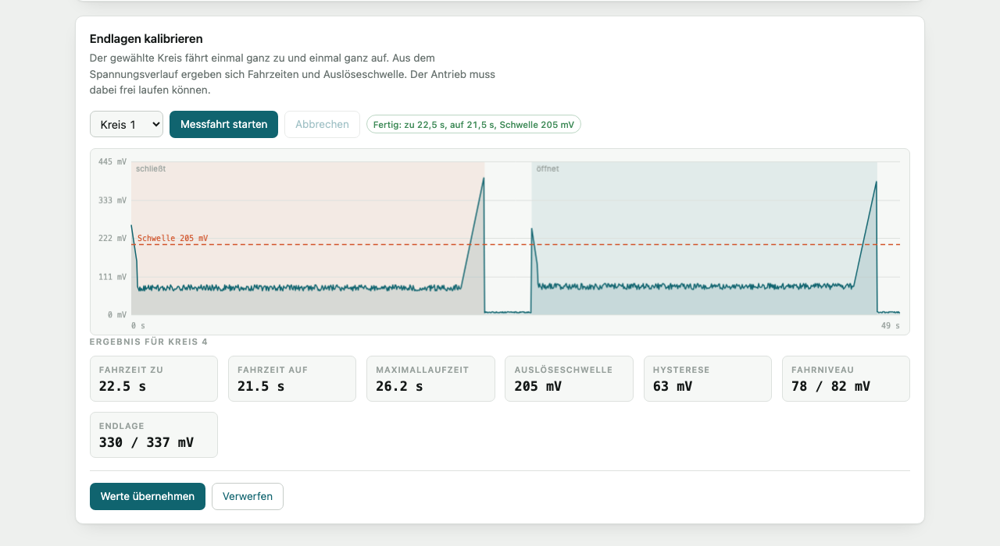

1. **Kreise** öffnen, beim gewünschten Kreis **Messfahrt starten**.
2. Der Verlauf wird währenddessen gezeichnet. Eine Fahrt dauert rund anderthalb Minuten.
3. Nach dem Ende stehen die Vorschläge unter dem Diagramm. **Übernehmen** schreibt sie in die
   Konfiguration, **Verwerfen** lässt alles beim Alten.

Während einer Messfahrt ist die Messgruppe des Kreises belegt; andere Kreise derselben Gruppe
warten.

> Die Messfahrt lohnt sich. An der bestehenden Anlage lagen die gemessenen Fahrzeiten
> durchgehend unter den zuvor fest eingestellten Werten — die Kreise waren damit systematisch
> anders eingestellt, als angenommen.

### Abstand zum Anschlag auf

Gewöhnliche Fahrten öffnen höchstens bis 92 % des Hubs; Ziele darüber werden auf 92 % begrenzt.
Ein ganz geöffneter Kreis steht deshalb bei 92 %. Die Fahrzeit auf aus der Messfahrt reicht bis
zum Anschlag auf. Dort fängt ein Steg am Zahnrad den Nippel des Stößels ab, und das
Blockiermoment des Getriebes geht in die Stößelführung — beim HmIP-VDMOT das Teil, das am
häufigsten bricht. Das Ventil steht vor dem Anschlag bereits ganz offen.

In den Anschlag auf fahren nur noch die Notfahrt (**Motor auf** in der Handsteuerung, **Auf** in
der Kreistabelle, **Alle auf**, MQTT `OPEN`) und die Messfahrt. In Richtung zu nimmt der
Ventilsitz den Druck auf.

### Entlastung nach dem Schließen

Zu fährt ein Kreis, bis der Motor am Ventilsitz blockiert. Die Spindel des Antriebs ist
selbsthemmend; nach dem Abschalten bliebe die volle Blockierkraft deshalb auf Ventilstift und
Dichtung stehen, im Sommer über Monate. Nach jeder Fahrt zu, die an der Endlage oder an der
Maximallaufzeit endet, fährt der Antrieb daher eine Sekunde wieder auf. Das sind bei rund 40 s
für den ganzen Hub etwa 0,1 mm, von denen das Spiel im Getriebe einen Teil aufnimmt. Die Kraft
ist danach weitgehend abgebaut, das Ventil bleibt geschlossen; die Feder des Ventils hält den
Stift am Stößel. Die Stellung bleibt bei 0 %, als Grund der letzten Fahrt bleibt „Endlage
erkannt“ beziehungsweise „Maximallaufzeit abgelaufen“ stehen.

Folgt auf eine Referenzfahrt unmittelbar eine Fahrt auf, entfällt die Entlastung. Bleibt ein
Raum nach dem Schließen spürbar warm, ist die Entlastung für dieses Ventil zu lang.

## Fühler des Heizungsgeräts zuordnen

Ein DS18B20 meldet sich mit seiner Werkskennung, nicht mit seiner Einbaulage. Unter **Fühler**
ordnen Sie jeder Kennung ihre Rolle zu.

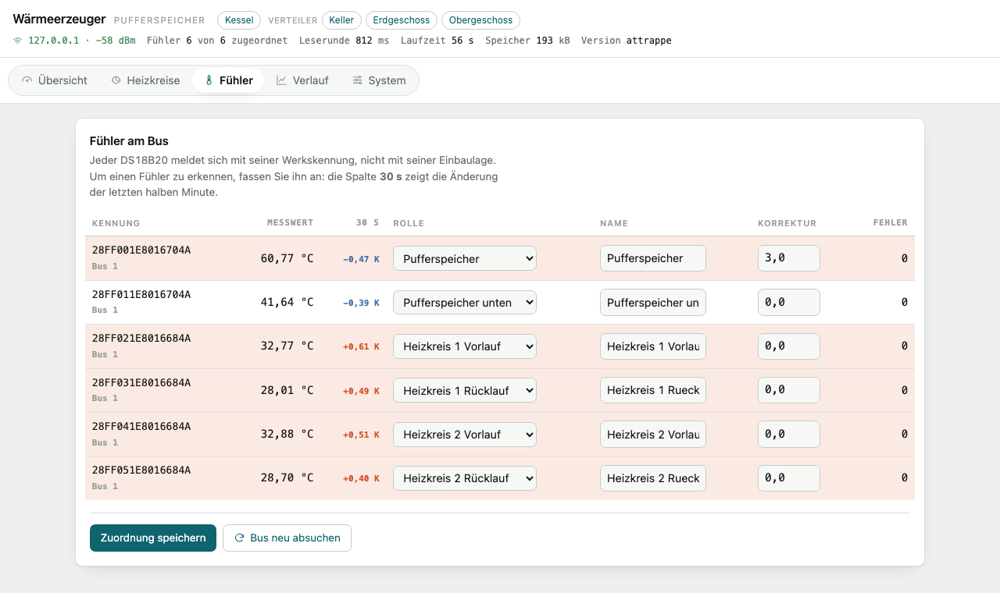

**So finden Sie den richtigen:** Fassen Sie einen Fühler mit der Hand an. Die Spalte **30 s**
zeigt die Änderung der letzten halben Minute; die betroffene Zeile hebt sich sichtbar hervor.
Ordnen Sie ihn dann zu und speichern Sie.

| Rolle | Wo der Fühler sitzt |
|---|---|
| `abgas` | außen am Abgasrohr des Kessels |
| `kessel_vl`, `kessel_rl` | Vor- und Rücklauf des Kessels |
| `puffer` | Pufferspeicher |
| `puffer_unten` | unterer Bereich des Speichers, sofern vorhanden |
| `hk<n>_vl`, `hk<n>_rl` | Vor- und Rücklauf des Heizkreises n, hinter dem Mischer |
| `aussen` | Außentemperatur; kommt vom RuuviTag an der Verteilerplatine und lässt sich hier nicht zuordnen |

**Korrekturwert.** Sitzt ein Fühler nicht ganz an der richtigen Stelle, tragen Sie die Abweichung
in Kelvin ein; sie wird auf jeden Messwert addiert. Anzumerken ist, dass ein fester Korrekturwert
eine Abweichung nur an einem Betriebspunkt ausgleicht: bei einem geschichteten Speicher ändert
sich der Fehler mit dem Ladezustand.

**Fehlerzähler.** Die letzte Spalte zählt verworfene Messungen. Der Wert 85,0 °C ist der
Einschaltwert eines DS18B20 nach einem Spannungseinbruch, −127 °C zeigt eine unterbrochene
Leitung an. Beide werden verworfen; steigt der Zähler stetig, stimmt etwas mit der Verkabelung
nicht.

### Anschluss des Busses

Der 1-Wire-Bus hängt an einem frei wählbaren Anschluss und braucht einen Anschlusswiderstand
**nach 3,3 V** — einen je Bus, am Gerät, nicht am Fühler.

| Leitungslänge | Widerstand | Kabel |
|---|---|---|
| bis etwa 10 m | 4,7 kΩ | beliebig |
| 10 bis 50 m | 2,2 bis 3,3 kΩ | verdrillt, DQ mit GND als Paar |
| darüber | eigener 1-Wire-Treiber vorsehen | verdrillt und geschirmt |

Bei langer Leitung begrenzt nicht der Spannungsabfall, sondern die Kapazität der Leitung: Sie
macht die steigende Flanke träge. Dagegen hilft ein kleinerer Widerstand, keine höhere Spannung.
Drei Fühler ziehen zusammen rund 4,5 mA; auf 30 m Alarmkabel sind das etwa 20 mV Abfall.

Die Fühler werden mit **3,3 V** versorgt, nicht mit 5 V. Der Anschluss des ESP32 verträgt
höchstens 3,6 V, und mit 5 V am Fühler steigt dessen Erkennungsschwelle über den Pegel, den ein
Widerstand nach 3,3 V erzeugt — die Kombination aus 5 V am Fühler und 3,3 V am Widerstand
schweigt deshalb, und die umgekehrte belastet den Anschluss über seinen Grenzwert.

Versorgt werden die Fühler regulär über VDD, nicht parasitär: Die Firmware startet die Messung
mit einem Sammelbefehl an alle Fühler zugleich, und dafür reicht der Strom aus der Datenleitung
nicht. Die Wahl steht im Einrichtungsassistenten und später unter
**System → 1-Wire-Bus**; eine Änderung wirkt sofort, ein Neustart ist nicht nötig.

| Anschluss | Geeignet |
|---|---|
| 13, 14, 16 bis 19, 21 bis 23, 25 bis 27, 32, 33 | ja — freie Anschlüsse ohne Sonderaufgabe |
| 6 bis 11 | nein, sie gehören zum Flash-Speicher |
| 34 bis 39 | nein, nur als Eingang ausgelegt und damit nicht treibfähig |
| 1 und 3 | nein, das ist die serielle Schnittstelle |
| 12 | nein, entscheidet beim Start über die Flash-Spannung; der Anschlusswiderstand verhindert den Start |
| 0, 2, 15 | möglich, aber ungünstig — sie werden beim Start ausgewertet |

Die Firmware lehnt die ungeeigneten Anschlüsse mit Begründung ab. Im Assistenten zeigt die
Seite laufend, wie viele Fühler sich am eingetragenen Anschluss melden; nach dem Umstellen
dauert es bis zu einer Minute, bis der Bus neu abgesucht ist.

## Pumpen einrichten

Auf dem Gerät am Pufferspeicher legen Sie unter **Heizkreise** an, welche Verteiler ein Kreis
versorgt und über welches Relais seine Pumpe geschaltet wird. Vorgesehen sind bis zu vier Kreise.

Die Schaltfläche **Heizkreis anlegen** steht am Ende der Seite und nennt, wie viele Kreise
bereits angelegt sind. Jeder neue Kreis bekommt die nächste freie Kennung und damit die
Fühlerrollen „Vorlauf Heizkreis n" und „Rücklauf Heizkreis n"; ordnen Sie ihm anschließend unter
**Fühler** die beiden Messstellen zu. Über **Heizkreis löschen** am Fuß einer Karte entfällt ein
Kreis wieder. Seine Pumpe wird dabei einmal abgeschaltet — sonst liefe sie weiter, ohne dass sie
noch jemand steuert. Die zugeordneten Fühler bleiben stehen, die übrigen Kreise behalten ihre
Kennung und ihre Einstellungen.

| Angabe | Bedeutung |
|---|---|
| Name | erscheint in der Oberfläche und in Home Assistant |
| Relais-Thema (MQTT) | Tasmota-Thema, etwa `pumpe_hk1` |
| Relais-Adresse (HTTP) | Adresse des Relais, falls kein Broker vorhanden ist |
| Relaisnummer | 1 bis 8, bei mehrkanaligen Geräten |
| Benutzer, Kennwort | nur wenn das Relais eine Anmeldung verlangt |
| Nachlauf | wie lange die Pumpe nach dem letzten Bedarf weiterläuft; Vorgabe 300 s |
| Mindestlaufzeit, Mindestpause | verhindern kurzes Takten; je 180 s |
| Speicher mindestens | darunter bringt Umwälzen nichts; Vorgabe 40 °C |
| Frostgrenze | darunter läuft die Pumpe in jedem Fall; Vorgabe 6 °C |
| Versorgte Verteiler | welche Platinen den Bedarf dieses Kreises melden |

**Zu den beiden Wegen.** Ist ein Broker eingerichtet und die Verbindung steht, geht der Befehl
über MQTT — dann meldet das Relais jede Änderung von selbst, auch eine von Hand am Gerät. Sonst
genügt die Adresse: der Befehl geht unmittelbar an die Schnittstelle `/cm` des Relais. Zwischen
zwei Aufrufen bleibt eine Änderung am Relais dabei unbemerkt, deshalb wird der Sollzustand alle
sechzig Sekunden nachgesendet. Die Oberfläche weist aus, welcher Weg gerade gilt.

**Warum „Speicher mindestens" hoch liegt.** Der Mischer kann nur herunterregeln. Fällt der
Speicher unter die benötigte Vorlauftemperatur, öffnet der Mischer vollständig und der Kreis
bekommt trotzdem zu wenig. Der Wert gehört deshalb **über** die höchste benötigte
Fußbodenvorlauftemperatur, nicht knapp über Raumtemperatur.

### Was bei einer Störung geschieht

| Fall | Verhalten |
|---|---|
| Ein zugeordneter Verteiler antwortet nicht mehr | Bedarf gilt als vorhanden, die Pumpe läuft; die Oberfläche meldet „Verteiler antwortet nicht" |
| Ein Verteiler hat seit dem Start nie geantwortet | Er wird nicht gewertet — sonst liefe die Pumpe wegen eines abgeschalteten Geräts durchgehend |
| Ein offenes Ventil gehört zu einem Raum ohne Messwert | Es zählt nicht als Bedarf; die Meldung des Verteilers weist es getrennt aus („ohne Regelung") |
| Ein Ventil gehört zu keinem Raum | Es zählt nicht als Bedarf und wird zugefahren |
| Diese Steuerung fällt ganz aus | Am Relais sorgt eine Regel dafür, dass die Pumpe von selbst anläuft (siehe unten) |
| Die Rückmeldung weicht länger als 30 s vom Sollwert ab | „Relais folgt nicht" |
| Das Relais nimmt keine Verbindung an | Es gilt als stromlos: Die vorgeschaltete Regelung hat den Pumpenausgang abgeschaltet (siehe unten). Die Pumpe gilt als stehend, keine Störung; die Vertauschungsprüfung ruht |
| Das Relais ist stromlos, die Steuerung will die Pumpe aber laufen lassen | „vorgeschaltete Regelung gibt die Pumpe nicht frei"; die App meldet es nach einer Stunde als Hinweis |
| Die Pumpe läuft, im Kreis fließt aber kaum Wasser | Die App meldet nach einer halben Stunde „Die Pumpe läuft, die Wärme kommt nicht an“, siehe unten |

**Kein Durchfluss trotz laufender Pumpe.** Steckt Luft in der Leitung, dreht die Pumpe, ohne
Wasser in das obere Geschoss zu fördern; die Fühler am Heizungsgerät zeigen dann nur, was sich
nahe am Mischer erwärmt. Die App erkennt das auf zwei Wegen. Trägt einer der versorgten Verteiler
einen Fühler am 1-Wire-Bus, gilt dessen wärmster Wert als Vorlauf am Verteiler: Liegt der Vorlauf
am Heizungsgerät mindestens 10 K darüber, kommt nichts an (Warnung). Ohne solchen Fühler bleibt
ein Hinweis: Rücklauf mindestens 14 K über dem Mittel der beheizten Räume bei höchstens 6 K
Spreizung. Mit Durchfluss kühlt das Wasser in den Schleifen deutlich stärker ab; an dieser Anlage
lag der Rücklauf dann 6 bis 8 K über den Räumen, mit Luft in der Leitung 16 K. Beide Meldungen
erscheinen erst, wenn der Zustand eine halbe Stunde anhält, und nur, solange Vorlauf mindestens
10 K über den Räumen liegt. Ein Fühler am Vorlauf jedes Verteilers macht die Prüfung eindeutig.

Häufigste Ursache ist zu niedriger Anlagendruck: Am höchsten Punkt müssen mindestens 0,3 bis
0,5 bar anliegen, am Kessel also je Meter Höhe 0,1 bar mehr. Reicht er nicht, saugt ein geöffneter
Entlüfter Luft an, statt sie abzulassen. Entlüftet wird deshalb nur bei warmer Anlage und
ausreichendem Druck.

**Absicherung am Relais.** Das Gerät sendet alle sechzig Sekunden ein Lebenszeichen. Hinterlegen
Sie am Tasmota-Relais folgende Einstellungen, damit die Pumpe bei einem Ausfall dieser Steuerung
von selbst anläuft:

```
PowerOnState 1
Rule1 ON Var1#State DO RuleTimer1 900 ENDON ON Rules#Timer=1 DO Power1 1 ENDON
Rule1 1
```

Bleibt das Lebenszeichen aus, schaltet das Relais nach einer Viertelstunde ein. Eine laufende
Pumpe gegen geschlossene Ventile ist verschwenderisch, aber unschädlich; eine stehende Pumpe bei
Wärmebedarf ist es nicht.

**Relais hinter einer vorgeschalteten Regelung.** Häufig bleibt die bisherige Regelung im Spiel:
Das Tasmota-Relais hängt am Pumpenausgang der Kesselregelung (Heizkreise) oder des Heliomaten
(Ladepumpe), und die Pumpe läuft nur, wenn beide sie wollen. Schaltet die vorgeschaltete Regelung
ab, hat das Relais keinen Strom und verschwindet aus dem Netz. Das Heizungsgerät wertet eine
fehlende Verbindung deshalb nicht als Störung, sondern als **stromlos**: Die Pumpe gilt als
stehend, die Oberfläche zeigt „Relais ohne Strom“ mit der Dauer, und eine Abweichung zwischen
Sollzustand und letzter Rückmeldung wird in dieser Zeit nicht gemeldet. Bekommt das Relais wieder
Strom, erhält es binnen zehn Sekunden den Sollzustand. Antwortet es dagegen mit einem falschen
Status, steht die Verbindung, und es bleibt eine Störung.

Damit eine Pumpe sofort läuft, sobald die vorgeschaltete Regelung Strom gibt, gehört an jedes
solche Relais `PowerOnState 1`; die Steuerung schaltet sie gegebenenfalls kurz danach ab. An der
Kesselkreispumpe ist das wichtig: Startet das Relais dort ausgeschaltet, heizt der Kessel ohne
Abfuhr, bis die Brennererkennung anspricht.

Will die Steuerung eine Pumpe laufen lassen, während ihr Relais stromlos ist, gilt der Kreis als
**gesperrt**, etwa in der Nachtabsenkung der Kesselregelung. Soll diese Steuerung allein über die
Heizkreispumpen entscheiden, gehören deren Ausgänge an der Kesselregelung auf Dauerbetrieb.

## Brenner und Pufferspeicher

Sind die entsprechenden Fühler zugeordnet, erscheinen auf der **Übersicht** zwei weitere Karten.

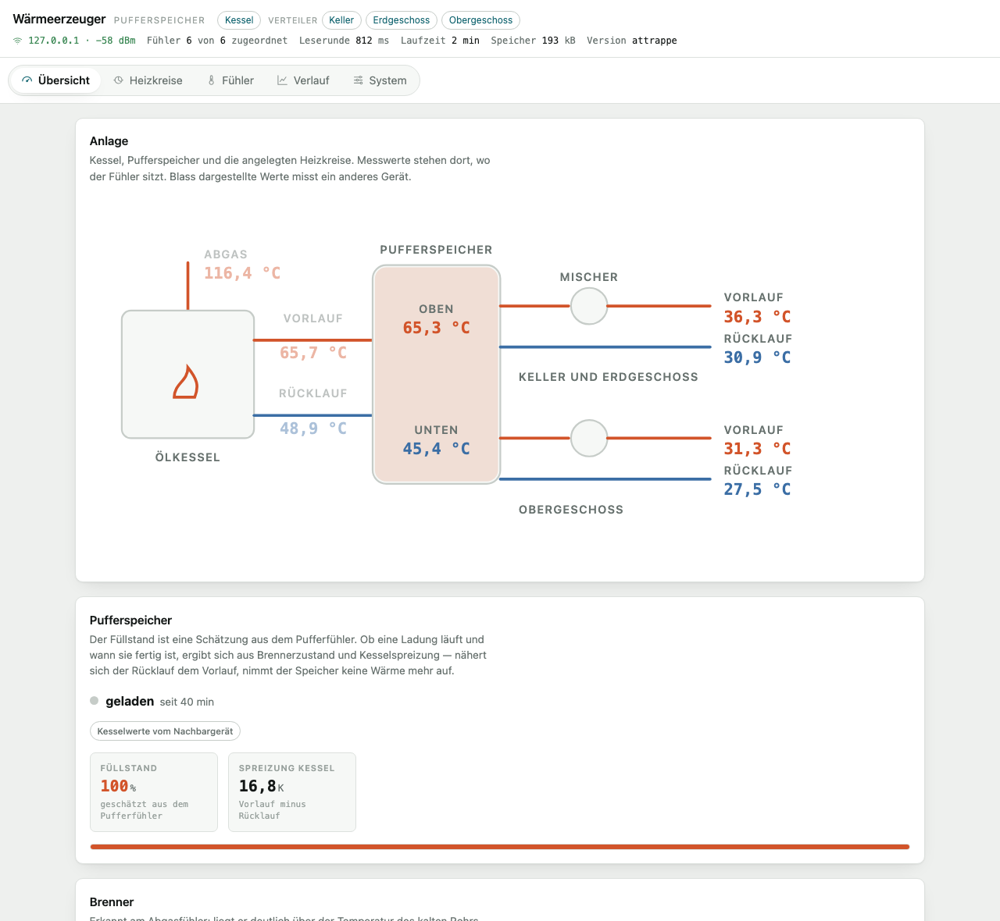

### Brenner

Erkannt wird am Abgasfühler. Ein fester Schwellwert wäre von der Raumtemperatur des Heizungsraums
abhängig — im Sommer stünde er zu tief, im Winter zu hoch. Gemessen wird deshalb gegen eine
gleitende Bezugslinie: das Minimum der letzten 24 Stunden, also die Temperatur des kalten Rohrs.

| Angabe | Vorgabe | Bedeutung |
|---|---|---|
| Einschaltschwelle | 12 K | so weit über dem kalten Rohr gilt der Brenner als laufend |
| Ausschaltschwelle | 6 K | darunter als aus |
| Haltezeit ein | 60 s | so lange muss die Bedingung anhalten |
| Haltezeit aus | 300 s | länger, damit kurzes Abkühlen den Lauf nicht beendet |
| Düsendurchsatz | 2,2 l/h | Grundlage der Verbrauchsschätzung — **siehe unten** |

Laufzeit und Starts des Tages überdauern einen Neustart. Häufige kurze Starts bei geringer
Gesamtlaufzeit werden als **Taktbetrieb** ausgewiesen — der Kessel geht dann öfter an, als er
Wärme abgibt.

**Der Ölverbrauch ist eine Schätzung**, keine Messung: Laufzeit mal Düsendurchsatz. Die Laufzeit
ist gemessen, der Durchsatz nicht — der Vorgabewert von 2,2 l/h ist ein plausibler Wert für eine
kleine Öldüse (rund 0,60 gph), er stammt nicht von Ihrer Anlage. Alle Literangaben in Tages- und
Ladungsprotokoll sowie in der Verbrauchslinie sind ihm unmittelbar proportional:

| Düse | Verbrauch an einem Tag mit 45 min Laufzeit |
|---|---|
| 1,60 l/h | 1,20 l |
| 1,89 l/h (0,50 gph) | 1,42 l |
| 2,20 l/h (Vorgabe) | 1,65 l |
| 2,65 l/h (0,70 gph) | 1,99 l |
| 3,00 l/h | 2,25 l |

Zwei Wege zum richtigen Wert. **Ablesen:** Die Größe steht auf der Düse selbst und meist in den
Unterlagen des Brenners, in gph — 0,50 gph sind 1,89 l/h, 0,60 gph sind 2,27 l/h. Das ist der
Nenndurchsatz bei Prüfdruck; weicht der eingestellte Pumpendruck davon ab, verschiebt sich der
Wert. **Messen:** Lesen Sie den Tankfüllstand zweimal im Abstand einiger Monate ab und teilen Sie
die verbrauchte Menge durch die summierte Brennerlaufzeit aus dem Tagesprotokoll. Das ergibt den
tatsächlichen Durchsatz einschließlich Pumpendruck und Düsenverschleiß — und macht aus der
Schätzung rückwirkend eine Messung.

### Ladezustand

Der Füllstand ist eine lineare Schätzung aus dem Pufferfühler zwischen den Werten für „leer" und
„voll". Ob eine Ladung läuft und wann sie fertig ist, ergibt sich aus zwei Beobachtungen:

- Während der Ladung ist der Kesselrücklauf kalt. Nähert er sich dem Vorlauf und bleibt fünf
  Minuten dort, nimmt der Speicher keine Wärme mehr auf.
- Schaltet der Brenner bei hohem Vorlauf von selbst ab, hat die eigene Regelung des Kessels die
  Ladung für beendet erklärt.

Stehen Kessel und Speicher an verschiedenen Geräten, holt sich das Gerät am Speicher die
Kesselwerte vom Nachbargerät. Bleiben sie aus, fällt die Beurteilung auf den Pufferfühler allein
zurück und meldet das als **„nur Schätzung, Kesselwerte fehlen"**.

Fällt der Pufferwert unter die Warnschwelle, erscheint **„Warmwasserreserve knapp"**. Da das
Trinkwasser im Durchlauf erwärmt wird, ist das der praktisch spürbare Grenzfall.

> Die Vorgabewerte (8 K Spreizung, 62 °C voll, 35 °C leer, Warnung unter 40 °C) sind Annahmen.
> Ziehen Sie sie nach der ersten aufgezeichneten Ladung nach.

### Außenfühler

Ein RuuviTag oder ein Thermometer mit BTHome, etwa der Climate-Sat von camperSense, kann als
Außenfühler dienen. Er gehört zu keinem Raum: Seine Temperatur geht in keine Ventilstellung ein,
sondern wird aufgezeichnet und an die Heizungsgeräte weitergereicht, damit sich Verbrauch und
Wetterlage später gegenüberstellen lassen.

Zugeordnet wird er an einer Verteilerplatine unter **Sensoren → Außenfühler** oder am
[Leitstand](#leitstand) unter **Funk**. Die Temperatur steht danach in der Kopfzeile, in Home
Assistant und im Verlauf der Heizungsgeräte. Ein RuuviTag liefert zusätzlich Luftfeuchtigkeit und
Luftdruck.

Warum an der Verteilerplatine und nicht am Heizungsgerät: Die Heizungsgeräte haben kein
Bluetooth — dort sitzen die Fühler am 1-Wire-Bus. Die Verteilerplatinen hören ohnehin mit, weil
sie die Raumthermometer empfangen.

Jedes Heizungsgerät holt sich den Wert einmal je Minute selbst: zuerst beim Leitstand, sonst bei
der ersten Verteilerplatine, die einen liefert. Es genügt also **ein** Gerät im Haus mit
Außenfühler, und eine Verteilerplatine muss dafür keinem Heizkreis zugeordnet sein. Unter
**Anlage** steht, von welchem Gerät der Wert kommt. Eine Außentemperatur ist eine Größe des
Hauses, keine eines Heizkreises. Heizungsgeräte bis 0.4.0 kennen den Leitstand noch nicht und
fragen nur die Verteilerplatinen.

Bleibt das Thermometer länger als eine Viertelstunde stumm, gilt sein Wert als veraltet und wird
nicht mehr weitergegeben — sonst schriebe eine leere Batterie eine eingefrorene Temperatur in
die Heizgradtage, ohne dass es auffiele. Die Verteilerplatine zeigt dann **kein Messwert** statt
des letzten Werts.

Unter den Verteilerplatinen sollte **nur eine** einen Außenfühler tragen. Melden zwei einen Wert,
nimmt das Heizungsgerät den zuletzt eingegangenen; die Temperatur wechselte dann zwischen zwei
Quellen. Ein Leitstand geht den Verteilerplatinen vor, solange sein Wert frisch ist; eine
Verteilerplatine mit Außenfühler bleibt dann Ersatz für den Fall, dass er ausfällt.

#### Funkbrücke: eine Platine nur für den Empfang

Steht das Thermometer außerhalb der Reichweite aller Verteilerplatinen, etwa am Kessel, genügt
eine weitere Platine mit der Verteiler-Firmware in seiner Nähe. Mit einem [Leitstand](#leitstand)
entfällt sie: Er empfängt die Thermometer selbst. Sie braucht keine Ventile, keine
Räume und keinen Heizkreis: Ein handelsüblicher ESP32 reicht, die Firmware kommt über den
Web-Flasher darauf.

1. Firmware aufspielen, das Gerät über seinen Einrichtungs-Zugangspunkt ins WLAN bringen.
2. Im Einrichtungsassistenten die Aufgabe **Nur Außenfühler** wählen und dem Gerät einen Ort
   geben, etwa „Funkbrücke Kessel“. Ein bereits eingerichtetes Gerät wird über
   **System → Einrichtung erneut durchlaufen** umgestellt; seine Räume entfallen dabei.
3. Im zweiten Schritt das Thermometer als Außenfühler wählen. Sendet es verschlüsselt, zuerst
   unter **Sensoren** den Schlüssel hinterlegen.
4. Den Außenfühler an der bisherigen Platine abmelden, damit nur eine Quelle meldet.

In dieser Betriebsart rührt die Platine keinen Kanal an: keine Schutzfahrt, kein Anfahren
unbekannter Stellungen, keine Messfahrt, keine Fahrbefehle. Die Oberfläche zeigt statt Räumen und
Kreisen den Außenfühler, die Anzeige am Gerät seine Temperatur, und Home Assistant erhält keine
Ventile. `GET /api/state` meldet unter `device.function` den Wert `outdoor`, sonst `valves`.

Die Heizungsgeräte finden die Brücke über mDNS und holen den Wert wie von jeder anderen Platine.
Ohne Räume meldet sie keinen Wärmebedarf, braucht keinen Heizkreis, und die App führt sie nicht
unter den Räumen. Ein Leitstand, der das Thermometer selbst nicht empfängt, übernimmt den Wert
der Brücke, siehe [Funkthermometer und Außenfühler](#funkthermometer-und-außenfühler).

### Brennerzustand am Pufferspeicher

Das Gerät am Pufferspeicher hat keinen Abgasfühler — der sitzt am Kessel. Es zeigt den
Brennerzustand trotzdem an, mit der Marke **vom Gerät am Kessel**, sobald jenes im Netz ist.
Laufzeit, Starts und Verbrauch bleiben dort, wo gemessen wird; hier steht nur, ob der Brenner
gerade läuft. Danach richten sich Ladezustand und Aufzeichnung.

Ohne erreichbares Gerät am Kessel steht dort **kein Abgasfühler**, und die Aufzeichnung weicht
auf die Speichertemperatur aus.

### Einstellungen im Einzelnen

Alle Werte stehen in der Oberfläche des jeweiligen Heizungsgeräts. Was hier nicht steht, ist
entweder eine Messung oder eine Angabe zur Verdrahtung.

**Brenner** (Karte *Brenner*, Bereich Übersicht)

| Feld | Vorgabe | Bedeutung |
|---|---|---|
| Ein ab (K über der Linie) | 12 K | So weit muss das Abgas über der Bezugslinie liegen, damit ein Anlauf erkannt wird. Zu klein: Ein warmer Aufstellraum löst aus. Zu groß: Ein kurzer Start bleibt unbemerkt. |
| Aus unter (K) | 6 K | Fällt das Abgas so weit an die Bezugslinie heran, gilt der Brenner als aus. Greift nur bei kaltem Kessel; bei warmem entscheidet der Ausschlag. |
| Ausschlag (K) | 6 K | Fällt das Abgas so weit unter den Höchstwert der laufenden Fahrt, ist der Brenner aus; steigt es danach so weit über den Tiefstwert, läuft er wieder. Dies ist das eigentliche Kriterium — die Bezugslinie beschreibt das kalte Rohr und versagt, solange der Kessel warm ist. Zu klein: Ein Messrauschen beendet die Fahrt. Zu groß: Kurze Takte verschmelzen zu einer Fahrt. |
| Haltezeit ein | 60 s | So lange muss die Einschaltbedingung anliegen. |
| Haltezeit aus | 300 s | Länger, damit kurzes Abkühlen den Lauf nicht beendet. |
| Düsendurchsatz | 2,2 l/h | Siehe oben — der einzige Wert, den Sie an Ihrer Anlage nachschlagen sollten. |

**Pufferspeicher** (Karte *Pufferspeicher*)

| Feld | Vorgabe | Bedeutung |
|---|---|---|
| Speicherinhalt | 0 l | Nur zum Umrechnen entnommener Kelvin in Kilowattstunden. 0 lässt die Angabe in Kelvin stehen. Grob abzuschätzen aus einer Ladung: gelieferte Wärme geteilt durch den Temperaturhub des Speichers, beides steht im Ladungsprotokoll. |
| Zapfung ab Einbruch | 2,0 K | So steil muss der Speicher fallen, damit es als Warmwasserzapfung gilt. Der Stillstandsverlust schafft im Vorgabefenster rund 0,2 K, ein Vollbad 6,5 K. |
| im Fenster | 900 s | Zeitfenster, über das der Einbruch gemessen wird. |
| Leer bei | 35 °C | Nullpunkt des Füllstands: die Temperatur, bei welcher der Kessel von sich aus anläuft. Wird selbst nachgemessen, sofern eingeschaltet. |
| Voll bei | 62 °C | Hundert Prozent. Sinnvoll ist der Wert, den der Speicher am Ende einer Ladung tatsächlich erreicht — er steht nach jeder Ladung im Ladungsprotokoll. **Auf beiden Heizungsgeräten gleich eintragen**, sonst zeigen sie verschiedene Füllstände für denselben Speicher. |
| Leerpunkt selbst nachmessen | ein | Beim Anlaufen des Brenners wird der Nullpunkt zu 40 Prozent an den gemessenen Wert herangeführt. |
| Nachmessen ab Abfall | 3 K | So weit muss der Speicher seit seinem Höchststand gefallen sein, damit ein Brennerstart als Messpunkt zählt. Verhindert, dass taktender Betrieb den Nullpunkt nach oben zieht. |
| Spreizung „voll" | 8 K | Nähert sich der Kesselrücklauf dem Vorlauf so weit an, nimmt der Speicher keine Wärme mehr auf. |
| Haltezeit | 300 s | So lange muss das anliegen. |
| Vorlauf gilt als heiß ab | 60 °C | Zusatzbedingung für „voll" und für die Frage, ob ein Abschalten des Brenners eine fertige Ladung war. Ohne sie gälte der kalte Anlauf als fertige Ladung — dort liegen Vor- und Rücklauf ebenfalls dicht beieinander, weil beide kalt sind. |
| Warnung Warmwasser | 40 °C | Darunter wird die Warmwasserreserve als knapp gemeldet. |

**Zeit und Neustart** (Bereich System)

| Feld | Vorgabe | Bedeutung |
|---|---|---|
| Zeitzone | `CET-1CEST,M3.5.0,M10.5.0/3` | Bestimmt, wann ein Tag im Protokoll endet und wann Termine fallen. |
| Neustart Stunde / Minute | −1 | Täglicher Neustart; −1 schaltet ihn ab. Er wird verschoben, solange eine Pumpe in einer Mindestlaufzeit steht. |
| Abfrage alle | 5 s | Wie oft die Verteiler nach Wärmebedarf gefragt werden. |
| Zeitgrenze | 180 s | Ab wann ein Verteiler, der einmal geantwortet hat und dann verstummt, als bedarfsmeldend gilt. |

### Kesselkreispumpe

Die Pumpe zwischen Kessel und Pufferspeicher wird am **Gerät am Kessel** eingerichtet, unter
**Heizkreise → Kesselkreispumpe**. Geschaltet wird sie wie die Heizkreispumpen über ein
Tasmota-Relais, über MQTT oder unmittelbar über HTTP.

Sie läuft, solange der Kessel Wärme abgibt, also sein Vorlauf wärmer ist als das Wasser, das aus
dem Speicher kommt. Kehrt sich das um, fördert dieselbe Pumpe Wärme aus dem Speicher in den
Kessel, und von dort geht sie durch den Schornstein verloren.

**Bei laufender Pumpe** wird der Kesselvorlauf mit dem Kesselrücklauf verglichen. Der Rücklauf
ist das Wasser, das tatsächlich aus dem Speicher kommt; die Differenz ist die Wärme, die der
Kessel gerade abgibt. Der Speicherfühler eignet sich dafür nicht, weil er an anderer Stelle sitzt.
An dieser Anlage lag er nach einer Ladung gut 3 K unter dem Rücklauf (Vorlauf 75,0 °C,
Rücklauf 75,3 °C, Speicher 72,0 °C). Gegen ihn gerechnet blieben 3 K „Abgabe“ stehen, die Pumpe
lief am 5. Oktober sieben Stunden durch, und der Kessel zündete in dieser Zeit sechsmal nach.

**Bei stehender Pumpe** fließt nichts: Vor- und Rücklauf nehmen beide die Temperatur des
Kesselkörpers an, und ihre Differenz sagt nichts mehr. Bezug ist dann die Speichertemperatur,
zuzüglich des Abstands, um den der Rücklauf beim letzten Lauf über dem Speicherfühler lag. Ohne
diesen Aufschlag liefe die Pumpe nach dem Abschalten gleich wieder an. Liegt der Rücklauf unter
dem Speicherfühler, etwa beim Entladen, gilt der Speicherfühler unverändert. Ohne
Speichertemperatur gilt auch bei stehender Pumpe der Rücklauf.

Beim Anlaufen des Brenners steht die Pumpe zunächst: Der kalte Kessel würde sonst den warmen
Speicher abkühlen. Sie springt an, sobald der Kesselvorlauf den Speicher um den Einschaltabstand
übersteigt — das ist zugleich die Rücklaufanhebung, die dem Kessel die Taupunktunterschreitung
erspart. Spätestens schaltet sie ein, wenn die Brennererkennung den Brenner meldet; das
geschieht je nach Abgasrohr eine bis mehrere Minuten nach dem Zünden.

| Einstellung | Vorgabe | Bedeutung |
|---|---|---|
| Ein ab Abstand | 3,0 K | So weit muss der Kesselvorlauf bei stehender Pumpe über dem Bezug liegen, damit sich das Fördern lohnt. |
| Aus unter | 2,0 K | Liegt der Kesselvorlauf bei laufender Pumpe weniger als diesen Abstand über dem Rücklauf, kommt nichts mehr an. Muss kleiner sein als „ein", sonst taktet die Pumpe. |
| Haltezeit | 120 s | so lange muss die Bedingung anliegen |
| Mindestlaufzeit, Mindestpause | je 180 s | verhindert Takten |
| Notgrenze | 85 °C | darüber läuft sie in jedem Fall |

Drei Regeln gehen der Spreizung vor. **Solange der Brenner läuft, läuft die Pumpe** — ohne
Haltezeit und auch in einer Mindestpause. Aus geht sie erst, wenn die Brennererkennung den
Brenner als aus meldet, und dann wie sonst nach Spreizung und Haltezeit; sie läuft also
mindestens die Haltezeit nach. Die Spreizung allein reicht dafür nicht aus: Am 23. September lag
der Kesselvorlauf während eines Brennerlaufs nur 0,9 K über dem Speicherfühler, die Pumpe stand,
und der Kessel schaltete den Brenner nach gut zwölf Minuten selbst ab. Ein Lauf dauert sonst rund
eine Dreiviertelstunde. **Ohne gültige Messwerte läuft die Pumpe** — eine laufende Pumpe ohne Not
ist verschwenderisch, ein heißer Kessel ohne Abfuhr ist es nicht. Und **überschreitet der
Kesselvorlauf die Notgrenze, läuft sie ebenfalls**, gleich was die Spreizung sagt; ein
klemmender Fühler darf die Wärmeabfuhr nicht verhindern. Bei stehender Pumpe erreicht die Wärme
des Kesselkörpers die Fühler am Rohr allerdings nur verzögert; die Notgrenze ersetzt deshalb die
Kopplung an den Brenner nicht.

**Nach einem Neustart** des Geräts beginnt die Regel bei laufender Pumpe, und aus geht sie
frühestens nach der Haltezeit. Die Brennererkennung setzt mit dem zuletzt gesicherten Zustand
fort: Lief der Brenner beim letzten Sichern und ist das Abgasrohr noch warm, gilt er weiter als
laufend, ohne dass ein zweiter Start gezählt wird. Gesichert wird bei jedem Wechsel und während
eines Laufs alle fünf Minuten.

Ein Klick auf das Pumpensymbol im Anlagenschema schaltet die Betriebsart weiter: Automatik,
Hand ein, Hand aus. **Hand aus** gilt auch bei laufendem Brenner und über der Notgrenze; die
Betriebsart ist für Arbeiten an der Pumpe gedacht, nicht für den Betrieb.

**Warum nur am Kessel.** Die Regelung braucht Kesselvor- und -rücklauf am selben Gerät. Mit
Werten vom Nachbargerät zu schalten wäre eine Entscheidung ohne eigene Grundlage — und schlimmer:
Fällt die Verbindung aus, gilt „keine Messwerte", und die Pumpe liefe dann dauerhaft. Die
Oberfläche bietet den Bereich deshalb nur dort an, und ein Einschalten ohne diese beiden Fühler
wird abgewiesen. Umgekehrt lassen sich Heizkreise nur auf dem Gerät mit dem Pufferfühler anlegen:
Ihre Freigabe hängt an der Speichertemperatur.

## Auswertung

Aus den beiden Protokollen rechnet das Gerät laufend einige Kennzahlen. Sie greifen **nicht** in
die Regelung ein — sie melden.

### Verbrauchslinie

Unter **Verlauf → Verbrauchslinie** wird eine Gerade durch die Tage im Protokoll gelegt:
Brennerlaufzeit über Heizgradtagen. Ein kalter Januar braucht mehr Öl als ein milder, ohne dass
an der Anlage etwas anders wäre; erst der Bezug auf die Außenlage macht Verbrauch vergleichbar.

- Die **Steigung** ist der Wärmebedarf des Hauses je Heizgradtag.
- Der **Achsenabschnitt** ist der Grundverbrauch ohne Heizbedarf, also Warmwasser.
- Die **Streuung** sagt, wie eng die Tage an der Linie liegen.

Ein Tag, der mehr als drei Streuungen über der Linie liegt, wird als Befund gemeldet. Das findet
ein Fenster, das offen steht; ein Ventil, das klemmt; eine Pumpe, die durchläuft. Nach unten wird
nie gemeldet: weniger Verbrauch ist kein Fehler.

Es braucht mindestens vierzehn Tage und eine Außenlage, die weit genug auseinanderliegt. Im
Sommer ist beides nicht gegeben — alle Tage stehen bei null Gradtagen, und durch eine senkrechte
Punktwolke führt keine sinnvolle Gerade. Die Karte nennt dann den Grund, statt eine Linie zu
zeigen, die keine ist. Tage ohne Außentemperatur bleiben außen vor und werden gezählt.

### Wärmepumpen-Check

Unter **Heizung › Auswertung › Wärmepumpen-Check** stellt die App zusammen, was die Planung einer
Wärmepumpe aus dem Betrieb der Ölheizung ablesen kann. Das ersetzt keine raumweise
Heizlastberechnung, ist aber ein Gegencheck aus dem tatsächlichen Verbrauch.

- **Heizlast:** Steigung der Verbrauchslinie mal Kesselleistung ergibt die Heizwärme je
  Heizgradtag; verlängert bis zur Normaußentemperatur des Orts (einstellbar, Vorgabe −12 °C) und
  durch 24 Stunden geteilt, die Heizlast in kW. Die Kesselleistung ist Düsendurchsatz mal Heizwert
  (10 kWh/l) mal Wirkungsgrad (einstellbar, Vorgabe 88 %). Dazu der Wärmeverlust des Hauses in W/K
  und die Brennerstunden, die der Auslegungstag bräuchte.
- **Warmwasser:** der Achsenabschnitt der Verbrauchslinie in kWh je Tag.
- **Heizlast aus der Speicherwärme:** unabhängig von Düse und Wirkungsgrad. Zwischen zwei Ladungen
  gibt der Speicher Wärme an das Haus ab: Temperaturabfall des Speicherfühlers mal Inhalt
  (`volumen_l`). Jede solche Entladung erhält die Heizgradtage ihres Zeitraums, anteilig aus dem
  Tagesprotokoll; Ladungen, zwischen denen weniger als sechs Stunden liegen, etwa ein
  nachzündender Kessel, gelten als eine. Eine nach Dauer gewichtete Gerade ergibt Wärme je
  Heizgradtag und den Sockel bei null Heizgradtagen, also Warmwasser samt Verlusten von Speicher
  und Leitungen. Nötig sind mindestens 8 Entladungen über 10 Tage und 3 Heizgradtage Spreizung;
  Tage mit unvollständiger Außentemperatur und Lücken über vier Tage gehen nicht ein. Dazu die
  Ladeleistung: Wärme in den Speicher je Brennerstunde aus den Ladungen mit mindestens 20 Minuten
  Brenner, und der Düsendurchsatz, der mit dem angenommenen Wirkungsgrad dazu passt.
- **Tankablesungen:** Zwei Ablesungen des Tankinhalts im Abstand einiger Wochen, samt nachgetankter
  Liter, ergeben mit den aufgezeichneten Brennerstunden den tatsächlichen Düsendurchsatz. Er
  ersetzt die Annahme, sobald mindestens 20 Brennerstunden und 90 % der Zeit dazwischen
  aufgezeichnet sind.
- **Vorlauftemperatur je Heizkreis:** die Heizkurve der letzten 90 Tage, verlängert bis zur
  Normaußentemperatur, und der höchste Vorlauf in der kältesten Zeit. Bewertet wird der Wert erst,
  wenn die Heizkurve mindestens die Hälfte der Unterschiede erklärt und die Messungen bis 15 K an
  die Normaußentemperatur heranreichen; Richtwerte bis 35 °C sehr günstig, bis 45 °C günstig, bis
  55 °C möglich.
- **Räume bei Kälte:** im kältesten Viertel der Stunden die Räume, die bei mindestens 90 % offenen
  Ventilen mehr als 0,5 K unter dem Sollwert blieben, danach die mit den am weitesten geöffneten
  Ventilen. Sie begrenzen, wie weit sich der Vorlauf senken lässt.

Die App nennt, was die Werte schwächt: angenommener Durchsatz, eine weit verlängerte Gerade, eine
Verbrauchslinie mit geringer Bestimmtheit oder einen Auslegungstag mit mehr als 24 Brennerstunden.

### Abgas-Vorlauf-Abstand

Wie weit die höchste Abgastemperatur einer Ladung über dem höchsten Kesselvorlauf liegt, sagt,
wie viel Wärme durch den Schornstein geht statt ins Wasser. Bei sauberem Kessel ist der Abstand
klein und stabil; Ruß im Wärmetauscher hebt ihn über Wochen an. Grob zwanzig Kelvin entsprechen
einem Prozentpunkt Wirkungsgrad.

Verglichen wird der Median der jüngsten fünfzig Ladungen mit dem Median der ersten fünfzig nach
der letzten Reinigung. Der Median, nicht der Mittelwert: Eine einzelne Ladung mit hohem
Abgaswert — etwa ein Start in den kalten Kessel — soll das Bild nicht verschieben.

Nach einer Reinigung drücken Sie **Kessel gereinigt — ab jetzt neu messen**. Damit bilden die
folgenden Ladungen den sauberen Zustand ab. Ohne dieses Datum steht der laufende Median da, aber
kein Vergleich; Ladungen aus der Zeit davor bilden den Bezug nicht, sonst sähe der saubere Kessel
besser aus, als er ist.

Der Zeitpunkt der nächsten Reinigung wird damit eine Messung statt eines Kalendereintrags.

### Warmwasser

Im Sommer verbraucht die Anlage täglich Öl, ohne dass ein Raum Wärme abruft. Darin stecken zwei
Dinge: das Warmwasser und der Stillstandsverlust des Speichers. Sie sehen im Verlauf verschieden
aus — der Verlust ist ein langsames, stetiges Absinken, eine Zapfung ein steiler Einbruch. An
dieser Anlage gemessen: **0,8 K je Stunde** im Stillstand gegen **6,5 K in einer halben Stunde**
für ein Vollbad.

Die Karte **Pufferspeicher** weist deshalb aus, wie oft am Tag gezapft wurde und wie viel dabei
entnommen wurde. Gezählt wird in Kelvin; ist der Speicherinhalt eingetragen, steht die Angabe
zusätzlich in Kilowattstunden. Während einer Ladung wird nicht gezählt — dort steigt der Speicher,
und was gleichzeitig gezapft wird, lässt sich am Fühler nicht abtrennen.

### Befunde

Auffälligkeiten stehen gesammelt auf der Anlagenseite, nicht über die Karten verstreut. Die
Schnittstelle führt sie unter `findings` in `GET /api/state`, jeweils mit einer festen Kennung
(`code`), dem Ort (`where`) und einem Text:

| Befund | Kennung | Bedingung und Bedeutung |
|---|---|---|
| Vorlauf und Rücklauf vertauscht | `flow_swapped` | Bei laufender Pumpe und einem Speicher ab 35 °C ist der Vorlauf eines Kreises länger als eine halbe Stunde mehr als 1 K kälter als sein Rücklauf. Gezählt wird erst, wenn die Pumpe fünf Minuten läuft, und nur, solange das Relais sie als eingeschaltet meldet. Entweder sitzen die Fühler an den falschen Rohren, oder ihre Rollen sind vertauscht zugeordnet. |
| Fühler verwirft viele Messungen | `probe_errors` | Mehr als 5 Prozent der Messungen eines Fühlers seit dem Start sind verworfen worden, gezählt ab hundert Messungen. Meist ein Wackelkontakt, eine zu lange Leitung oder ein zu schwacher Anschlusswiderstand. |
| Warmes Wasser strömt in den Kesselrücklauf | `backflow` | Bei stehender Pumpe und ausgeschaltetem Brenner steigt der Kesselrücklauf um mindestens 3 K über seinen Tiefstwert. Von selbst kann er dabei nicht wärmer werden. An dieser Anlage sprang er bei einer Warmwasserzapfung von 36,9 auf 46,3 °C, während der Vorlauf bei 32 °C blieb: Heißes Wasser wird in die Rücklaufleitung gedrückt und kühlt dort ab. Meist fehlt eine Schwerkraftbremse oder sie ist undicht; jede Zapfung führt dann Wärme in den kalten Kessel. |
| Tag über der Verbrauchslinie | `day_above_trend` | Die Brennerlaufzeit des letzten abgeschlossenen Tages liegt mehr als drei Standardabweichungen über der Verbrauchslinie, siehe oben. |
| Kessel überträgt schlechter | `flue_gap_rising` | Der Abgas-Vorlauf-Abstand der letzten Ladungen liegt mehr als 15 K über dem Stand nach der Reinigung, siehe oben. |

Die Prüfung auf vertauschte Fühler urteilt nur, solange sich der Zustand beurteilen lässt; steht
die Pumpe, ruht sie, statt von vorn zu beginnen. Die Standzeit zählt dabei nicht zur Haltezeit,
ebenso wenig die ersten fünf Minuten nach dem Anlaufen: In dieser Zeit steht noch das Wasser der
Standzeit in den Rohren, und der Rücklauf ist oft wärmer als der Vorlauf. Gemeldet wird erst, wenn
der Zustand eine halbe Stunde beurteilbar anliegt, und nur, solange die Pumpe läuft. Steht sie,
verschwindet die Meldung und kehrt nach der nächsten Einlaufzeit zurück, falls der Zustand weiter
zutrifft. Sie erlischt, sobald er beurteilbar nicht mehr zutrifft. Die Rückströmung zählt Ereignisse: Der Befund bleibt stehen,
bis das Gerät neu startet, und nennt ihre Anzahl sowie den größten Anstieg. Verbrauchslinie und
Abgasabstand werden aus den Protokollen berechnet und ändern sich nur mit einem neuen Tag bzw.
einer neuen Ladung.

## Schutzfahrt und Schutzlauf

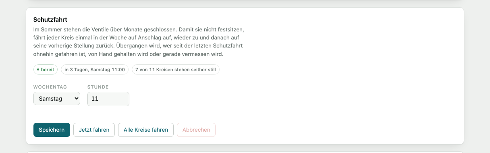

Im Sommer stehen die Ventile über Monate geschlossen und die Umwälzpumpen still. Beides setzt
sich mit der Zeit fest. Einmal in der Woche fahren deshalb alle Ventile einmal durch und alle
Pumpen laufen kurz an.

Der Termin steht auf beiden Gerätearten unter **System** und ist ab Werk **Samstag 11 Uhr** —
eine Stunde nach dem täglichen Neustart der Verteilerplatinen, damit sich beides nicht in die
Quere kommt. Wochentag auf „kein Termin" schaltet ihn ab.

**An der Verteilerplatine.** Jeder Kreis fährt einmal auf, auf Anschlag wieder zu und danach auf
seine vorherige Stellung zurück. Zu wird auf Anschlag gefahren, nicht auf eine Stellung: Das
Ventil schließt ganz, und die Stellung ist danach wieder gesichert statt geschätzt. Auf endet die
Fahrt wie jede gewöhnliche Fahrt bei 92 % des Hubs (siehe
[Abstand zum Anschlag auf](#abstand-zum-anschlag-auf)). Die Kreise fahren nacheinander, je
Messgruppe einer; für alle elf dauert das rund zwanzig Minuten.

| Übergangen wird | Grund |
|---|---|
| Kreise, die seit der letzten Schutzfahrt gefahren sind | wer regelt, sitzt nicht fest — und die Fahrt käme dem Raum in die Quere |
| Kreise in Notstellung von Hand | die Handbedienung hat Vorrang |
| Kreise, die gerade vermessen werden | die Messfahrt darf nicht gestört werden |

**Jetzt fahren** stößt die Schutzfahrt außerhalb des Termins an, **Alle Kreise fahren** nimmt
auch die zwischenzeitlich gefahrenen mit. **Abbrechen** streicht die noch offenen Kreise;
angefangene Fahrten laufen zu Ende, weil ein Ventil auf halbem Weg schlechter stünde als eines,
das seine Fahrt abschließt.

**Am Heizungsgerät.** Jede Heizkreispumpe läuft drei Minuten. Übergangen wird eine Pumpe, die in
den letzten 24 Stunden ohnehin gelaufen ist. Die Kesselkreispumpe hat keinen Schutzlauf; sie läuft
bei jeder Ladung. Der Schutzlauf gilt unabhängig von Bedarf und Speichertemperatur — er dient
dem Lager, nicht der Wärme.

Gemessen wird der Termin an der Uhr, nicht an der Laufzeit seit dem Einschalten. Das ist der
Unterschied, auf den es ankommt: Die Verteilerplatinen starten täglich um 10 Uhr neu und
erreichen nie sieben Tage Laufzeit; ein Termin, der daran hinge, käme nie. Steht die Uhr noch
nicht, fällt der Termin aus, statt im Jahr 1970 zu liegen. Wer zur Terminstunde aus war und
später am selben Tag angeht, holt ihn nach.

## Verlauf und Aufzeichnung

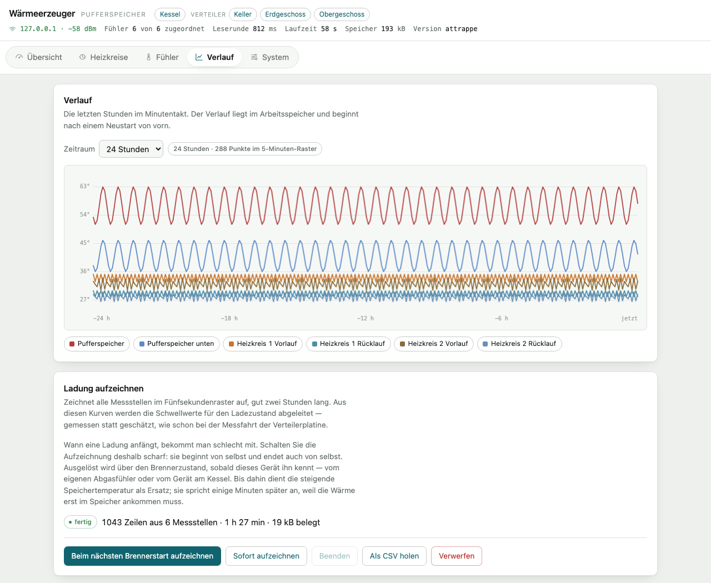

**Verlauf.** Die letzten 24 Stunden im Minutentakt. Die Messreihen lassen sich einzeln
zuschalten. Der Verlauf liegt im Arbeitsspeicher und beginnt nach einem Neustart von vorn. Er führt alle
Messstellen, die das Gerät je gesehen hat — auch die vom Nachbargerät. Fällt eine davon
vorübergehend aus, bleibt ihre Spalte bestehen und der Verlauf läuft weiter.

**Ladung aufzeichnen.** Zeichnet alle belegten Messstellen im Fünfsekundenraster auf, gut zwei
Stunden lang.

Wann eine Ladung anfängt, bekommt man schlecht mit. Schalten Sie die Aufzeichnung deshalb scharf:

1. **Beim nächsten Brennerstart aufzeichnen**
2. Die Aufzeichnung beginnt von selbst und endet auch von selbst
3. **Als CSV holen** lädt die Datei herunter
4. **Verwerfen** gibt den Arbeitsspeicher wieder frei

Ausgelöst wird über eines von zwei Zeichen. Welches, sagt die Zustandszeile.

| Zeichen | Voraussetzung | Beginn | Ende |
|---|---|---|---|
| **Brennerzustand** | eigener Abgasfühler, oder ein Gerät am Kessel meldet ihn | der Brenner läuft an | zehn Minuten nach dem Brennerlauf |
| **Speichertemperatur** | ein Fühler mit der Rolle `puffer` | sie steigt um 1,5 K in zwanzig Minuten | eine Viertelstunde ohne neuen Höchstwert |

Der Brennerzustand hat Vorrang: er ist das unmittelbare Zeichen. Die Speichertemperatur ist der
Ersatz für ein Gerät am Pufferspeicher, solange das Gerät am Kessel noch nicht steht — sie
spricht einige Minuten später an, weil die Wärme erst im Speicher ankommen muss. Kennt ein Gerät
weder das eine noch das andere, lässt es sich nicht scharf schalten und sagt das mit Begründung.

Über den Brennerzustand gilt außerdem: Schaltet der Kessel zwischendurch ab und gleich wieder
ein, läuft die Aufzeichnung durch — taktender Betrieb gehört zur selben Ladung. Läuft der Brenner
in dem Augenblick, in dem Sie scharf schalten, wird der übernächste Start abgewartet; eine halbe
Kurve taugt zur Auswertung nicht. **Abbrechen** hebt die Schaltung auf.

Der Arbeitsspeicher wird schon beim Scharfschalten belegt, damit ein Fehlschlag sofort auffällt
und nicht erst dann, wenn der Kessel nachts anspringt.

Die Schaltung übersteht einen Neustart: Sie wartet womöglich stundenlang auf die nächste Ladung,
und ein Neustart dazwischen darf das nicht verwerfen. Der Inhalt einer bereits **laufenden**
Aufzeichnung liegt dagegen im Arbeitsspeicher und ist danach weg — das Gerät ist dann wieder
scharf und wartet auf die nächste Ladung.

**Sofort aufzeichnen** beginnt ohne Umweg — für den Fall, dass der Kessel gerade läuft und Sie
den Rest der Kurve haben wollen. Eine so begonnene Aufzeichnung endet nicht von selbst, sondern
erst über **Beenden** oder wenn der Speicher voll ist.

Aufgezeichnet werden nur die Messstellen, die beim Start belegt sind; sind Kesselwerte über das
Nachbargerät erreichbar, kommen sie mit hinein. Die Datei zeigt damit die ganze Anlage, nicht nur
die Hälfte, die an einem Gerät hängt.

Aus diesen Kurven werden die Schwellwerte für den Ladezustand abgeleitet — gemessen statt
geschätzt, wie schon bei der Messfahrt der Verteilerplatine.

## Leitstand

Der Leitstand ist ein zusätzliches Gerät, ein M5Stack Core mit eigener Firmware
(`apps/station`). Er regelt nichts und schaltet nichts. Er zeigt den Zustand der Anlage auf
seinem Bildschirm, empfängt Funkthermometer, liefert die Außentemperatur an die Heizungsgeräte und
zeichnet alle Geräte auf seiner SD-Karte auf. HomeKit und der Abgleich des Verlaufs mit der App
folgen in späteren Etappen; Plan und Begründung stehen im [Konzept Leitstand](konzept-leitstand.md).

### Einrichten

1. Firmware aufspielen. Beim ersten Mal über USB, im Verzeichnis `apps/station` mit
   `idf.py -p <Port> flash`; danach über `POST /api/ota` wie bei den anderen Geräten. Das Öffnen
   der seriellen Schnittstelle startet das Gerät neu; geprüft wird deshalb über das Netz.
2. Ohne WLAN-Zugang öffnet der Leitstand einen Zugangspunkt `leitstand-XXXX`, ab Werk ohne
   Kennwort. Der Bildschirm nennt Netz und Adresse. Eingerichtet wird entweder in der App unter
   **Einrichtung › Neues Gerät** mit der Auswahl **Leitstand** oder im Browser: verbinden,
   `http://192.168.4.1` öffnen und unter **Einstellungen** das Heimnetz wählen. Die App schreibt
   Ort und WLAN-Zugang und nimmt den Leitstand danach selbst auf; den Gerätenamen `leitstand`
   ändert sie nicht, weil die Regelgeräte ihn unter diesem Namen suchen.
3. Im Heimnetz meldet er sich per mDNS mit der Rolle `station` und einer Kennung `lst_…` an. Er
   findet die Verteilerplatinen und Heizungsgeräte selbst; einzutragen ist nichts.

In der App erscheint er in der Einrichtung mit einem eigenen Symbol und wird dort aufgenommen.
Die App führt ihn unter **Geräte → Leitstand**, getrennt von den Regelgeräten: Er hat keine
Parameter, keine Sicherung und gehört zu keiner Etage.

### Bildschirm und Tasten

Am Core2 gibt es sechs Seiten, am Core Basic nur Anlage und Leitstand: Verlauf und Ereignisse
brauchen Speicher, den der Core Basic nicht hat.

| Seite | Inhalt | Mittlere Taste |
|---|---|---|
| Anlage | Kessel mit Vorlauf, Rücklauf und Abgas, Brenner an oder aus mit Laufzeit und Starts des Tages, Speicher mit Füllstand, Außentemperatur | – |
| Räume (Core2) | alle Räume aller Verteiler mit Ist, Soll, Ventilstellung und Feuchte, nach Etage; ein Raum unter seinem Sollwert steht in Blau, ein ausgeschalteter mit „aus“ | nächste Seite der Liste |
| Verlauf (Core2) | 24 Stunden: Speicher, Kesselvorlauf (gestrichelt), Außen, darunter der Brennerlauf als Balken | Raumwerte: die Temperatur jedes Raums |
| Meldungen (Core2) | offene Befunde der Heizungsgeräte, darunter die Ereignisse des Tages mit Uhrzeit, neueste zuerst | ältere Ereignisse |
| Geräte (Core2) | je Gerät Erreichbarkeit, WLAN, Laufzeit seit dem Neustart (unter einem Tag hervorgehoben), freier Speicher, Fassung; darunter der Außenfühler mit Schlüsselzustand | Funkthermometer in Reichweite |
| Leitstand | Uhrzeit, WLAN, freier Speicher, erreichbare Geräte, Außenfühler, Protokoll, HomeKit, Firmware, Gerät mit Versorgung (Core2: Netz oder Akku mit Ladestand) | HomeKit-Code mit QR-Code |

- **Linke und rechte Taste** blättern zwischen den Seiten. Der erste Druck auf einen dunklen
  Bildschirm weckt ihn nur.
- **Mittlere Taste**, anderthalb Sekunden gehalten, schaltet den Bildschirm aus und wieder an;
  kurz gedrückt schaltet sie innerhalb der Seite um (Tabelle). Was sie tut, steht in der Mitte
  des Fußes.
- **Berührung (Core2):** Die drei Tasten sind die Felder unter dem Bildschirm. Auf dem Bildschirm
  blättert Wischen nach links oder rechts zur nächsten oder vorigen Seite; Wischen nach oben oder
  unten wirkt wie die mittlere Taste; Tippen auf den Fuß wie die Taste darunter.
- Kommt ein neuer Befund hinzu, schaltet sich die Anzeige am Core2 ein und zeigt die Seite
  Meldungen.
- Nach `dim_after_min` Minuten ohne Bedienung wird er auf ein Sechstel der Helligkeit
  abgedunkelt, in der Nacht zwischen `night_from_h` und `night_to_h` nach einer Minute ganz
  ausgeschaltet.

Den Verlauf hält der Leitstand im PSRAM; nach einem Neustart liest er die letzten 24 Stunden aus
den Fünfminutendateien der Karte. Die Seite lässt sich auch aus der App umschalten, und die App zeigt ein Abbild des Bildschirms
(`GET /api/screen`). Das Bild wird zeilenweise gelesen; währenddessen steht der Bildschirm für
einen Augenblick still.

### Funkthermometer und Außenfühler

Der Leitstand empfängt dieselben Thermometer wie die Verteilerplatinen: BTHome offen und
verschlüsselt, etwa den Climate-Sat von camperSense, dazu RuuviTag sowie Xiaomi- und
ATC-Thermometer. Der
Schlüssel eines verschlüsselten Thermometers, 32 Hexadezimalziffern aus der Hersteller-App, wird
unter **Funk** oder in der App unter **Leitstand → Funkthermometer** hinterlegt. Dort steht auch,
ob er passt.

Eines der Thermometer wird dort **als Außenfühler** zugeordnet. `GET /api/demand` liefert seinen
Wert als `outdoor_c` mit dem Alter `outdoor_age_s`, solange er nicht älter als eine Viertelstunde
ist. Heizungsgeräte ab der Fassung nach 0.4.0 fragen den Leitstand zuerst und weichen erst dann
auf eine Verteilerplatine aus (siehe [Außenfühler](#außenfühler)). Der Leitstand selbst meldet
keinen Wärmebedarf.

Empfängt der Leitstand den Außenfühler nicht selbst oder ist dessen Wert älter als eine
Viertelstunde, übernimmt er den jüngsten Wert einer Verteilerplatine, die einen Außenfühler
empfängt. Anzeige, HomeKit und `GET /api/demand` zeigen dann diesen Wert; die Seite Anlage nennt
statt „Funk“ die Platine, von der er stammt, und `GET /api/state` führt sie unter
`outdoor.source`. Der eigene Empfang geht vor, sobald er wieder frisch ist.

Raumthermostate in HomeKit folgen den Räumen der Verteiler: Führt ein erreichbarer Verteiler einen
Raum nicht mehr, entfernt der Leitstand das zugehörige Zubehör. Ein Verteiler, der nicht antwortet,
behält seine Räume; sie zeigen in Home „Keine Antwort“.

### Protokoll auf der SD-Karte

Der Leitstand fragt jedes Gerät alle 30 Sekunden ab und schreibt, was es liefert, auf die Karte.
Je Tag, gezählt in UTC, entsteht ein Verzeichnis `protokoll/<jahr>/<tag>/`:

| Datei | Inhalt |
|---|---|
| `geraete.json` | Kennung, Ort, Art und Firmware je Gerät |
| `<kennung>.csv` | Messwerte im Takt der Abfrage |
| `<kennung>.5min.csv` | Mittelwerte je fünf Minuten, im Raster der App |
| `ereignisse.jsonl` | Neustart mit Grund, Erreichbarkeit, Firmware, Brenner und Pumpen mit Dauer, Sollwerte, Betriebsarten, Befunde |
| `zustaende.jsonl` | vollständiger Zustand jedes Geräts alle 15 Minuten und bei neuer Firmware |
| `protokolle/<kennung>.ladungen.csv`, `.tage.csv` | Ladungs- und Tagesprotokoll der Heizungsgeräte, einmal am Tag vollständig übernommen |

Welche Spalten eine Datei hat und was sie bedeuten, steht im
[Katalog der Messgrößen](katalog-messgroessen.md). Kommt im Laufe des Tages eine Spalte hinzu,
etwa durch einen neuen Raum, beginnt eine neue Datei `<kennung>.2.csv`.

- **Karte:** FAT32. Vorgesehen ist eine Ausführung für Dauerbetrieb mit 16 GB; der Leitstand
  schreibt rund 4 MB am Tag. Ohne Karte läuft er weiter und versucht es jede Minute erneut. Wird
  die Karte im Betrieb gezogen oder getauscht, merkt er das binnen zehn Sekunden an ihrem Status,
  gibt die Einbindung auf und bindet die neue ein; beides steht als Ereignis `leitstand` im
  Protokoll. Sicherer bleibt es, ihn für den Tausch vom Strom zu nehmen. Eine Karte mit anderem
  Dateisystem oder mehreren Partitionen, etwa von einem Raspberry Pi, formatiert der Leitstand unter
  **Protokoll → Karte formatieren** als eine FAT32-Partition über die ganze Karte; alles darauf
  geht dabei verloren. Eine Karte mit 64 GB braucht dafür rund 15 Sekunden.
- **Schreiben:** Jede Zeile geht sofort auf die Karte: Datei öffnen, anhängen, schließen. Ein
  Stromausfall kostet höchstens die Zeile, die gerade geschrieben wird. Das Konzept sah vor, eine
  Minute im Arbeitsspeicher zu sammeln; dafür ist auf dem Core ohne PSRAM kein Platz.
- **Uhrzeit:** Ohne gestellte Uhr wird nichts geschrieben. Wie viele Abfragen bis dahin
  verworfen wurden, steht im Ereignis `leitstand` beim Start.
- **Platz:** Unterschreitet der freie Platz 10 Prozent, löscht der Leitstand stündlich die
  ältesten Zustände und Messwerte im Takt der Abfrage. Fünfminutenmittel und Ereignisse bleiben.
- **Abruf:** Die Weboberfläche zeigt unter **Protokoll** den Stand der Karte und die Tage mit
  ihren Dateien zum Herunterladen. `GET /log/<tag>/<datei>` liefert eine Datei, mit
  `Range: bytes=N-` ab Stelle N; alle Dateien wachsen nur.
- **Auswertung am Gerät:** `GET /api/log/series` liefert ausgewählte Messgrößen eines Geräts in
  wählbarem Raster, `GET /api/log/events` die Ereignisse eines Zeitraums, beides als JSON.
- **Prüfen:** `python3 tools/protokoll_pruefen.py leitstand.local [tag]` holt die Dateien eines
  Tages und prüft Spaltenzahl, Zeitfolge und JSON-Zeilen, zählt die Abtastungen je Gerät und
  meldet Lücken über vier Takte, die kein Ereignis belegt.

Der Bildschirm nennt auf der Seite Leitstand unter **Protokoll** den freien Platz, die seit dem
Start geschriebene Menge und Schreibfehler.

**In der App.** Die App übernimmt die Fünfminutenmittel des Leitstands in ihren Verlauf, beim
Verbinden und danach alle fünf Minuten. Vom laufenden Tag holt sie mit `Range` nur die Zeilen, die
seit dem letzten Abgleich hinzukamen; eine Zeile ohne Zeilenende bleibt für den nächsten Abgleich
stehen. Ein Tag gilt zehn Minuten nach Mitternacht (UTC) als abgeschlossen und wird danach nicht
mehr abgefragt. Die Werte des Leitstands haben Vorrang vor der eigenen Aufzeichnung der App, weil
sie den ganzen Zeitraum abdecken; ein zweiter Abgleich desselben Tages überschreibt, statt doppelt
zu zählen. Wie weit der Abgleich ist, steht je Leitstand in `Abgleich-<kennung>.json` neben dem
Verlauf und wird nach jeder Datei gesichert, sodass ein abgebrochener Abgleich an derselben Stelle
fortsetzt. Den Stand zeigt **Geräte › Leitstand › Verlauf**.

Heizung › Verlauf zeigt jede Gruppe in einem eigenen Diagramm mit eigener Skala; die Heizkreise
teilen eine Skala und zeigen die Außentemperatur auf einer festen rechten Achse (−10 bis 20 °C).
Über die Karte eines Heizkreises führt **Verlauf und Heizkurve** zum Vorlauf über der
Außentemperatur mit Ausgleichsgerade: Ihre Steigung ist die Heizkurve, wie sie sich einstellt.

Der Assistent liest die Ereignisse über das Werkzeug `ereignisse`, etwa für „Wie oft ist der
Brenner gestern angesprungen?“. Mit `feinverlauf` holt er Messwerte im Takt der Abfrage vom
Leitstand, bis 24 Stunden, auch freien Speicher und WLAN-Empfang eines Geräts; das geht nur im
Heimnetz. `verlauf` reicht bis ein Jahr, über 30 Tage in Tagesmitteln.

**Analysepaket.** Unter **Einstellungen › Daten › Analysepaket erstellen** entsteht ein ZIP mit
dem Verlauf eines Zeitraums (7 Tage bis 1 Jahr) im gewählten Raster (5 Minuten bis 1 Tag): je
Gerät eine CSV-Datei mit den Spalten des Katalogs, Zeiten in UTC, dazu `ereignisse.csv`,
`anlage.json` mit Geräten, Räumen und Heizkreisen, der Katalog der Messgrößen und `LIESMICH.txt`.
Es enthält Gerätekennungen, Orts- und Raumnamen, aber keine Adressen und keine Zugangsdaten. Die
App gibt es nur über **Teilen** weiter.

Ebenso übernimmt die App `ereignisse.jsonl`. **Heizung › Verlauf** markiert im Diagramm Neustarts
(rot nach Absturz, Wächter oder Unterspannung), neue Firmware und neue Befunde der gezeigten Geräte
und legt einen grauen Streifen über die Zeit, in der ein Gerät nicht erreichbar war; darunter stehen
dieselben Ereignisse als Liste mit Grund und Dauer. Der Verlauf eines Raums markiert, wann er ein-
oder ausgeschaltet wurde, und Neustarts seines Verteilers. Ist eine Datei auf dem Leitstand kürzer
als das bereits Übernommene, wurde die Karte getauscht oder formatiert; die App liest den Tag dann
von vorn. Nach **Einstellungen › Verlauf löschen** übernimmt sie alles, was auf der Karte liegt,
erneut.

### HomeKit

Auf dem Core2 (mit PSRAM) ist der Leitstand eine HomeKit-Brücke. Am Core Basic bleibt HomeKit
aus; die Seite Leitstand sagt dann „aus · braucht PSRAM“.

- **Je Raum ein Thermostat:** Isttemperatur, Sollwert von 5 bis 35 °C in Schritten von 0,5 K,
  Betriebsart aus oder heizen, Heizzustand (Ventile offen) und Luftfeuchte, sofern das
  Raumthermometer sie liefert.
- **Fühler:** Außen (Temperatur und Feuchte), Pufferspeicher und Kesselvorlauf, sobald die
  Anlage sie liefert.
- **Schreiben:** Sollwert und Betriebsart gehen nach 900 ms Sammelzeit an den zuständigen
  Verteiler, über dieselben Endpunkte wie die App; das Verschieben eines Reglers in Home löst so
  nur einen Befehl aus. Scheitert er, versucht es der Leitstand dreimal im Abstand von zwei
  Sekunden. Bis die Abfrage den neuen Wert zeigt, höchstens eine Minute, behält Home den
  eingestellten Wert.
- **Nicht erreichbar:** Antwortet ein Verteiler nicht, zeigen seine Räume in Home „Keine Antwort“
  statt veralteter Werte.
- **Nicht über HomeKit:** Pumpen und Einstellungen der Anlage.
- **Hinzufügen:** Den Code erzeugt der Leitstand beim ersten Start und behält ihn. Er steht nur
  auf der Anzeige (Seite Leitstand, mittlere Taste kurz), als Zahl und als QR-Code; weder die App
  noch die Weboberfläche zeigen ihn. In der Home-App: Gerät hinzufügen, Code scannen.
- **Neue Räume** erscheinen in Home ohne neue Kopplung. Die Zuordnung eines Raums zu einem Zimmer
  in Home bleibt über Neustarts erhalten.
- **Kopplungen löschen:** in der App unter Geräte › Leitstand › HomeKit oder mit
  `POST /api/homekit/reset` und `{"bestaetigung":"KOPPLUNGEN LOESCHEN"}`. Der Code bleibt.
- Für Automationen und den Zugriff von unterwegs braucht Home eine Steuerzentrale (Apple TV oder
  HomePod).

**Echtzeituhr und Versorgung (Core2):** Nach einem Stromausfall stellt der Leitstand die Zeit aus
seiner Echtzeituhr, bevor das Netz sie liefert, und protokolliert ohne Lücke weiter; stündlich
stellt er die Uhr nach der Netzzeit nach. Fällt die Versorgung aus, läuft er auf dem Akku weiter
und schreibt ein Ereignis `leitstand` mit `versorgung_aus` samt Ladestand, bei Rückkehr
`versorgung_wieder`.

### Einstellungen

| Schlüssel | Vorgabe | Bedeutung |
|---|---|---|
| `site` | Leitstand | Name in der Kopfzeile und in der App |
| `outdoor.mac` | leer | Adresse des Außenfühlers; leer heißt keiner |
| `poll.heat_s` | 30 s | Abfragetakt der Heizungsgeräte |
| `poll.manifold_s` | 30 s | Abfragetakt der Verteilerplatinen |
| `display.brightness` | 160 | Helligkeit, 10 bis 255 |
| `display.dim_after_min` | 2 | Abdunkeln nach so vielen Minuten ohne Bedienung; 0 heißt nie |
| `display.night_from_h`, `display.night_to_h` | 23, 6 | Bildschirm nachts aus, zur vollen Stunde; −1 heißt nie |
| `wifi.ssid`, `wifi.pass`, `wifi.hostname`, `wifi.ap_pass`, `wifi.timezone` | —, —, `leitstand`, —, Mitteleuropa | wie bei den anderen Geräten |

Einen täglichen Neustart gibt es am Leitstand nicht. Die Heizungsgeräte werden alle 30 statt alle
10 Sekunden abgefragt, bis geklärt ist, ob ihre Neustarts am 23. September mit der häufigeren
Abfrage zusammenhingen.

### Schnittstelle

| Aufruf | Zweck |
|---|---|
| `GET /api/state` | Gerät, Netz, Speicher, Neustartgrund (`reset_reason`), Außenfühler, Funk, erreichbare Geräte, Anzeige, Protokoll (`log`) |
| `GET /api/plant` | zusammengefasster Zustand der abgefragten Geräte |
| `GET`/`PUT /api/config` | Einstellungen, ohne Kennwörter |
| `GET /api/ble`, `POST /api/ble/key` | empfangene Thermometer, Schlüssel setzen oder löschen |
| `GET /api/demand` | Außentemperatur für die Heizungsgeräte |
| `GET /api/peers` | gefundene Geräte |
| `GET /api/screen` | Abbild des Bildschirms als BMP |
| `POST /api/display` | Seite wählen, Bildschirm an oder aus |
| `POST /api/system/restart`, `/api/system/factory` | Neustart, Werksvorgabe |
| `POST /api/ota` | Firmware aktualisieren; während der Übertragung ruht die Abfrage der Anlage |
| `GET /api/log/days` | Tage mit Protokoll; mit `?tag=JJJJ-MM-TT` dessen Dateien samt Größe |
| `GET /log/<tag>/<datei>` | eine Datei des Protokolls, mit `Range: bytes=N-` ab Stelle N; die übernommenen Protokolle unter `protokolle/` |
| `GET /api/log/series?geraet=&schluessel=a,b&von=&bis=&raster=` | Mittel von bis zu acht Messgrößen je Raster; ab 300 s aus den Fünfminutenmitteln, höchstens 31 Tage, darunter aus den Rohwerten, höchstens 2 Tage; Zeiten in Sekunden seit 1970 |
| `GET /api/log/events?von=&bis=[&geraet=][&art=]` | Ereignisse eines Zeitraums, höchstens 31 Tage und 2000 Einträge |
| `POST /api/homekit/reset` | alle Kopplungen mit Home löschen; nur mit `{"bestaetigung":"KOPPLUNGEN LOESCHEN"}`. Den Stand (`active`, `reason`, `controllers`, `accessories`) liefert `GET /api/state` unter `homekit`, den Code nicht |
| `POST /api/log/lasttest`, `GET /api/log/lasttest` | Dauerlastprüfung: `{"mb":1024}` schreibt ein Muster auf die Karte, liest es zurück und vergleicht; der Betrieb läuft dabei weiter |
| `POST /api/log/format` | ganze Karte als FAT32 formatieren; nur mit `{"bestaetigung":"KARTE LOESCHEN"}` |
| `GET /api/coredump`, `POST /api/coredump/erase` | letzter Absturz: Task, Programmzähler, Ursache, Rücksprungadressen und Prüfsumme des ELF; löschen |

## Home Assistant

Es gibt zwei Wege; sie lassen sich einzeln oder gemeinsam nutzen.

### Über MQTT

Tragen Sie unter **System → MQTT** Broker, Benutzer, Kennwort und ein Themenpräfix ein. Die
Geräte melden ihre Entitäten selbst über MQTT-Discovery an. Welche entstehen, richtet sich
danach, was ein Gerät wirklich führt: ohne Abgasfühler keine Brenner-Entitäten, ohne Heizkreise
keine Pumpen.

### Über die Integration

Unter [`custom_components/floor_heating/`](../custom_components/floor_heating/) liegt eine
Integration für HACS. Sie spricht die Geräte unmittelbar über HTTP an und kommt ohne Broker aus.

1. Repository in HACS als eigene Quelle hinzufügen, Integration installieren, Home Assistant neu
   starten.
2. **Einstellungen → Geräte & Dienste → Integration hinzufügen → Fußbodenheizung**.
3. Adresse des Geräts eintragen.

Beide Gerätearten werden unterstützt; die Integration erkennt am Gerät selbst, welche vorliegt,
und richtet die passenden Entitäten ein.

| Verteilerplatine | Heizungsgerät |
|---|---|
| `climate` je Raum | Fühler als `sensor` |
| `cover` je Heizkreis | Brennerzustand, Laufzeit, Starts, Verbrauch |
| Raumthermometer als `sensor` | Füllstand und Ladezustand |
| Messfahrt und Notfahrt als Dienste | Pumpe und Bedarf je Kreis, Betriebsart als Auswahl |

## Wartung

### Firmware aktualisieren

**System → Firmware**, Datei wählen, **Einspielen**. Das Gerät startet neu. Läuft die neue
Fassung nicht an, kehrt der Bootlader zur vorherigen zurück; die Konfiguration bleibt in beiden
Fällen erhalten.

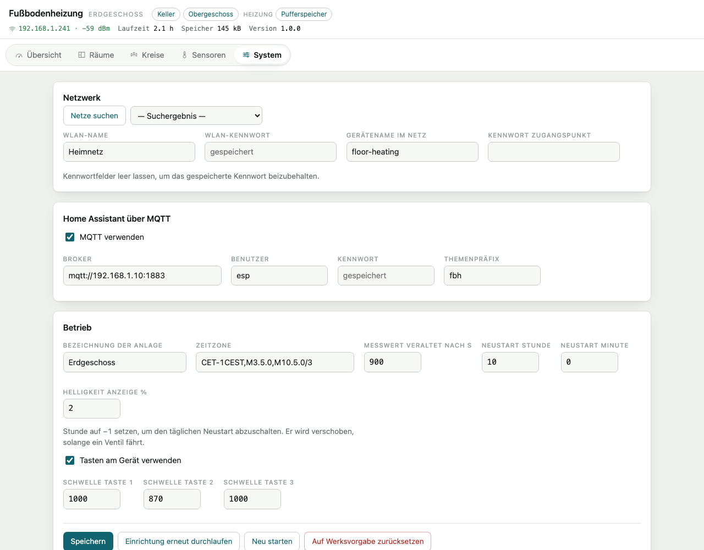

### Einstellungen sichern

**System → Einstellungen sichern → Sicherung holen** lädt eine Datei mit allem, was am Gerät
eingerichtet ist. **Sicherung einspielen** liest sie wieder ein. Auf der Kommandozeile:

```bash
curl -s -o sicherung.json http://<adresse>/api/config/backup
curl -X POST -H "Content-Type: application/json" --data @sicherung.json http://<adresse>/api/config/restore
```

Die Sicherung enthält die Zugangsdaten **im Klartext**, auf dem Verteiler auch die Schlüssel
verschlüsselter Thermometer. Ohne sie ließe sich nichts zurückspielen, was den Namen verdient;
die Datei gehört deshalb behandelt wie ein Kennwortzettel. Die Ausgabe von `GET /api/config` ist etwas anderes: Dort erscheinen Kennwörter
nur als „gesetzt" oder „nicht gesetzt", und sie taugt daher nicht als Sicherung.

Beim Zurückspielen wird von den Werkseinstellungen aus aufgebaut. Ein Feld, das in der Sicherung
fehlt, fällt damit auf seine Vorgabe, statt den laufenden Wert zu behalten — sonst wäre das
Ergebnis eine Mischung aus zwei Ständen. Die Schlüssel verschlüsselter Thermometer ersetzt das
Zurückspielen nur, wenn die Sicherung welche enthält; eine ältere Sicherung ohne sie lässt die
vorhandenen unverändert.

Angenommen wird nur eine Datei aus `GET /api/config/backup` — sie trägt dafür eine Kopfzeile mit
Gerätetyp, Kennung und Zeitpunkt. Die Ausgabe von `GET /api/config` hat diese Kopfzeile nicht und
wird abgewiesen; von Hand geschriebene Änderungen gehören nach `PUT /api/config`, das nur
übernimmt, was dasteht. Der Grund ist die Aufbauweise: Zurückgespielt wird von den
Werkseinstellungen aus, und ein Rumpf ohne Inhalt setzte damit alles zurück, ohne dass es nach
einem Fehler aussähe.

Zwei Dinge bleiben ausgenommen:

- **Der Netzzugang.** Wer über das Netz einspielt, verlöre sonst die Verbindung zum Gerät.
  WLAN-Name, Kennwort und Gerätename bleiben, wie sie sind.
- **Sicherungen des anderen Gerätetyps.** Eine Verteiler-Sicherung auf einem Heizungsgerät wird
  abgewiesen, und umgekehrt.

### Auf Werksvorgabe zurücksetzen

**System → Auf Werksvorgabe zurücksetzen** verwirft alle Einstellungen einschließlich der
WLAN-Zugangsdaten, auf dem Verteiler auch die Schlüssel verschlüsselter Thermometer. Das Gerät öffnet danach wieder seinen Einrichtungs-Zugangspunkt.

### Täglicher Neustart

Unter **System** lässt sich eine Uhrzeit für einen täglichen Neustart eintragen. Er wird
verschoben, solange ein Ventil fährt beziehungsweise eine Pumpe in einer Mindestlaufzeit steht.
Auf den Heizungsgeräten ist er ab Werk abgeschaltet.

## Fehlersuche

| Beobachtung | Mögliche Ursache | Vorgehen |
|---|---|---|
| Raum wird nicht warm, Ventile stehen | kein Thermometer zugeordnet oder Messwert veraltet | **Räume** prüfen; unter **Sensoren** sehen, ob das Thermometer empfangen wird |
| Raum zeigt „kein Thermometer" | Zuordnung fehlt | unter **Räume** ein Gerät auswählen |
| Thermometer ohne Werte, „Schlüssel fehlt" oder „Schlüssel falsch" | verschlüsselt sendendes Gerät ohne passenden Schlüssel | Schlüssel aus der camperSense-App unter **Sensoren** eintragen |
| Ein Kreis fährt nicht | Handbetrieb aktiv oder Messgruppe belegt | **Kreise** prüfen, gegebenenfalls **Wieder regeln** |
| Ventilstellung passt nicht zur Wirklichkeit | Stellung nach einem Neustart unbekannt | Kreis von Hand ganz zu und ganz auf fahren, danach Messfahrt |
| Endlage wird nicht erkannt | Schwelle zu hoch | Messfahrt für diesen Kreis |
| Am Bus meldet sich kein Fühler | falscher GPIO, fehlender Anschlusswiderstand, Leitungsbruch | **System → 1-Wire-Bus** prüfen; das Gerät sucht bei leerem Bus jede Minute erneut |
| Fühler zeigt Aussetzer, Fehlerzähler steigt | Wackelkontakt oder zu lange Leitung | Verkabelung prüfen, gegebenenfalls auf zwei Busse aufteilen |
| Pumpe läuft dauernd | ein zugeordneter Verteiler antwortet nicht | Meldung unter **Heizkreise** ansehen, Verteiler prüfen |
| „Relais nicht erreichbar" | Adresse falsch oder Gerät aus | Adresse unter **Heizkreise** prüfen |
| „Relais antwortet mit 404" | die Adresse gehört zu keinem Tasmota-Gerät | Adresse prüfen |
| „kein Weg zum Relais" | weder Thema noch Adresse eingetragen | eines von beidem eintragen |
| Brennerzustand bleibt unbekannt | kein Abgasfühler zugeordnet | unter **Fühler** die Rolle `abgas` vergeben |
| „nur Schätzung, Kesselwerte fehlen" | das Gerät am Kessel ist nicht erreichbar | Netzverbindung des anderen Geräts prüfen |
| Gerät nicht erreichbar | WLAN weg | Das Gerät öffnet nach einiger Zeit seinen Zugangspunkt; darüber sind die Einstellungen zugänglich |
| Nach einer Aktualisierung läuft die vorherige Fassung | die neue ist nicht vollständig angelaufen | Ursache über `idf.py monitor` suchen |

## Anhang

### Vorgabewerte

| Bereich | Wert | Vorgabe |
|---|---|---|
| Regelung | Proportionalband | 1,0 K |
| | Prüfintervall | 30 s |
| | Rasterung | 0,1 |
| | Zeitgrenze der Messwerte | 900 s |
| Antriebe | Fahrzeit auf / zu | 39 s / 40 s |
| | Maximallaufzeit | 45 s |
| | Auslöseschwelle | 190 mV |
| Pumpen | Nachlauf | 300 s |
| | Mindestlaufzeit, Mindestpause | je 180 s |
| | Speicher mindestens | 40 °C |
| | Frostgrenze | 6 °C |
| | Schutzlauf | alle 7 Tage, 3 min |
| Bedarf | Abfrage | alle 5 s |
| | Zeitgrenze | 180 s |
| | Schwelle | 5 % Ventilstellung |
| Brenner | Ein / Aus | 12 K / 6 K über dem kalten Rohr |
| | Ausschlag gegen den Extremwert | 6 K |
| | Haltezeit ein / aus | 60 s / 300 s |
| | Düsendurchsatz | 2,2 l/h |
| Speicher | Spreizung „geladen" | 8 K über 5 min, Vorlauf über 60 °C |
| | voll / leer | 62 °C / 35 °C |
| | Leerpunkt nachmessen ab | 3 K Abfall seit dem Höchststand |
| | Warnung Warmwasser | 40 °C |
| | Warmwasserzapfung ab | 2 K Einbruch in 900 s |
| Kesselkreispumpe | Ein / Aus über dem Speicher | 3,0 K / 2,0 K |
| | Haltezeit | 120 s |
| | Mindestlaufzeit, Mindestpause | je 180 s |
| | Notgrenze | 85 °C |
| Auswertung | Verbrauchslinie ab | 14 Tagen, 3 K Spreizung der Gradtage |
| | Befund ab | 3 Streuungen über der Linie |
| | Abgasabstand ab | 10 Ladungen, Fenster 50 |
| | Befund ab | 15 K über dem Zustand nach der Reinigung |
| Befunde | Vorlauf und Rücklauf vertauscht | 1 K, 1800 s anliegend, gezählt ab 300 s Pumpenlauf |
| | Fühler verwirft Messungen | über 5 %, ab 100 Messungen |
| | Rückströmung in den Kesselrücklauf | 3 K Anstieg |
| Außenfühler | Zeitgrenze | 900 s |
| | Abfrage durch die Heizungsgeräte | alle 60 s |
| Fühler | Abtastabstand | 10 s |
| Netz | Zugangspunkt-Kennwort | `fussboden` |

### Schnittstelle

Beide Geräte antworten auf dieselben Grundadressen; die Fachadressen unterscheiden sich.

**Beide**

```
GET     /api/state              vollstaendiger Zustand
GET     /api/config             Konfiguration ohne Kennwoerter
PUT     /api/config             Konfiguration aendern
GET     /api/config/backup      Sicherung, mit Kennwoertern im Klartext
POST    /api/config/restore     Sicherung zurueckspielen, ohne den Netzzugang
GET     /api/peers              gefundene Geraete im Haus
POST    /api/wifi/scan          Suchlauf nach Netzen starten
GET     /api/wifi/scan          Stand des Suchlaufs und gefundene Netze
POST    /api/system/restart     Neustart
POST    /api/system/factory     auf Werksvorgabe zuruecksetzen
POST    /api/ota                Firmware einspielen
```

**Verteilerplatine**

```
POST    /api/room/{id}/target   Sollwert setzen
POST    /api/room/{id}/mode     heat | off
POST    /api/room/{id}/check    Regelung sofort ausloesen
POST    /api/channel/{n}/cmd    open | close | stop | auto | position
POST    /api/channel/all/cmd    dasselbe fuer alle Kreise, ohne position
GET     /api/calib?from=N       Stand der Messfahrt, Messreihe ab Punkt N
POST    /api/calib/{n}/start    Messfahrt starten
POST    /api/calib/abort        laufende Messfahrt abbrechen
POST    /api/calib/accept       Ergebnis uebernehmen
POST    /api/calib/discard      Ergebnis verwerfen
GET     /api/ble                empfangene Thermometer, Adressen mit Schluessel
POST    /api/ble/key            {"mac","bindkey"}: Schluessel setzen, "" entfernt ihn
GET     /api/demand             Waermebedarf, fuer das Heizungsgeraet
POST    /api/system/seize       Schutzfahrt jetzt fahren
POST    /api/system/seize-all   dasselbe, auch die zwischenzeitlich gefahrenen
POST    /api/system/seize-abort offene Kreise streichen
```

Kanalbefehle erwarten `{"cmd": "…"}`. `open` und `close` fahren den Kreis ganz auf bzw. zu,
`stop` hält ihn an; alle drei setzen ihn in den Handbetrieb, in dem die Regelung ihn nicht
bewegt. `auto` gibt ihn an die Regelung zurück. `position` fährt mit `"position"` zwischen 0 und
1 eine Zwischenstellung an, ohne Handbetrieb: Der nächste Regeldurchlauf kann sie wieder
verwerfen. Befehle an einen Kreis in der Messfahrt bleiben ohne Wirkung; die Antwort lautet
trotzdem `ok`, ebenso bei `position` an `all`.

**Heizungsgerät**

```
GET     /api/measurements       Messstellen und Brennerzustand, fuer das Nachbargeraet
GET     /api/history            Verlauf der letzten 24 Stunden, Zwei-Minuten-Raster
GET     /api/record             Aufzeichnung einer Ladung als CSV
POST    /api/record/arm         bei der naechsten Ladung aufzeichnen
POST    /api/record/start       sofort aufzeichnen
POST    /api/record/stop        beenden, im scharfen Zustand abbrechen
POST    /api/record/discard     verwerfen und Speicher freigeben
POST    /api/circuit/{n}/mode   auto | ein | aus
POST    /api/boilerpump/{modus} auto | ein | aus
POST    /api/probes/rescan      Bus neu absuchen
GET     /api/log/charges        Ladungsprotokoll als CSV
GET     /api/log/days           Tagesprotokoll als CSV
POST    /api/system/clear-logs  Protokolle und Tageswerte verwerfen
```

`/api/history` nimmt zwei Angaben entgegen: `step` ist die Zahl der Rasterschritte je Punkt
(Vorgabe 5, also zehn Minuten), `max` die Zahl der Punkte (Vorgabe 288, höchstens 1440). Der
jüngste Punkt steht zuletzt.

### Konfiguration im Einzelnen

Die Konfiguration ist ein JSON-Dokument. `GET /api/config` gibt es ohne Kennwörter aus,
`PUT /api/config` nimmt es ganz oder in Teilen entgegen, und die Sicherungsdatei aus
`GET /api/config/backup` enthält es vollständig. Die Bereiche in den Tabellen sind die der
Prüfung im Gerät: Ein Wert außerhalb wird mit einer Meldung abgewiesen und nichts gespeichert.
Geprüft wird stets die gesamte Konfiguration, wie sie nach dem Zusammenführen aussähe.

Beim Zusammenführen gilt:

- **Einzelwerte und Gruppen** (`burner`, `buffer`, `boiler_pump`, `wifi`, `mqtt`, `touch`):
  Es ändert sich nur, was im Rumpf steht.
- **Listen** (`probes`, `circuits`, `rooms`) ersetzen die gespeicherte Liste. Ein Eintrag, der
  fehlt, ist danach entfernt.
- **Innerhalb eines Listeneintrags** übernimmt das Heizungsgerät fehlende Felder aus dem
  bisherigen Stand desselben Eintrags — bei Fühlern erkannt an `rom`, bei Heizkreisen an `id`.
  Der Verteiler baut jeden Raum dagegen aus den Vorgaben neu auf: Ein fehlendes Feld erhält die
  Vorgabe. Solltemperatur und Betriebsart eines Raums ändern Sie deshalb besser über
  `POST /api/room/<id>/target` und `POST /api/room/<id>/mode`.
- **`channels`** beim Verteiler ändert nur die genannten Kreise und Felder.
- **Kennwörter** erscheinen in `GET /api/config` nur als `pass_set` bzw. `ap_pass_set`. Ein
  Kennwortfeld, das im Rumpf fehlt, bleibt unverändert; eine leere Zeichenkette löscht das
  Kennwort.

Für das Zurückspielen einer Sicherung gelten andere Regeln, siehe **Einstellungen sichern**.

#### Heizungsgerät

**Allgemein**

| Schlüssel | Vorgabe | Bereich | Bedeutung |
|---|---|---|---|
| `cfg_version` | — | nur lesend | Aufbaustand der Konfiguration |
| `site` | leer | Text | Bezeichnung des Geräts, in der Kopfzeile und bei den anderen Geräten im Haus. Solange sie fehlt, öffnet die Oberfläche den Einrichtungsassistenten. |
| `onewire_pin` | `[13, -1]` | GPIO 0–33 außer 1, 3, 6–11 und 12; −1 = unbenutzt | Anschlüsse der beiden 1-Wire-Busse. Mindestens einer muss belegt sein, beide nicht am selben GPIO. Eine Änderung wirkt sofort. |
| `poll_s` | 10 | 1–600 s | Abtastabstand der Fühler |
| `demand_poll_s` | 5 | 1–300 s | Abfrageabstand der Verteiler |
| `demand_timeout_s` | 180 | 10–3600 s | Antwortet ein Verteiler, der schon einmal geantwortet hat, länger nicht, zählt er als Bedarf |
| `timezone` | `CET-1CEST,M3.5.0,M10.5.0/3` | POSIX-Zeitzone | Bestimmt den Tageswechsel der Protokolle und die Termine |
| `reboot_hour`, `reboot_minute` | −1, 0 | −1 bis 23, 0–59 | Täglicher Neustart; −1 schaltet ihn ab |
| `seize_weekday`, `seize_hour` | 6, 11 | −1 bis 6, 0–23 | Wöchentlicher Schutzlauf der Pumpen; 0 = Sonntag, −1 schaltet ihn ab |

GPIO 34 bis 39 sind reine Eingänge, 6 bis 11 gehören zum Flash-Speicher, 1 und 3 zur seriellen
Schnittstelle, und GPIO 12 bestimmt beim Start die Flash-Spannung — der Anschlusswiderstand des
Busses würde dort den Start verhindern.

**Fühler** — `probes[]`, höchstens zwölf

| Schlüssel | Bereich | Bedeutung |
|---|---|---|
| `rom` | 16 Hexadezimalziffern | Kennung des DS18B20, wie sie unter **Fühler** steht, etwa `42011453677EAA28`. Andere Zeichen werden übergangen, Groß- und Kleinschreibung ist gleichgültig. |
| `role` | Rolle oder leer | Jede Rolle nur einmal; leer gibt den Fühler frei |
| `name` | Text | Bezeichnung; leer ergibt den Namen der Rolle |
| `offset_k` | −20 bis 20 K | Korrekturwert, wird auf jeden Messwert aufgeschlagen |

Rollen: `abgas`, `kessel_vl`, `kessel_rl`, `puffer`, `puffer_unten`, `hk1_vl`, `hk1_rl`,
`hk2_vl`, `hk2_rl`, `hk3_vl`, `hk3_rl`, `hk4_vl`, `hk4_rl`, `aussen`.

**Heizkreise** — `circuits[]`, höchstens vier, nur auf dem Gerät mit eigenem Pufferfühler

| Schlüssel | Vorgabe | Bereich | Bedeutung |
|---|---|---|---|
| `id` | laufend | 1–4, eindeutig | Kennung; bestimmt die vorgegebenen Fühlerrollen |
| `name` | „Heizkreis *n*" | Text | Bezeichnung |
| `enabled` | ja | ja/nein | Ein abgeschalteter Kreis wird weder geregelt noch geschaltet |
| `vl_role`, `rl_role` | `hk<n>_vl`, `hk<n>_rl` | Rolle | Vor- und Rücklauffühler des Kreises |
| `peers` | leer | bis zu vier Kennungen | Verteiler, deren Bedarf der Kreis bedient, etwa `fbh_a1b2c3` |
| `mode` | `auto` | `auto`, `ein`, `aus` | Betriebsart der Pumpe. Der Frostschutz gilt auch bei `aus`. |
| `overrun_s` | 300 | 0–3600 s | Nachlauf nach dem letzten Bedarf |
| `min_run_s`, `min_pause_s` | 180, 180 | 0–3600 s | Mindestlaufzeit und Mindestpause |
| `min_buffer_c` | 40 | 0–90 °C | Ist der Speicher kälter, läuft die Pumpe auch bei Bedarf nicht |
| `frost_c` | 6 | −10 bis 20 °C | Meldet ein zugeordneter Verteiler einen Raum unter diesem Wert, läuft die Pumpe in jedem Fall. Unabhängig davon läuft sie bei einem Vorlauf unter 8 °C. |
| `pump.topic` | leer | Text | Tasmota-Thema; wird verwendet, solange MQTT verbunden ist |
| `pump.host` | leer | Adresse | Tasmota-Adresse; wird über HTTP angesprochen, wenn kein Thema eingetragen oder MQTT nicht verbunden ist |
| `pump.relay` | 1 | 1–8 | Relaisnummer am Tasmota-Gerät |
| `pump.user`, `pump.pass` | leer | Text | Anmeldung am Tasmota-Gerät, falls dort eingerichtet |

**Brenner** — `burner`

| Schlüssel | Vorgabe | Bereich | Bedeutung |
|---|---|---|---|
| `delta_on_k` | 12 | 1–100 K, über `delta_off_k` | Einschaltschwelle über der Bezugslinie |
| `delta_off_k` | 6 | ab 0 K | Ausschaltschwelle über der Bezugslinie |
| `swing_k` | 6 | 1–60 K | Ausschlag: um so viel unter dem Höchstwert der Fahrt gilt der Brenner als aus, um so viel über dem folgenden Tiefstwert wieder als an |
| `on_hold_s` | 60 | 0–3600 s | So lange muss die Einschaltbedingung anstehen |
| `off_hold_s` | 300 | 0–3600 s | So lange muss die Ausschaltbedingung anstehen |
| `duese_l_h` | 2,2 | 0–20 l/h | Düsendurchsatz für die Verbrauchsschätzung; eine Annahme, keine Messung |
| `wartung_epoch` | 0 | Unix-Zeit, 0 = nicht gesetzt | Datum der letzten Kesselreinigung; Bezug für den Abgas-Vorlauf-Abstand |

**Pufferspeicher** — `buffer`

| Schlüssel | Vorgabe | Bereich | Bedeutung |
|---|---|---|---|
| `leer_c` | 35 | 15–90 °C | Nullpunkt des Füllstands |
| `voll_c` | 62 | 20–95 °C, über `leer_c` | Hundertpunkt des Füllstands |
| `leer_lernen` | ja | ja/nein | Nullpunkt beim Brennerstart nachmessen |
| `lern_drop_k` | 3 | 0,5–30 K | Mindestabfall seit dem Höchststand, damit ein Brennerstart als Messpunkt zählt |
| `leer_epoch` | 0 | Unix-Zeit | Zeitpunkt der letzten Kalibrierung; setzt das Gerät |
| `spread_full_k` | 8 | 1–40 K | Unterschreitet die Spreizung Kesselvorlauf – Kesselrücklauf diesen Wert, gilt der Speicher als geladen |
| `spread_hold_s` | 300 | 0–3600 s | So lange muss die Spreizung darunter liegen |
| `kessel_hot_c` | 60 | 20–95 °C | Zusätzlich muss der Kesselvorlauf diesen Wert übersteigen |
| `warn_c` | 40 | 20–80 °C | Unter dieser Speichertemperatur erscheint die Warnung zur Warmwasserreserve |
| `volumen_l` | 0 | 0–20000 l | Speicherinhalt, nur für die Umrechnung in Kilowattstunden; 0 = unbekannt |
| `zapf_drop_k` | 2 | 0,2–40 K | Einbruch, ab dem eine Warmwasserzapfung gezählt wird |
| `zapf_win_s` | 900 | 60–7200 s | Zeitfenster für diesen Einbruch |

Beide Heizungsgeräte berechnen den Füllstand und kalibrieren den Nullpunkt jeweils für sich,
aus denselben Messwerten. Verpasst eines einen Brennerstart — etwa weil es gerade neu startete —,
weichen die beiden Nullpunkte voneinander ab. Mit jedem gemeinsamen Messpunkt verringert sich
der Unterschied auf 60 Prozent.

**Kesselkreispumpe** — `boiler_pump`, nur auf dem Gerät mit eigenem Kesselvor- und
-rücklauffühler. Die Bereiche werden geprüft, sobald `enabled` gesetzt ist.

| Schlüssel | Vorgabe | Bereich | Bedeutung |
|---|---|---|---|
| `enabled` | nein | ja/nein | Pumpe vorhanden und angeschlossen |
| `mode` | `auto` | `auto`, `ein`, `aus` | Betriebsart |
| `on_k` | 3 | über 0 bis 20 K | Einschalten, wenn der Kesselvorlauf den Speicher um diesen Wert übersteigt; ohne Speicherwert gilt der Kesselrücklauf |
| `off_k` | 2 | unter `on_k` | Ausschalten, wenn der Abstand nicht mehr darüber liegt |
| `hold_s` | 120 | 0–3600 s | So lange muss die neue Bedingung anstehen |
| `min_run_s`, `min_pause_s` | 180, 180 | 0–3600 s | Mindestlaufzeit und Mindestpause |
| `emergency_c` | 85 | 60–110 °C | Über diesem Kesselvorlauf läuft die Pumpe in jedem Fall |
| `topic`, `host`, `relay`, `user`, `pass` | — | wie bei den Heizkreisen | Relais |

**Netz** — `wifi`, `mqtt`

| Schlüssel | Vorgabe | Bedeutung |
|---|---|---|
| `wifi.ssid`, `wifi.pass` | leer | Heimnetz |
| `wifi.hostname` | `heizung` | Gerätename im Netz |
| `wifi.ap_pass` | `fussboden` | Kennwort des Einrichtungs-Zugangspunkts, mindestens acht Zeichen. Leer öffnet den Zugangspunkt ohne Kennwort. |
| `mqtt.enabled` | nein | MQTT einschalten; verlangt `mqtt.uri` |
| `mqtt.uri` | leer | etwa `mqtt://192.168.1.10:1883` |
| `mqtt.user`, `mqtt.pass` | leer | Anmeldung am Broker |
| `mqtt.prefix` | `heiz` | Präfix der Themen |

#### Verteilerplatine

**Allgemein**

| Schlüssel | Vorgabe | Bereich | Bedeutung |
|---|---|---|---|
| `cfg_version` | — | nur lesend | Aufbaustand der Konfiguration |
| `site` | leer | Text | Bezeichnung; solange sie fehlt, öffnet die Oberfläche den Einrichtungsassistenten |
| `sensor_timeout_s` | 900 | 60–43200 s | Ist der letzte Messwert eines Raumthermometers älter, setzt die Regelung des Raums aus: Die Ventile bleiben stehen, und der Raum meldet keinen Bedarf. |
| `outdoor_mac` | leer | MAC oder `null` | RuuviTag für die Außentemperatur; `null` entfernt die Zuordnung, ein fehlender Schlüssel lässt sie bestehen |
| `display_brightness` | 2 | 0–100 % | Helligkeit der Anzeige |
| `timezone` | `CET-1CEST,M3.5.0,M10.5.0/3` | POSIX-Zeitzone | wie beim Heizungsgerät |
| `reboot_hour`, `reboot_minute` | 10, 0 | −1 bis 23, 0–59 | Täglicher Neustart; −1 schaltet ihn ab |
| `seize_weekday`, `seize_hour` | 6, 11 | −1 bis 6, 0–23 | Wöchentliche Schutzfahrt der Ventile; 0 = Sonntag, −1 schaltet sie ab |
| `touch.enabled` | ja | ja/nein | Tasten am Gehäuse verwenden |
| `touch.thresholds` | `[1000, 870, 1000]` | Zahlen | Eine Taste gilt als berührt, solange ihr Messwert unter der Schwelle liegt. Die laufenden Werte zeigt die Seite **Sensoren**. |

**Räume** — `rooms[]`, höchstens elf

| Schlüssel | Vorgabe | Bereich | Bedeutung |
|---|---|---|---|
| `id` | laufend | ab 1, eindeutig | Kennung |
| `name` | — | nicht leer | Bezeichnung |
| `channels` | leer | Kreisnummern 1–11 | Zugehörige Heizkreise; jeder Kreis gehört höchstens einem Raum |
| `sensor_mac` | keines | MAC oder `null` | Raumthermometer (ATC- oder pvvx-Firmware, RuuviTag) |
| `mode` | `heat` | `heat`, `off` | `off` fährt die Ventile zu; der Raum meldet dann keinen Bedarf |
| `target_c` | 20 | 5–35 °C | Solltemperatur |
| `p_band_k` | 1,0 | 0,2–10 K | Proportionalband: um diesen Betrag unter dem Sollwert ganz auf, darüber ganz zu, am Sollwert halb offen |
| `interval_s` | 30 | 5–3600 s | Prüfabstand der Regelung |
| `step` | 0,1 | 0,01–0,5 | Rasterung der Zielstellung |
| `min_delta` | 0,01 | 0–0,5 | Kleinere Änderungen der Zielstellung lösen keine Fahrt aus |

**Heizkreise** — `channels[]`, elf; die Werte stammen meist aus der Messfahrt

| Schlüssel | Vorgabe | Bereich | Bedeutung |
|---|---|---|---|
| `id` | — | 1–11 | Kreisnummer; bestimmt, welcher Kreis geändert wird |
| `open_ms`, `close_ms` | 39000, 40000 | 1000–300000 ms | Fahrzeit auf und zu |
| `max_ms` | 45000 | längere Fahrzeit bis 600000 ms | Abbruch, wenn die Endlage ausbleibt. Die Messfahrt setzt die längere Fahrzeit plus ein Sechstel. |
| `blank_ms` | 2000 | 0–30000 ms | Sperrzeit nach dem Anlaufen, in der die Endlagenerkennung nicht auslöst |
| `bemf_mv` | 190 | 10–2200 mV | Schwelle der Endlagenerkennung an der Gegenspannung des Motors. Die Messfahrt legt sie in die Mitte zwischen dem Wert während der Fahrt und dem in der Endlage. |
| `bemf_hyst_mv` | 30 | bis `bemf_mv` | Hysterese dazu; aus der Messfahrt ein Viertel desselben Abstands, mindestens 10 mV |
| `calibrated` | nein | ja/nein | Die Werte stammen aus einer Messfahrt |
| `bemf_group` | — | nur lesend | Messgruppe; die Kreise einer Gruppe teilen sich einen Messeingang |

**Netz** — `wifi` und `mqtt` wie beim Heizungsgerät, mit `floor-heating` als Gerätename und
`fbh` als Präfix.

### Begriffe

| Begriff | Bedeutung |
|---|---|
| **Messgruppe** | Zwei Heizkreise teilen sich einen Messeingang für die Endlagenerkennung. Innerhalb einer Gruppe fährt immer nur ein Kreis. |
| **Gegenspannung** | Die Spannung über dem Messwiderstand. Sie steigt, wenn der Motor am Anschlag blockiert — daran wird die Endlage erkannt. |
| **Messfahrt** | Einmaliges Zu- und Auffahren mit Aufzeichnung, um Fahrzeiten und Auslöseschwelle zu ermitteln. |
| **Referenzfahrt** | Fahrt in eine Endlage, wenn die Stellung eines Kreises unbekannt ist — etwa nach einem Neustart ohne gespeicherte Stellung. |
| **Bedarf** | Ein Verteiler meldet Bedarf, sobald bei einem seiner Kreise die Ist- oder Zielstellung über 5 % liegt. Gezählt wird nur, was geregelt wird: Kreise ausgeschalteter Räume, Räume ohne Messwert und Kreise ohne Raum bleiben außen vor. |
| **Heizgradtag** | Je Stunde der positive Anteil von 20 °C minus Außentemperatur, gemittelt über die Stunden des Tages mit gültigem Außenwert. Ohne diese Größe ist Verbrauch nicht vergleichbar. Anders als die Gradtagzahl nach VDI 3807 (G20/15) gibt es keine Heizgrenze von 15 °C: Jede Stunde unter 20 °C zählt. Die Werte liegen deshalb nie unter veröffentlichten Gradtagzahlen, in der Übergangszeit deutlich darüber. |
| **Nachlauf** | Zeit, die eine Pumpe nach dem letzten Bedarf weiterläuft, um die Restwärme abzuführen. |
| **Schutzlauf** | Kurzer Lauf nach langer Standzeit, damit die Pumpe nicht festsitzt. |
| **Bezugslinie** | Das Minimum des Abgasfühlers über 24 Stunden: die Temperatur des kalten Rohrs. Sie erkennt das Anlaufen des Brenners. |
| **Ausschlag** | Wie weit das Abgas gegen den Höchst- beziehungsweise Tiefstwert seit dem letzten Wechsel ausschlägt. Daran wird das Ende eines Brennerlaufs erkannt — die Bezugslinie kann das nicht, weil ein warmer Kessel das Rohr dauerhaft über ihr hält. |
| **Spreizung** | Vorlauf minus Rücklauf. Am Kessel zeigt sie den Ladefortschritt, am Heizkreis die Wärmeabgabe. |

### Stand der Erprobung

Stand 22. September 2026. Im Haus laufen fünf Geräte: Verteilerplatinen im Keller, im
Erdgeschoss und im Obergeschoss sowie je ein Gerät an Kessel und Pufferspeicher.

| Bereich | Stand |
|---|---|
| Regelung, Ventile, Messfahrt | im Betrieb; 16 von 33 Kreisen vermessen |
| Thermometer über Bluetooth | im Betrieb |
| Verschlüsselte BTHome-Thermometer (Climate-Sat) | nicht an der Anlage erprobt; Entschlüsselung gegen Rahmen aus dem Rahmenbau der Satelliten-Firmware geprüft |
| Einrichtung über den Zugangspunkt | im Betrieb; Verbindung beim ersten Versuch, seit der Bluetooth-Empfang Funkzeit abgibt |
| Gegenseitiges Auffinden der Geräte | im Betrieb |
| Fühler an Kessel und Pufferspeicher | im Betrieb |
| Bedarfsabfrage und Pumpenlogik | im Betrieb |
| Kesselkreispumpe mit Relais | im Betrieb; Schwellen an der Anlage gemessen. Kopplung an die Brennererkennung und Fortsetzung nach einem Neustart seit 23. September am Kessel aufgespielt; die Pumpe steht dort noch auf Hand ein, im Automatikbetrieb noch nicht erprobt |
| Brennerlauf, Ladeerkennung, Aufzeichnung | im Betrieb seit Mitte August, 23 Ladungen |
| Nullpunkt des Füllstands nachmessen | im Betrieb; erster Messpunkt am 5. September |
| Warmwasserzapfung, Rückströmung | im Betrieb; beide an der Anlage beobachtet |
| Sicherung der Einstellungen | Rundlauf über die vier damals laufenden Geräte geprüft |
| Außentemperatur bis zu den Heizungsgeräten | im Betrieb |
| Verbrauchslinie | rechnet aus 28 Tagen, aussagekräftig erst in der Heizperiode |
| Abgas-Vorlauf-Abstand | rechnet aus 23 Ladungen, 7 K |
| Raumregelung unter Heizlast | nicht erprobt, bisher fast nur Warmwasserbereitung |
| MQTT-Discovery | nicht erprobt, kein Broker eingerichtet |
| Leitstand: Anzeige, Abfrage der Geräte, Funkempfang | im Betrieb seit 23. September auf einem M5Stack Core ohne PSRAM; tiefster freier Speicher rund 35 kB, 24-Stunden-Messung offen |
| Leitstand als Quelle der Außentemperatur | Das Gerät am Kessel fragt ihn seit 23. September zuerst; Schlüssel des Climate-Sat und Zuordnung sind noch nicht eingetragen, der Wert kommt deshalb weiter vom Verteiler. Das Gerät am Pufferspeicher trägt noch 0.4.0 |
| Leitstand in der App | ab Build 6 der App; gegen die Attrappe erprobt, am echten Gerät noch nicht aufgenommen |
| Protokoll auf der SD-Karte | seit 23. September am Leitstand, seit 10:22 Uhr auf einer Karte mit 64 GB; vorher auf der 56-MB-Startpartition dieser Karte. Acht Neustarts während des Schreibens, drei davon als Absturz, ohne einen Formatfehler (`tools/protokoll_pruefen.py`). Dauerlast bestanden: 1 GB bei laufender Anzeige geschrieben und zurückgelesen, ohne Fehler. Drei Stromunterbrechungen während des Schreibens ohne Schaden; die Sieben-Tage-Prüfung steht aus |
| Neustartgrund `reset_reason`, Neustart ohne Absturz | seit 23. September auf allen Geräten der Anlage und am Leitstand |

Die Rechenmodule hinter Regelung, Ventilen, Pumpen, Brenner, Ladezustand, Plausibilität,
Kesselkreispumpe und Auswertung laufen ohne Hardware gegen 611 Prüfungen, das Protokoll des
Leitstands gegen weitere 137 (`make -C test/host`),
ebenso die Dekodierung und Entschlüsselung der Funkpakete.
Dass Einstellungsablage, Rechenmodule und Oberfläche dieselben Vorgaben führen, prüft
`python3 tools/check_defaults.py`.
